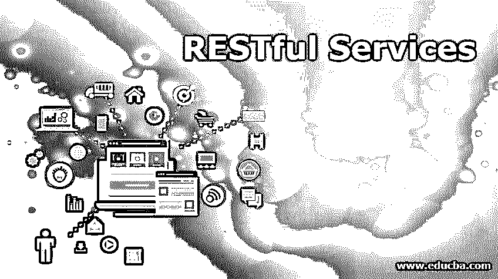
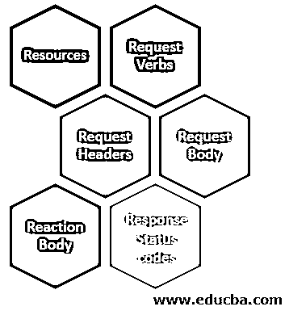

# RESTful 服务

> 原文：<https://www.educba.com/restful-services/>

<sup>

</sup> 

## RESTful Web 服务简介

下面的文章提供了 RESTful 服务的概要。RESTful web 管理在 web 上工作得最好。表述性状态转移(REST)是一种确定约束的设计风格，例如，统一界面，无论何时应用于 web 管理，都会启动吸引人的属性，例如，可执行性、多功能性和可修改性，使管理能够在 web 上最佳地工作。RESTful Web 服务是通过 WWW 进行通信的客户和服务器应用程序。

RESTful Web 服务是基于 REST 设计的 Web 服务。在 REST 架构中，一切都是资产。RESTful Web 服务提供了在不同阶段和系统上运行的编程应用程序之间的通信。我们可以将 web 服务视为按需编码。RESTful Web 服务是一种能力或技术，可以通过向 URL 发送 HTTP 请求来调用，管理人员将结果恢复为响应。

<small>网页开发、编程语言、软件测试&其他</small>

### RESTful 服务关键组件

**RESTful 用法的关键组成如下:**

 **


#### 1.资源

主要的关键组件只是一项资产。假设服务器上的 web 应用程序有几个代表的记录。我们接受 web 应用程序的 URL [是 http://demo.ravi.com 怎么样。现在，要通过 REST 访问工人记录资产，可以给出方向 http://demo.ravi.com/工人/1，这个命令建议 web 服务器请给出工人编号为 1 的工人的细节。](https://www.educba.com/what-is-web-application/)

#### 2.请求动词

这些描述了您需要如何处理资产。程序给出一个 GET 动作词来训练它需要获取信息的端点。尽管如此，有许多不同的动作词可以使用，包括 POST、PUT 和 DELETE。因此，考虑到 http://demo.ravi.com/worker/1,模型，互联网浏览器实际上提供了一个 GET 动词，因为它需要获得工人记录的细微之处。

#### 3.请求标题

这些是与招标一起发送的额外指南。这些可能是所需反应或批准微妙之处的特征。

#### 4.请求正文

数据随请求一起发送。当向 REST web 管理发出 POST 请求时，信息会定期在请求中发送。在 POST 呼叫中，客户实际上告诉 web 管理，它需要向服务器添加资产。从今以后，请求机构将拥有需要添加到服务器的资产的细微之处。

#### 5.反应体

这是反应的基本主体。因此，在我们的模型中，如果我们设法通过请求查询 web 服务器是 http://demo.ravi.com/工人/1，web 服务器可能会在响应体中用工人的每一个细微之处来恢复 XML 记录。

#### 6.响应状态代码

这些代码是与 web 服务器的反应一起返回的通用代码。模型是代码 200，如果在恢复对客户的反应时没有错误，则通常返回该代码。

### RESTful 服务的方法

让我们举一个例子，我们有一个 RESTful web administration，其特征是在 http://demo.ravi.com/worker.地区，当客户向该 web administration 发出任何请求时，它可以确定任何普通的 HTTP 动作词 GET、POST、DELETE 和 PUT。

如果特定的动作词是由客户发送的，则会发生以下情况。

*   **POST:** 它将用于使用 RESTful web 服务创建一个新的 worker。
*   **GET:** 它将用于获取所有使用 RESTful web 服务的工作人员。
*   **PUT:** 它将用于更新所有使用 RESTful web 服务的 workers。
*   **DELETE:** 它将用于删除所有使用 RESTful web 服务的 workers。

### 实现 RESTful 服务的示例

下面的代码测试是一个非常简单的根资产类的例子，利用了 JAX-RS 的注释:

**代码:**

```
package com.sun.jersey.test.welcomeworld.resources;
import javax.ws.rs.GET;
import javax.ws.rs.Produces;
import javax.ws.rs.Path;
//The Java class will be facilitated at the URI way "//welcomeworld"
@Path("/welcomeworld ")
public class WorldResource {
@GET // indicate the HTTP demand sort of an asset.
@Produces("text/plain") // type "text/plain"
public String getMessage() {
// Return statement
return "Welcome World";
}
}
```

@Path 评论的价值是相对的 URI 方式。在第一个模型中，Java 课程将在 URI 大道/欢迎世界进行。@GET comments 是一个请求策略指示符，与@POST、@PUT、@DELETE 和@HEAD 并列，以 JAX-RS 为特征，与相对命名的 HTTP 技术相关。@Produces 注释用于指示资产可以创建并发送回客户的 MIME 媒体类型。@Consumes 解释用于指示资产可以吞噬的由客户发送的 MIME 媒体类型。

### RESTful 使用的注释

以下是 restful web 服务使用的顶级注释:

*   **@Path:** 用于确定总体的上课方式和技巧。我们可以通过检查路径注释权重来获得 web 服务的 URI。
*   **@GET、@PUT、@POST、@DELETE 和@HEAD:** 用于表示某个策略的 HTTP 需求类型。
*   **@Produces，@Consumes:** 用于表示邀约和反应类型。
*   **@PathParam:** 用于通过解析将技术参数绑定到激励方式。

### 状态代码

RESTful web 服务给出的各种状态代码如下:

*   404: 找不到资源
*   **200:** OK 或成功
*   **201:** 创建
*   401: 未经授权
*   500: 服务器错误

### 结论

在本文中，我们提升了对 REST 的认识。我们关注了 HTTP 是 REST 管理的构建块的方式。HTTP 是一种约定，用于描述程序请求和反应的结构。我们看到 HTTP 管理 web 服务器上未公开的资产。利用 URIs 来区分资产，并且利用以 HTTP 为特征的动作词来执行这些资产上的任务。

### 推荐文章

这是 RESTful 服务指南。这里我们分别讨论介绍、关键组件、方法、示例、注释和状态代码。您也可以浏览我们推荐的其他文章，了解更多信息——

1.  [Java 中的 API 是什么？](https://www.educba.com/what-is-api-in-java/)
2.  [JSON 是什么？](https://www.educba.com/what-is-json/)
3.  [Python 框架](https://www.educba.com/python-frameworks/)
4.  [PHP 框架](https://www.educba.com/php-frameworks/)


**