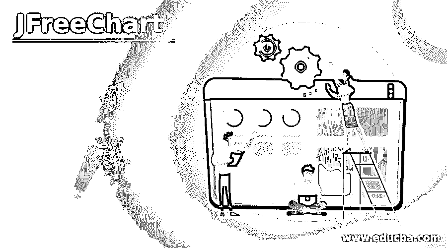

# 肯尼迪机场

> 原文：<https://www.educba.com/jfreechart/>

## JFreeChart 简介

一个 100%免费的 Java 图表库叫做 JFreeChart，开发者可以很容易地在他们的应用程序中显示专业质量的图表。它有一个完善的应用程序编程接口和一致的特性来支持各种范围的图表类型，它的设计非常灵活，可以很容易地扩展到服务器端应用程序和客户端应用程序以及几种输出类型，如 JavaFX 组件、swing、矢量图形文件格式、图像文件等。JFreeChart 是一个开放源码的自由软件，可以在所有专有应用程序中使用。

### 使用 JFreeChart 的必要性

*   它支持多种图表类型，因为它的应用程序编程接口有很好的文档记录并且非常一致。
*   该设计非常灵活，非常容易扩展，服务器端应用程序和客户端应用程序都可以作为目标。
*   它支持多种输出类型，如 JavaFX 组件、swing、矢量图形文件格式(包括 EPS、SVG 和 pdf)、图像文件(包括 JPEG 和 PNG)等。
*   它是由 GNU 宽松通用公共许可证或 LGPL 发布的开源自由软件，允许在专有应用程序中使用。

### JFreeChart 的工作

*   可以从两个层面来解释，一个是类层面，一个是应用层面。
*   在类级别，用户可以在文件中输入数据以在文件中创建数据集，或者用户可以在数据库中输入数据以在数据库中创建数据集。
*   dataset 对象接受在文件或数据库中创建的数据集，并将其存储在 dataset 对象中。
*   饼图利用了常规数据集，而折线图、条形图等。利用类别数据集构造折线图，可以将一系列数据存储在一个系列数据集中。
*   系列集合数据集存储了可在木糖醇图表中使用的不同类别的系列数据集。
*   最后，在 swing frame 上显示图表，或者创建一个图像。
*   在应用层，用户数据由客户端程序接收，以生成帧或图像格式的输出。
*   客户程序根据需要使用标准的 Java 应用程序编程接口或 JFreeChart 应用程序编程接口。
*   客户端程序生成的输出可以直接在应用程序中显示，也可以以 PNG 或 JPEG 等图像格式独立显示。

### 优点和缺点

下面给出了提到的优点和缺点:

<small>网页开发、编程语言、软件测试&其他</small>

#### 优势

*   它是由 GNU 宽松通用公共许可证或 LGPL 发布的开源自由软件，允许在专有应用程序中使用。
*   它支持多种输出类型，如 JavaFX 组件、swing、矢量图形文件格式(包括 EPS、SVG 和 pdf)、图像文件(包括 JPEG 和 PNG)等。
*   该设计非常灵活，非常容易扩展，服务器端应用程序和客户端应用程序都可以作为目标。
*   它支持多种图表类型，因为它的应用程序编程接口有很好的文档记录并且非常一致。
*   JFreeChart 提供了各种各样的图表和交互式图表。
*   提供的渲染速度非常好。
*   所提供的出口产品质量非常好。
*   缩放插件质量非常好。
*   与 Chart.js 相比，它提供了非常好的性能。
*   当需要在 web 页面上显示图表时，这是最理想的方法。
*   它与 Java 版本 8 配合得很好，并且是专门为 Java 编写的。
*   JFreeChart 有一些文档是可用的，尽管它不是免费的，也不是最新的。
*   它有一个非常大的现成样品图书馆，尽管它们不是免费的。
*   它可以很好地与 web 应用程序一起工作，尤其是 TomCat 8。
*   它非常容易理解，因为 JFreeChart 中的应用程序编程接口有很好的文档记录。
*   使用 JFreeChart 创建的图表可以根据我们的要求进行定制。
*   当数据被动态加载时，以图表的形式显示数据是恰当而简单的编程选项。
*   使用 JFreeChart 可以高效地创建图表。
*   JFreeChart 的安装设置非常用户友好。

#### 不足之处

*   JFreeChart 并不是完全免费的，因为 JFreeChart 的文档必须购买，开始使用的示例图表也必须购买。
*   JFreeChart 的文档还不是最新的。
*   如果需求是在网页中显示图表，那么就需要编写代码来在网页上显示图表。
*   如果需求是在网页中显示图表，那么它不允许在聊天的格式中进行频繁的改变。

### JFreeChart 的应用

*   它可以在所有基于 Java 的应用程序中使用，因为它是用 Java 开发的开源库。
*   它可以用来创建各种各样的图表。
*   它可用于创建二维图表和三维图表。
*   使用 JFreeChart 可以创建各种各样的图表，如条形图、饼图、XY 图表、折线图等。
*   它可以免费用于商业应用程序，因为它是用 Java 开发的开源库。

### 结论

在本文中，我们已经通过定义了解了 JFreeChart 的概念、JFreeChart 的必要性、工作原理、使用 JFreeChart 的优点、使用 JFreeChart 的缺点以及的应用，例如创建条形图、饼图、XY 图表、折线图、三维图表以及其他二维图表。

### 推荐文章

这是 JFreeChart 的指南。这里我们讨论 JFreeChart 的简介，使用 JFreeChart 的必要性，工作原理，优缺点，应用。您也可以看看以下文章，了解更多信息–

1.  [Java GUI 框架](https://www.educba.com/java-gui-framework/)
2.  [Java 关机挂钩](https://www.educba.com/java-shutdown-hook/)
3.  [Java 矢量类](https://www.educba.com/java-vector-class/)
4.  [Java 字符串等于](https://www.educba.com/java-string-equals/)

