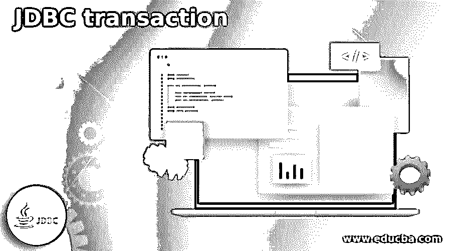
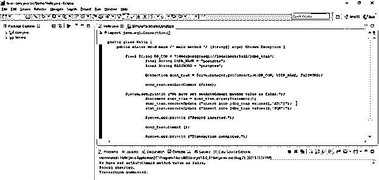
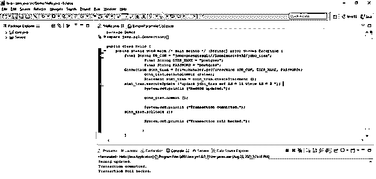
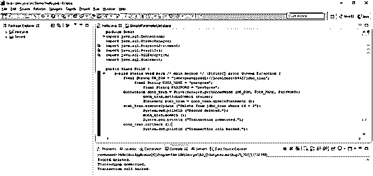

# JDBC 交易

> 原文：<https://www.educba.com/jdbc-transaction/>

## JDBC 交易简介

JDBC 事务不过是将在单个命令中执行的工作单元，数据库 ACID 属性将使用 JDBC 描述事务管理。ACID 在 JDBC 事务中被称为原子性、一致性、隔离性和持久性，基本上在 JDBC 连接接口中会提供管理事务的方法。我们可以使用 setAutoCommit、Commit 和 rollback 方法来管理使用 JDBC 的事务。我们可以在事务中使用 PreparedStatement 来执行 SQL 语句，在语句中使用 PreparedStatement 后将按照事务顺序执行。

**语法:**

<small>网页开发、编程语言、软件测试&其他</small>

下面是 JDBC 交易的语法如下。

**使用简单报表的 JDBC 交易—**

`Public static void main /* main method */ (string args [])
Class.forName (“database driver name”)
Connection con_object DriverManager.getConnection (“connection string”)
Con_object.setAutoCommit (value)
Statement stmt_object = con_object.createStatement ();
Stmt_bject.executeUpdate(“SQL query”);
Stmt_bject.executeUpdate(“SQL query”);
con_object.commit();
con_object.rollback();
Con.close();`

**使用准备好的报表的 JDBC 交易—**

`Public static void main /* main method */ (string args [])
Class.forName (“database driver name”)
Connection con_object DriverManager.getConnection (“connection string”)
Con_object.setAutoCommit (value)
PreparedStatement Prp_stmt_object = con_object.prepareStatement (“SQL query”);
Prp_stmt_object.executeUpdate (“);
con_object.commit ();
con_object.rollback ();
Con.close ();`

### JDBC 交易的参数描述语法

*   **数据库驱动程序名称–**要连接指定的数据库，我们需要一个数据库驱动程序名称。我们需要加载数据库驱动程序来连接到指定的数据库。
*   **连接字符串—**包含数据库服务器的用户名、密码、主机名和端口等字符串。
*   **set auto commit—**这是在事务中使用的连接接口的方法。这个方法的缺省值是 true，意味着我们可以提交所有的事务而不需要发出 commit 命令。我们可以通过将布尔值设为 false 来禁用它。
*   **提交–**这是一种连接接口的方法，用于提交数据库服务器正在运行的事务。我想我们没有将 AutoCommit 方法设置为 false，我们需要在成功的事务后发出 Commit 命令。
*   **roll back—**该方法用于取消数据库服务器上先前运行的事务。我们可以在提交之前回滚事务。我们可以在将 setAutoCommit 方法的值设置为 false 后回滚事务。
*   **执行更新-**该方法用于执行 PreparedStatement 方法的语句。它将执行在 PreparedStatement 下编写的语句。

### 交易在 JDBC 是如何运作的？

*   事务不过是在单个语句块中执行的 SQL 查询块。
*   正如我们所知，所有 JDBC 连接都处于自动提交模式，使用这种模式，所有事务都将在每个事务成功执行后提交。
*   默认情况下，JDBC 连接模式设置为 true，我们可以通过将 setAutoCommit 方法值定义为 false 来更改该值。
*   以下是在 JDBC 中禁用事务处理自动提交所需的要点。

1.  我们可以通过禁用自动提交参数来使用分布式事务。
2.  我们可以提高应用程序的性能。
3.  我们还可以通过禁用事务的自动提交参数来维护业务的完整性。

*   下面是在一个事务中使用的连接接口的方法。

1.  Void commit()方法
2.  Void setAutoCommit()方法
3.  Void rollback()方法
4.  Void setSavePoint()方法
5.  Void releaseSavePoint 点()方法

*   JDBC setAutoCommit 包含布尔值 true 或 false，我们可以使用 setAutoCommit 方法将该值设置为 true 或 false。我想我们已经将 value 设置为 true，它将自动提交所有事务。
*   保存点将为我们提供对事务的额外控制，这是我们使用事务在数据库服务器上完成的。
*   释放保存点方法用于删除创建的保存点。我们可以使用 setSavePoint 方法创建一个新的保存点。
*   我们不需要在成功执行后更新事务。
*   使用事务，我们可以为 java 兼容的驱动程序提供数据完整性、一致的视图和正确的应用程序语义。
*   下面是交易管理中使用的最重要的函数。

1.  犯罪
2.  反转
3.  保存点

*   保存点在事务中非常有用，可以在执行完所有事务后回滚特定的事务。
*   我们创建了多个保存点来使用事务在数据库上执行这个操作。
*   当我们在数据库服务器上执行 rollback 或 commit 操作时，我们创建的任何保存点都将被自动销毁或删除。

### 例子

下面的例子显示 JDBC 交易如下。

#### 1.使用插入查询的 JDBC 事务

以下示例显示了使用插入查询的事务，如下所示。我们使用了提交和设置自动提交方法。

**代码:**

`public static void main /* main method */ (String[] args) throws Exception {
final String DB_CON = "jdbc:postgresql://localhost:5432/jdbc_tran";
final String USER_NAME = "postgres";
final String PASSWORD = "postgres";
Connection conn_tran = DriverManager.getConnection (DB_CON, USER_NAME, PASSWORD);
conn_tran.setAutoCommit (false);
System.out.println ("We have set setAutoCommit method value as false,");
Statement stmt_tran = conn_tran.createStatement ();
stmt_tran.executeUpdate ("insert into jdbc_tran values(1,'ABC')");
stmt_tran.executeUpdate ("insert into jdbc_tran values(2,'PQR')");
System.out.println ("Record inserted.");
conn_tran.commit ();
System.out.println ("Transaction committed.");
}
}`

#### 2.使用更新查询的 JDBC 事务

以下示例显示了使用更新查询的事务，如下所示。我们使用了提交、设置自动提交和回滚方法。

**代码:**

`public static void main /* main method */ (String[] args) throws Exception {
final String DB_CON = "jdbc:postgresql://localhost:5432/jdbc_tran";
final String USER_NAME = "postgres";
final String PASSWORD = "postgres";
Connection conn_tran = DriverManager.getConnection (DB_CON, USER_NAME, PASSWORD);
conn_tran.setAutoCommit (false);
Statement stmt_tran = conn_tran.createStatement ();
stmt_tran.executeUpdate ("update jdbc_tran set id = 11 where id = 2 ");
System.out.println ("Record updated.");
conn_tran.commit ();
System.out.println ("Transaction committed.");
conn_tran.rollback ();
System.out.println ("Transaction roll backed.");
}
}`

#### 3.使用删除查询的 JDBC 事务

以下示例显示了使用删除查询的事务，如下所示。我们使用了提交、设置自动提交和回滚方法。

**代码:**

`public static void main /* main method */ (String[] args) throws Exception {
final String DB_CON = "jdbc:postgresql://localhost:5432/jdbc_tran";
final String USER_NAME = "postgres";
final String PASSWORD = "postgres";
Connection conn_tran = DriverManager.getConnection (DB_CON, USER_NAME, PASSWORD);
conn_tran.setAutoCommit (false);
Statement stmt_tran = conn_tran.createStatement ();
stmt_tran.executeUpdate ("Delete from jdbc_tran where id = 1");
System.out.println ("Record deleted.");
conn_tran.commit ();
System.out.println ("Transaction committed.");
conn_tran.rollback ();
System.out.println ("Transaction roll backed.");
} }`

### 结论

JDBC 事务不过是单个单位的工作。事务对于提高应用程序的性能非常有用。事务中有三种类型的函数可用，即提交、回滚和保存点。提交、回滚、设置自动提交、设置保存点和释放保存点是事务中可用的方法。

### 推荐文章

这是一本 JDBC 交易指南。在这里，我们将讨论事务在 JDBC 是如何工作的，并给出例子和参数。您也可以看看以下文章，了解更多信息–

1.  [蜂巢 JDBC 驾驶员](https://www.educba.com/hive-jdbc-driver/)
2.  什么是 JDBC？
3.  [JDBC 建筑](https://www.educba.com/jdbc-architecture/)
4.  [JDBC 司机](https://www.educba.com/jdbc-driver/)

