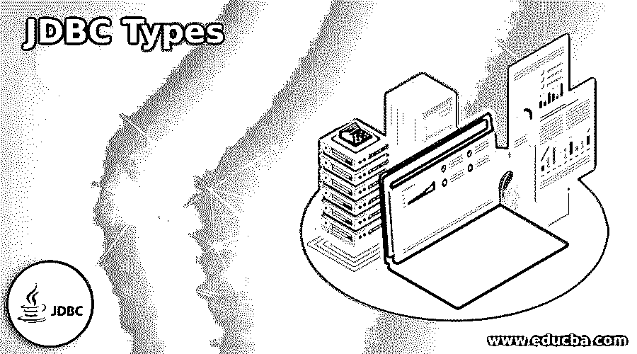

# JDBC 类型

> 原文：<https://www.educba.com/jdbc-types/>

## JDBC 简介

JDBC 驱动程序被定义为允许 java 应用程序与数据库协作的软件模块。我们现在有五种类型的 JDBC 驱动程序，它们有助于应用 JDBC API 中明确的接口来与数据库服务器相关联。例如，假设通过 JDBC 驱动程序，我们能够打开任何数据库连接，通过传输 SQL 或数据库查询与它相关联，然后用 Java 接受结果。这里，许多类都有它们各自明确的行为，它们真实的应用程序是在第三方驱动程序中完成的，存在于 JDK 附带的 Java.sql 包中。此外，Java.sql.Driver 接口由第三方供应商在其数据库驱动程序中实现。

### 各种 JDBC 类型

由于涉及操作 Java 的操作系统和硬件平台的多样性，它可能会改变 JDBC 驱动程序的实现。据说 JDBC 驱动程序是安装在客户机上而不是服务器上的客户端适配器，它有助于将来自 Java 程序的请求转换成 DBMS 可以理解的协议。

<small>网页开发、编程语言、软件测试&其他</small>

适用于行业的 JDBC 驱动程序类型:

*   JDBC-ODBC 桥驱动程序
*   部分 Java 驱动程序(本地 API 驱动程序)
*   为数据库中间件托管的纯 Java 驱动程序(或网络协议驱动程序)
*   托管纯 Java 驱动程序，用于直接访问数据库(或本地协议驱动程序)
*   具有卓越外观的高功能驱动程序

但是，当我们考虑在这五种 JDBC 类型中为大多数应用程序选择最佳类型时，我们必须选择一个纯 Java 驱动程序，即类型 3、4 或 5。

*   类型 1 的 JDBC 驱动程序被实现来检查 ODBC 数据源旁边的 JDBC 应用程序。类型 2 的 JDBC 驱动程序需要一个内置的数据库 API 来实现。类型 1 和类型 2 的 JDBC 驱动程序都将基于 Java 的 API 与其他 API 相结合。因此，我们也只能有四种类型的 JDBC 驱动程序。
*   JDBC 类型 3 是唯一应用于访问和进入中间件服务器的 JDBC 驱动程序，该服务器反过来创建对数据库的适当调用。如果我们看到一个 3 型 JDBC 驱动程序的好例子，那就是 DataDirect SequeLink JDBC 驱动程序。
*   类型 4 的 JDBC 驱动程序是最公司化的，也是为一个独特的供应商的数据库考虑的。然而，JDBC 驱动程序(如 DataDirect 5 型 JDBC 驱动程序)提供了比其他类型的 JDBC 驱动程序更先进的功能和更高的性能。

JDBC 是由 Oracle 公司推出的 java 标准版平台的一部分，它作为 Java 应用程序和数据库之间的内部层接口。这里，JDBC 类包含在 Java 包中，比如 javax.sql 和 java.sql

#### 1.JDBC-ODBC 驱动程序

这被认为是类型 1 JDBC 桥驱动程序，它使用 ODBC 驱动程序连接到数据库。JDBC-ODBC 桥驱动程序将 JDBC 方法的调用转换成 ODBC 函数的调用。由于这种类型 1 驱动程序可以与任何数据库相关联，因此也称为通用驱动程序。

*   由于这可能是为与许多数据库通信而实现的相互驱动程序，因此传输的数据可能不安全。
*   需要在每台客户机上安装 ODBC 驱动程序。
*   类型 1 驱动程序不是用 Java 编写的，因此不可移植。
*   该驱动软件内置于 JDK 中，不需要单独安装。
*   这是独立于数据库的类型，驱动程序。

#### 2.本机 API 驱动程序

该类型 2 驱动程序应用客户端数据库的库，将 JDBC 方法的调用转换成数据库 API 的本地调用。由于它使用本地 API 连接多个数据库，因此传输的数据更加安全。

*   需要在每台客户机上进行设置。
*   要求在每台客户机上设置供应商客户机库。
*   类型 2 驱动程序不是用 Java 编写的，因此不可移植。
*   这是数据库相关的驱动程序。

#### 3.网络协议驱动程序

类型 3 驱动程序实现应用服务器，即中间件，其直接或间接地将 JDBC 调用转换成数据库的供应商详细协议。在一个服务器中，数据库驱动程序的所有连接都是可用的，不需要客户端安装。

*   完全用 Java 编写，因此是可移植的。
*   应用服务器执行不同的任务，如日志、审计、负载平衡等。因此，不需要客户端库。
*   在客户端机器上，可能需要网络支持。
*   维护成本增加了，因为它需要在中间层编写特定于数据库的代码。
*   由于切换功能，从一个数据库切换到另一个数据库是可能的。

#### 4.本地协议驱动程序

这个 type 4 驱动程序直接与数据库通信，不需要任何本地数据库库。因此，它也被称为瘦驱动程序。

*   不需要任何中间件服务器或本地库，因此不需要安装客户端或服务器端。
*   完全用 Java 转录，因此它们是可移植的。

我们可以根据以下条件应用驱动程序:

*   对于访问单个数据库，如 Oracle、IBM、Sybase，我们可以选择类型 1 驱动程序。
*   对于 Java 应用程序同时访问许多数据库，则选择类型 3。
*   如果类型 3 或 4 在任何情况下都不存在，那么类型 2 驱动程序是有帮助的。
*   类型 1 驱动程序基本上只用于开发和测试任务，因为它不作为部署级驱动程序来衡量。

### 结论-JDBC 类型

Java 数据库连接被认为是一种应用程序编程接口，即为流行的编程语言 Java 设计的 API，它说明了客户机如何访问某种类型的表格数据，特别是关系数据库。因此，JDBC 帮助编写 Java 应用程序，该应用程序控制三种编程活动，包括数据库的开放连接、查询传输、作为结果从数据库服务器获取数据记录或通过 SQL 命令更新它们。

### 推荐文章

这是一本 JDBC 类型指南。为了更好地理解，我们在这里讨论介绍以及各种 JDBC 类型。您也可以看看以下文章，了解更多信息–

1.  什么是 JDBC？
2.  [JDBC 面试问题](https://www.educba.com/jdbc-interview-questions/)
3.  [Java 电子邮件验证](https://www.educba.com/java-email-validation/)
4.  [Java 中迄今为止的时间戳](https://www.educba.com/timestamp-to-date-in-java/)

