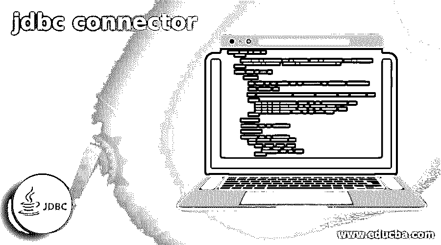

# JDBC 连接器

> 原文：<https://www.educba.com/jdbc-connector/>

## JDBC 连接器介绍

Java 数据库连接是一个程序，允许用户通过在 J2EE 上运行的 Java 应用服务器访问不同的数据库。要连接 JDBC 驱动程序和应用程序服务器，需要使用 JDBC 连接器。要执行这个选项，涉及到不同的组件，如 JDBC API、驱动程序管理器、JDBC 驱动程序和应用程序。JDBC 连接器由不同类型的驱动程序组成，客户端应用程序和 JDBC 依赖这些驱动程序与数据库进行交互。本文介绍了 JDBC 连接器的应用、工作和结构。

### 什么是 JDBC 连接器？

简单地说，JDBC 连接器用于关联 JDBC 驱动程序和应用程序。建立这个连接是为了让用户能够使用 Java 应用服务器在不同的数据库上工作。建立 JDBC 连接的组件是应用程序、JDBC API、驱动程序管理器和 JDBC 驱动程序。应用程序是与数据源交互的 servlet 或 Java applet。JDBC 的 API 使 Java 程序能够运行 SQL 语句并获取结果。JDBC API 定义的接口和重要性类是驱动程序、连接、驱动程序管理器、语句、PreparedStatement、SQL 数据、结果集和可调用语句。在 JDBC 连接器中，驱动程序管理器起着至关重要的作用，它使用很少的特定于数据库的驱动程序来有效地关联数据库和企业应用程序。JDBC 的驱动程序通过 JDBC 连接与数据源交互。它与相关数据源进行逻辑通信。

<small>网页开发、编程语言、软件测试&其他</small>

### 连接器结构和工作流程

JDBC 的体系结构包括两层和三层处理模式来管理数据库。

两层 JDBC 架构:Java 应用程序直接与数据源交互。JDBC 驱动程序允许数据源和应用程序之间的交互。当用户向数据源发送查询时，查询的解决方案作为结果集回复给用户。这里，数据源可以位于用户所连接的网络的不同机器上。这被称为服务器或客户机配置，其中用户的机器充当客户机，保存数据源的机器充当服务器。

三层 JDBC 架构:在这里，用户的查询被传输到中间层的服务，命令从中间层再次传输到数据源。然后，结果输出被发送到中间层，然后从那里传送给用户。它由信息系统管理主管使用。

有四种类型的 JDBC 驱动程序，如部分是 java 驱动程序的 Native-API 驱动程序、网络协议驱动程序和完全是 Java 驱动程序的瘦驱动程序，以及 JDBC-ODBC 桥驱动程序。

type1 驱动程序具有从 JDBC 调用到 CLI 的其他调用的 JDBC 映射。

类型 2 通过使用其他 CLI 拥有部分 Java 代码和本机代码

类型 3 是一个纯粹的 Java 驱动程序，它包含了将 JDBC 调用转换为特定供应商调用的中间件

Type 4 也是一个纯 Java 驱动程序，不需要任何中间件或客户端二进制文件。可以直接下载到客户端。

### 解释 JDBC 连接器

*   JDBC 连接器提供了一种与数据库建立连接的方法。它具有以下特征。
*   Java 的一组接口和类是用 Java 编程语言编写的。
*   结构化 API 为数据库程序员提供了编写数据库应用程序的帮助。
*   Java 应用程序可以通过这个过程与大量数据库进行交互。
*   一种使程序员能够使用 JDBC API 编译单个程序的程序，该程序可以在任何使用 JDBC 和 Java 的平台上执行。
*   这是一种将 SQL 语句传输到任何关系数据库的方法。
*   JDBC SQL 命令的最小级别接口。使用这些命令可以直接调用它。这是因为 JDBC 是结构化的基础，然后建立最大水平的工具和接口。它还支持与数据库建立网络，并协助发送 SQL 语句和处理结果。

开放式数据库连接 API 是最广泛使用的访问关系数据库的接口，它提供了将任何数据库链接到任何平台的适应性。即使它有一些缺点。使用 JDBC 而不是 ODBC API 的四个主要原因。

ODBC 使用 C 接口，需要从 Java 调用标准 C 代码。它有许多局限性，如安全性、实现、应用程序的可移植性。不支持将 ODBC C 中的 API 翻译成 Java API，因为它没有指针，但 ODBC 与指针不同。JDBC 是可移植的使用，并提供了简单的解决方案的查询，ODBC，需要驱动程序手动安装在每台客户机上。JDBC 吸收了 Java 的优点和风格。

### 怎么用？

*   把 JDBC 和数据库连接起来。应用以下步骤。
*   找到或安装用户想要访问的数据库
*   让 JDBC 图书馆被包括在内。
*   检查类路径，并确保 JDBC 驱动程序正确位于类路径上
*   使用 JDBC 库设置到数据库的连接
*   暗示发出 SQL 命令的连接
*   活动完成后，必须关闭连接。

### 安装 JDBC 连接器

接收器连接器和 JDBC 的源使用 JDBC API 使应用程序能够链接和使用大量的数据库系统。为了使这个设置工作，连接器应该有一个适用于用户正在使用的适当数据库系统的 JDBC 驱动程序。连接器具有用于极少数数据库系统的 JDBC 驱动程序，用户必须为数据库系统安装最新的 JDBC 4.0 驱动程序。每个 JDBC 驱动程序的详细信息可能有所不同。

找到 JDBC 4.0 驱动程序，使用每个数据库的 JAR 文件，

将 JAR 文件复制到共享路径:share\java\kafka-connect—JDBC 目录。这被粘贴在用户平台安装的每个连接器工作节点上。

现在，重新启动所有连接器工作节点。

### 结论

上面的文章解释了 JDBC 连接器的工作和结构及其类型。根据用户的偏好和应用，JDBC 连接器是隐含的。

### 推荐文章

这是一个 jdbc 连接器的指南。这里我们详细讨论 JDBC 连接器的工作和结构及其类型。您也可以看看以下文章，了解更多信息–

1.  [JDBC 面试问题](https://www.educba.com/jdbc-interview-questions/)
2.  什么是 JDBC？
3.  [甲骨文的 JDBC 驱动程序](https://www.educba.com/jdbc-driver-for-oracle/)
4.  [PostgreSQL JDBC 驱动程序](https://www.educba.com/postgresql-jdbc-driver/)

