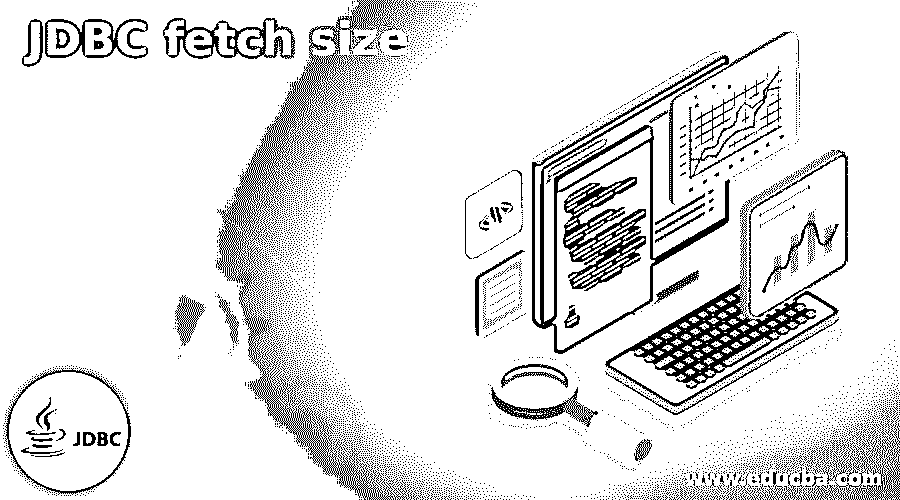
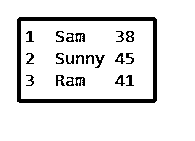
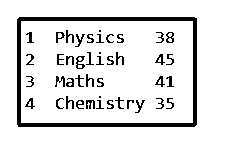

# JDBC 提取大小

> 原文：<https://www.educba.com/jdbc-fetch-size/>




## JDBC 提取大小介绍

JDBC 提取大小是一种执行和管理数据库内存的方法。获取大小用于 resultset 即时获取数据库记录，并控制从 JVM 到数据库的多次调用。提取大小是返回 10 个大小的数据库记录的语句和准备好的语句的默认值。提取大小是一个属性，它使用驱动程序通过语句提取多个数据库行。fetch size is 方法提示驱动程序维护或管理数据库行。提取大小是 JDBC 属性交互默认数据库，并且数据库行可以最大化或最小化提取大小。

**语法**

<small>网页开发、编程语言、软件测试&其他</small>

*   基本的提取大小语法如下所示。

```
setFetchSize(int row);
```

*   JDBC 语句提取大小语法如下所示。

```
statement.setFetchSize(fetch size);
```

*   JDBC 驱动程序的默认提取大小设置为 10。
*   SQL server 语句的默认提取大小设置为 128。

*   一条记录的提取大小语法如下所示。

```
statement.setFetchSize(Integer.MIN_values);
```

*   一条记录的提取大小语法如下所示。

```
statement.setFetchSize(Integer.MAX_VALUE);
```

*   多记录的提取大小语法如下所示。

```
statement.setFetchSize(fetchSize);
```

*   hibernate 配置的 fetch size 语法如下所示。

```
<property name = "hibernate.jdbc.fetch_size" value = "100" />
```

*   hibernate 配置的 fetch size 语法如下所示。

```
.setHint("eclipselink.jdbc_fetch_size", value = "50");
```

*   带有查询提示的提取大小语法如下所示。

```
@QueryHint (name = "QueryHints.jdbc_fetch_size", value = "50");
```

### 如何在 JDBC 获取尺寸？

*   用所需的列及其信息创建一个数据库表。
*   创建一个带有前缀的 java 文件。

JdbcFetch.java

*   创建一个 java 类和方法。

```
class JdbcFetch{
public static void main(String[] args) { write fetch size code here…} }
```

*   使用 jdbc 驱动程序与所需的数据库管理系统进行互连。

```
driver = "com.mysql.jdbc.Driver";
Class.forName(driver);
```

*   通过 jdbc 方法使用与数据库及其主机的连接。

```
connect = "jdbc:mysql://localhost:3306/database_name", "user_name", "root_password";
connection connec = DriverManager.getConnection(connect);
```

*   使用 resultset 显示数据库表信息。

```
statement stat = connec.createStatement();
```

*   初始化提取大小。

```
stat.setFetchSize(100);
ResultSet resultst = stat.executeQuery( "select * from table_name" );
```

*   对结果集变量使用 while 循环。

```
while(resultst.next()){ write output code… }
```

*   将数据库信息显示为输出。

```
System.output.println("write output variable here..");
```

*   关闭 JDBC 连接。

```
Connec.close();
```

*   结合提取尺寸的工序。

```
class JdbcFetch{
public static void main(String[] args) {
driver = "com.mysql.jdbc.Driver";
Class.forName(driver);
connect = "jdbc:mysql://localhost:3306/database_name", "user_name", "root_password";
connection connec = DriverManager.getConnection(connect);
statement stat = connec.createStatement();
stat.setFetchSize(100);
ResultSet resultst = stat.executeQuery( "select * from table_name" );
while(resultst.next()){
System.output.println("write output variable here..");
}
Connec.close();
} }
```

### JDBC 提取大小的示例

下面提到了不同的例子:

#### 示例#1

基本提取大小示例和输出如下所示。

**代码:**

```
import java.sql.*;
class JdbcFetch{
public static void main(String[] args) {
driver = "com.mysql.jdbc.Driver";
Class.forName(driver);
connect = "jdbc:mysql://localhost:3306/tutorial", "root", "root";
connection connec = DriverManager.getConnection(connect);
statement stat = connec.createStatement();
stat.setFetchSize(10);
ResultSet resultst = stat.executeQuery( "select * from table books" );
while(resultst.next()){
System.output.println(resultst.getInt(1)+ " " +resultst.getString(2));
}
Stat.close();
resultst.close();
Connec.close();
} }
```

**输出:**


**描述**

*   提取大小连接并提取数据库中所需的行。
*   如果数据库值很小，那么它使用提取大小来提取整行。
*   JDBC 设置默认值意味着 10 个提取大小。
*   提取大小在配置内部起作用。
*   应用程序输出显示完整的数据库信息，没有任何中断。

#### 实施例 2

数据库示例的提取大小和输出如下所示。

**代码:**

```
import java.sql.*;
class JdbcFetch{
public static void main(String[] args) {
driver = "com.mysql.jdbc.Driver";
Class.forName(driver);
connect = "jdbc:mysql://localhost:3306/tutorial", "root", "root";
connection connec = DriverManager.getConnection(connect);
statement stat = connec.createStatement();
stat.setFetchSize(50);
ResultSet resultst = stat.executeQuery( "select id, name, marks from table books" );
while(resultst.next()){
System.output.println(resultst.getInt(1)+ " " +resultst.getString(2)+ " "" +resultst.getInt(3));
}
Stat.close();
resultst.close();
Connec.close();
} }
```

**输出:**




**描述**

*   提取大小连接并立即提取数据库的 50 行。
*   如果数据库值很小，那么它使用提取大小来提取整行。
*   JDBC 设置最大取指大小为 50。
*   提取大小在配置内部起作用。
*   应用程序输出显示完整的数据库信息，没有任何中断。

#### 实施例 3

获取大小示例和输出如下所示。

**代码:**

```
import java.sql.*;
class JdbcFetch{
public static void main(String[] args) {
driver = "com.mysql.jdbc.Driver";
Class.forName(driver);
connect = "jdbc:mysql://localhost:3306/tutorial", "root", "root";
connection connec = DriverManager.getConnection(connect);
statement stat = connec.createStatement();
stat.setFetchSize(5);
ResultSet resultst = stat.executeQuery( "select id, book from table books" );
while(resultst.next()){
System.output.println(resultst.getInt(1)+ " " +resultst.getString(2));
}
Stat.close();
resultst.close();
Connec.close();
} }
```

**输出:**


**描述**

*   提取大小连接并立即提取数据库的 5 行。
*   如果数据库值很小，那么它使用提取大小来提取整行。
*   JDBC 设置最大取指大小为 5。

#### 实施例 4

获取大小示例和输出如下所示。

**代码:**

```
import java.sql.*;
class JdbcFetch{
public static void main(String[] args) {
driver = "com.mysql.jdbc.Driver";
Class.forName(driver);
connect = "jdbc:mysql://localhost:3306/tutorial", "root", "root";
connection connec = DriverManager.getConnection(connect);
statement stat = connec.createStatement();
stat.setFetchSize(integer.MIN_VALUE);
ResultSet resultst = stat.executeQuery( "select * from table exam" );
while(resultst.next()){
System.output.println(resultst.getInt(1)+ " " +resultst.getString(2) )+ " "" +resultst.getInt(3));
}
Stat.close();
resultst.close();
Connec.close();
} }
```

**输出:**


**描述**

*   提取大小连接并提取数据库的最小行。
*   如果数据库大小不影响整数。最小值。
*   它使用提取大小只提取表中的一行。

#### 实施例 5

获取大小示例和输出如下所示。

**代码:**

```
import java.sql.*;
class JdbcFetch{
public static void main(String[] args) {
driver = "com.mysql.jdbc.Driver";
Class.forName(driver);
connect = "jdbc:mysql://localhost:3306/tutorial", "root", "root";
connection connec = DriverManager.getConnection(connect);
statement stat = connec.createStatement();
stat.setFetchSize(integer.MAX_VALUE);
ResultSet resultst = stat.executeQuery( "select * from table exam" );
while(resultst.next()){
System.output.println(resultst.getInt(1)+ " " +resultst.getString(2) )+ " "" +resultst.getInt(3));
}
Stat.close();
resultst.close();
Connec.close();
} }
```

**输出:**




**描述**

*   提取大小连接并提取数据库的最大行数。
*   如果数据库值很小，那么它使用提取大小来提取整行。

### 结论

提取大小是分区和维护数据库信息；不同的提取大小不会影响数据库信息的输出。读取大小创建了具有大量数据库信息的可持续、简单且用户友好的应用程序。提取大小可以最大限度地减少应用程序工作以及开发人员和数据库管理人员的维护。

### 推荐文章

这是一本 JDBC 尺寸指南。在这里，我们详细讨论了如何在 JDBC 获取大小以及示例和输出。您也可以看看以下文章，了解更多信息–

1.  [JDBC 司机](https://www.educba.com/jdbc-driver/)
2.  什么是 JDBC？
3.  [JDBC 建筑](https://www.educba.com/jdbc-architecture/)
4.  [甲骨文的 JDBC 驱动程序](https://www.educba.com/jdbc-driver-for-oracle/)


