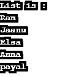
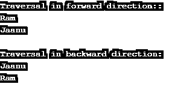
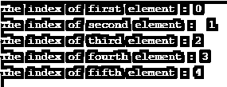
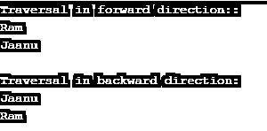
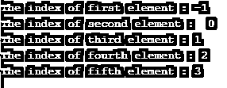

# Java 列表迭代器

> 原文：<https://www.educba.com/java-listiterator/>


## Java Listiterator 简介

在 Java 中，ListIterator 是一个双向迭代器，有助于逐个迭代列表中的元素。它可以从 Java 1.2 版获得，并扩展了接口迭代器。与普通迭代器不同，ListIterator 支持 CRUD 操作，向前和向后迭代。此外，由于光标的位置在调用 previous()时返回的元素和调用 next()时返回的元素之间，listiterator 没有当前元素。

**语法**

<small>网页开发、编程语言、软件测试&其他</small>

下面是 Java ListIterator 的语法。

```
ListIterator<T> li = list.listIterator();
```

### Java 中的 ListIterator 类是如何工作的？

正如已经讨论过的，Java ListIterator 是一个双向迭代器，可以向前和向后遍历。为了支持这一功能，有两组方法可用。

*   正向方法，如 hasNext()、Next()、nextIndex()
*   反向方法，如 hasPrevious()、Previous()、previousIndex()

这些方法将在下一节详细讨论。

让我们看看 ListIterator 是如何工作的。

#### 1.创建一个姓名列表

```
List<String> nm = new ArrayList<String>();
nm.add("Ram");
nm.add("Jaanu");
nm.add("Elsa");
nm.add("Anna");
nm.add("payal");
```

#### 2.创建 ListIterator 对象

```
//get list iterator
ListIterator<String> li =nm.listIterator(); In the beginning, the Cursor of ListIterator will be pointed before the first element in the List. On calling the methods li.hasNext() and li.next() in a while loop, the cursor will be moved to the last element in the list. In order to start traversing from last, li.hasPrevious( ) and li.previous() methods will be called. On reaching the first element and again calling the same method will return a false value.
```

### Java 列表迭代器的方法

以下是 Java ListIterator 中使用的不同方法。

#### 1.添加(东榆树)

元素 elm 将被插入列表中。**代码:**

```
import java.util.ArrayList;
import java.util.List;
import java.util.ListIterator;
public class ListIterExample {
public static void main(String a[])
{
ListIterator<String> li = null;
List<String> nm = new ArrayList<String>();
//add the elements to the list
nm.add("Ram");
nm.add("Jaanu");
nm.add("Elsa");
nm.add("Anna");
nm.add("payal");
//get list iterator
li=nm.listIterator();
System.out.println("List is :");
while(li.hasNext()){
System.out.println(li.next());
}
}
}
```

**输出:**




#### 第二个 hasNext()

如果迭代器在正向遍历过程中有下一个元素，将返回 True。

**代码:**

```
import java.util.ArrayList;
import java.util.List;
import java.util.ListIterator;
public class ListIterExample {
public static void main(String a[])
{
ListIterator<String> li = null;
List<String> nm = new ArrayList<String>();
nm.add("Ram");
nm.add("Jaanu");
//get list iterator
li=nm.listIterator();
System.out.println("List is :");
//iterates if next element is present in forward direction
while(li.hasNext()){
System.out.println(li.next());
}
}
}
```

**输出:**


#### 3.hasPrevious()

如果迭代器在反向遍历过程中有下一个元素，将返回 True。

**代码:**

```
import java.util.ArrayList;
import java.util.List;
import java.util.ListIterator;
public class ListIterExample {
//main method
public static void main(String a[])
{
//
ListIterator<String> li = null;
List<String> nm = new ArrayList<String>();
nm.add("Ram");
nm.add("Jaanu");
//get list iterator
li=nm.listIterator();
System.out.println("Traversal in forward direction::");
while(li.hasNext()){
System.out.println(li.next());
}
System.out.println("\nTraversal in backward direction:");
while(li.hasPrevious()){
System.out.println(li.previous());
}
}
}
```

**输出:**




#### 4.下一个()

将返回下一个元素，并将光标位置前移。

**代码:**

```
import java.util.ArrayList;
import java.util.List;
import java.util.ListIterator;
public class ListIterExample {
public static void main(String a[])
{
ListIterator<String> li = null;
List<String> nm = new ArrayList<String>();
nm.add("Ram");
nm.add("Jaanu");
//get list iterator
li=nm.listIterator();
System.out.println("List is :");
//iterates if next element is present in forward direction
while(li.hasNext()){
System.out.println(li.next());
}
}
}
```

**输出:**


#### 5\. nextIndex()

将为调用 next()时返回的元素返回索引。

**代码:**

```
import java.util.ArrayList;
import java.util.List;
import java.util.ListIterator;
public class ListIterExample {
//main method
public static void main(String a[])
{
//
ListIterator<String> li = null;
List<String> nm = new ArrayList<String>();
nm.add("Ram");
nm.add("Jaanu");
nm.add("Khan");
nm.add("Alia");
nm.add("Jhanvi");
//get list iterator
li=nm.listIterator();
System.out.println("The index of first element : " + li.nextIndex());
li.next();
System.out.println("The index of second element :  " + li.nextIndex());
li.next();
System.out.println("The index of third element : " + li.nextIndex());
li.next();
System.out.println("The index of fourth element : " + li.nextIndex());
li.next();
System.out.println("The index of fifth element : " + li.nextIndex());
}
}
```

**输出:**




#### 6.上一个()

将返回前一个元素，光标位置将向后移动。

**代码:**

```
import java.util.ArrayList;
import java.util.List;
import java.util.ListIterator;
public class ListIterExample {
//main method
public static void main(String a[])
{
//
ListIterator<String> li = null;
List<String> nm = new ArrayList<String>();
nm.add("Ram");
nm.add("Jaanu");
//get list iterator
li=nm.listIterator();
System.out.println("Traversal in forward direction::");
while(li.hasNext()){
System.out.println(li.next());
}
System.out.println("\nTraversal in backward direction:");
while(li.hasPrevious()){
System.out.println(li.previous());
}
}
}
```

**输出:**




#### 7.previousIndex()

将为调用 previous()时返回的元素返回索引。

**代码:**

```
import java.util.ArrayList;
import java.util.List;
import java.util.ListIterator;
public class ListIterExample {
//main method
public static void main(String a[])
{
//
ListIterator<String> li = null;
List<String> nm = new ArrayList<String>();
nm.add("Ram");
nm.add("Jaanu");
nm.add("Khan");
nm.add("Alia");
nm.add("Jhanvi");
//get list iterator
li=nm.listIterator();
System.out.println("The index of first element : " + li.previousIndex());
li.next();
System.out.println("The index of second element :  " + li.previousIndex());
li.next();
System.out.println("The index of third element : " + li.previousIndex());
li.next();
System.out.println("The index of fourth element : " + li.previousIndex());
li.next();
System.out.println("The index of fifth element : " + li.previousIndex());
} }
```

**输出:**




#### 8.移除()

调用 next()或 previous()时返回的最后一个元素将被移除。

**代码:**

```
import java.util.ArrayList;
import java.util.List;
import java.util.ListIterator;
public class ListIterExample {
//main method
public static void main(String a[])
{
//
ListIterator<String> li = null;
List<String> nm = new ArrayList<String>();
nm.add("Ram");
nm.add("Jaanu");
nm.add("Kavya");
nm.add("Dileep");
nm.add("Sam");
nm.add("Anna");
//get list iterator
li=nm.listIterator();
System.out.println("List is : " + nm);
li.next();
li.next();
li.remove();
System.out.println("After calling remove() method : " + nm);
}
}
```

**输出:**


#### 9.集合(英语)

用指定元素替换 next()或 previous()返回的最后一个元素(可选操作)。

**代码:**

```
import java.util.ArrayList;
import java.util.List;
import java.util.ListIterator;
public class ListIterExample {
//main method
public static void main(String a[])
{
//
ListIterator<String> li = null;
List<String> nm = new ArrayList<String>();
nm.add("Ram");
nm.add("Jaanu");
nm.add("Kavya");
nm.add("Dileep");
nm.add("Sam");
nm.add("Anna");
//get list iterator
li=nm.listIterator();
System.out.println("List is : " + nm);
li.next();
li.next();
li.set("Anjali");
System.out.println("After calling set() method : " + nm);
}
}
```

**输出:**


### 结论

ListIterator 是 Java 中的双向迭代器，它逐个迭代列表中的元素。与普通迭代器不同，ListIterator 支持 CRUD 操作。本文详细讨论了 ListIterator 的不同方面。

### 推荐文章

这是一个 Java Listiterator 的指南。这里我们讨论 ListIterator 类如何在 Java 中工作以及方法。您也可以看看以下文章，了解更多信息–

1.  [Java varargs](https://www.educba.com/java-varargs/)
2.  [Java 谓词](https://www.educba.com/java-predicate/)
3.  [JavaScript 范围](https://www.educba.com/javascript-range/)
4.  Java 分区偏移


