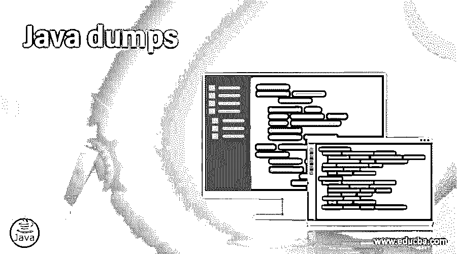

# Java 转储

> 原文：<https://www.educba.com/java-dumps/>




## Java 转储简介

Java 转储是当虚拟机由于网络问题、内存错误或当用户启动任何类型的按键组合而意外停止时，错误创建的一些 Java 核心。可以很容易地创建 Java 转储，方法是调用包含在应用程序源代码中的 Java 转储 API，或者通过命令行直接提供-Xdump:java 选项。Java Dump 通过提供一些有用的信息来帮助最终用户排除故障和诊断应用程序意外停止运行时发生的暂停的根本原因。

**语法**

<small>网页开发、编程语言、软件测试&其他</small>

java 转储没有特定的语法，因为对 Java 转储的需求取决于问题的根本原因，如前所述，根本原因可能是多种多样的。因此，当用户需要诊断根本原因并希望使用 jcmd 工具执行分析时，只需向 JVM 发送所需的请求，并且在运行时必须使用用于向机器和 Java 程序发送请求的相同系统。因此，语法定义如下:

```
jcmd <process_ id> GC.heap_dump <pathname_for_file>
```

其中传递的参数有 **:**

**< process_id > :** 用于为 java 程序正在执行的进程提供 id。

**<文件路径名> :** 如上所述，文件将被传递到的路径的名称。

### Java 中的转储是如何工作的？

Java 转储工作流非常有趣，因为它在机器崩溃或由于提到的各种原因(如网络中断、内存错误等)导致系统意外停机时，为最终用户或程序员提供了巨大的帮助。此外，任何形式的妨碍 java 程序执行的错误都可以通过使用 Java 转储进行故障排除和根本原因诊断来避免。Java 中的转储工作基于以下一些场景:

*   java 应用程序可能由于一般保护错误而崩溃，并自动生成 Java 转储文件的场景。为了克服和理解根本原因，非常需要理解线程类型或者正确地知道正在执行的当前线程，以便容易地识别问题。
*   另一种情况可能是由于 Java 堆耗尽内存，这也会自动生成 Java 转储。
*   一个场景可能是因为死锁情况，其中所有线程的目标是同时获取相同的线程作为资源。
*   也可能会出现突然挂起的情况，用户可能已经运行了击键组合。
*   有几种方法来处理上述情况，这意味着找到根本原因并捕捉异常，其中包括许多 Java 转储工具，这些工具为最终用户提供了在立即崩溃或任何其他不太受欢迎的情况(如 halt 或 OutOfMemory 事件)时进行调试和故障排除的便利性和灵活性。

通过使用 Java 转储工具和技术，有不同的方法来捕获所有场景及其根本原因。它们在解决与内存泄漏相关的问题和内存优化问题时非常有用。它们大多以二进制格式存储在 hprof 文件中，可以使用以下工具和技术进行可视化和分析:

*   通过向 JDK 工具(如 jmap)提供适当的进程 Id 和文件路径，使用这些工具。
*   当 JVM 中的同一台机器用于头转储以读取根本原因和确认时，使用负责发出请求和响应的 jcmd 为 JVM 服务。
*   JVM 也是 JDK 的[部分的一个工具，用于增强和提供帮助，以便轻松地检查 java 转储。](https://www.educba.com/what-is-jdk/)
*   也可以通过编程方式自动捕获转储，然后相应地获得输出。

### Java 转储的示例

此示例演示了线程在资源上执行死锁，现在它们已经获得了资源上的锁，因此有可能使用命令行中提到的命令通过 Java 转储来分析资源上的死锁。

```
public class Java_lock_Dump_Demo {
public static void main(String[] args) throws InterruptedException {
Object ob_a = new Object();
Object ob_b = new Object();
Object ob_c = new Object();
Thread Java_lock_Dump_DemoThread1 = new Thread (new       Java_lock_Dump_Demo_Sync_Thread(ob_a, ob_b ), "Java_lock_Dump_DemoThread1");
Thread Java_lock_Dump_DemoThread2 = new Thread (new Java_lock_Dump_Demo_Sync_Thread(ob_b, ob_c ), "Java_lock_Dump_DemoThread2");
Thread Java_lock_Dump_DemoThread3 = new Thread (new Java_lock_Dump_Demo_Sync_Thread(ob_c, ob_a ), "Java_lock_Dump_DemoThread3");
Java_lock_Dump_DemoThread1.start();
Thread.sleep(3000);
Java_lock_Dump_DemoThread2.start();
Thread.sleep(3000);
Java_lock_Dump_DemoThread3.start();
}
}
class Java_lock_Dump_Demo_Sync_Thread implements Runnable {
private Object ob_a;
private Object ob_b;
public Java_lock_Dump_Demo_Sync_Thread(Object ob_a, Object ob_b) {
this.ob_a = ob_a;
this.ob_b = ob_b;
}
@Override
public void run() {
String nm = Thread.currentThread().getName();
synchronized (ob_a) {
System.out.println(nm + " acquire_the_lock_on_first_resource " + ob_a);
try {
Thread.sleep(10000);
} catch (InterruptedException e) {
e.printStackTrace();
}
synchronized (ob_b) {
System.out.println(nm + " acquire_the_lock_on_second_resource " + ob_b);
}
System.out.println(nm + " Release_the_lock_for_second_object " + ob_b);
}
System.out.println(nm + " Release_the_lock_for_first_object " + ob_a);
System.out.println(nm + " Completed with the deadlock_test for acquiring the resource.");
}
}
```

**输出:**


如何获得上面编译的代码的转储可以使用以下命令来完成:

*   首先，在命令行中使用以下命令检索进程 id:JSP
*   然后，在获得进程 id 后，在命令行中运行以下命令:

```
Jcmd<Process_id> GC.heap_dump <file-path>
jcmd 20528 GC.heap_dump C:\Users\adutta\eclipse-workspace\Matcher_Example\src
```

### 结论

java 转储被认为是 Java 中一个非常有趣的特性，因为它为程序员和用户提供了在程序运行暂停以及机器内存空间不足时摆脱不想要和意外情况的能力。它还为用户提供了有关根本原因或故障排除问题的详细和适当的内容。

### 推荐文章

这是一个 Java 转储指南。在这里，我们讨论转储如何在 Java 中工作，并举例说明代码和输出。您也可以看看以下文章，了解更多信息–

1.  [Java 别名](https://www.educba.com/java-alias/)
2.  [Java 按值调用](https://www.educba.com/java-call-by-value/)
3.  [JavaScript 数组切片](https://www.educba.com/javascript-array-slice/)
4.  [JavaScript Minify](https://www.educba.com/javascript-minify/)


