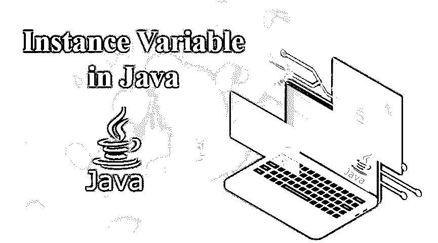
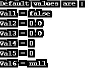
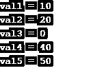

# Java 中的实例变量

> 原文：<https://www.educba.com/instance-variable-in-java/>




## Java 中的变量介绍

每当在类或函数中调用对象时，就会创建 Java 程序中的实例，每次调用对象和创建实例时，都会使用变量来分配内存存储单元。对实例执行的任何更改或操作都将自动反映在实例变量和相应的内存单元中。这种类型的变量由几种数据类型支持，即 int、char、long、short、boolean、float、double、byte 和 object。

**语法:**

<small>网页开发、编程语言、软件测试&其他</small>

```
<datatype>  <variable_name>;
<datatype>  <variable_name> = <initializing_value>;
```

主要有 3 种类型的变量:

*   局部变量
*   实例变量
*   类/静态变量

### Java 中的实例变量

实例变量在类中声明/定义，但在构造函数、方法和块之外。这样称呼实例变量是因为它们是特定于实例(对象)的，并且不在实例(对象)之间共享，并且对特定实例的变量所做的更改不会反映到其他实例上。当为堆中的对象分配内存时，会为每个实例变量创建一个槽。对象的实例变量在用“new”创建对象时创建，在销毁对象时销毁。对象使用它们来保存状态。

**语法:**

```
public class Employee {
public String Name; // instance variable with public Access.
private int salary ; // instance variable with private access.
public static String company; // not an instance variable as it is Static and the value it holds is
//   not instance but class specific.
}
```

### 声明实例变量

实例变量有默认值；因此，与局部变量不同，它们可以在没有初始化的情况下声明。变量的默认值取决于它们的数据类型。

| **Datatype** | **默认值** |
| 布尔型 | 错误的 |
| 字节 | Zero |
| 短的 | Zero |
| （同 Internationalorganizations）国际组织 | Zero |
| 长的 | 0L |
| 茶 | u0000 |
| 漂浮物 | 0.0f |
| 两倍 | 0.0d |
| 目标 | 空 |

### Java 中实例变量的特点

*   实例变量对构造函数、方法和块是可见的。通常建议将它们声明为私有的，但是用户可以通过用适合他们程序的各种访问修饰符来声明可见性来改变可见性的级别。
*   变量名通常调用实例变量，但是当在静态方法中使用这些变量时，应该使用带有变量引用的完全指定的名称来调用它们。
    **语法:**

    ```
    Objectreference.variable_name
    ```

*   基类的实例变量可以被子类使用，这取决于变量的访问级别。
*   可以将实例变量声明为 final，以保护已声明变量的常量。最终实例变量在声明时被初始化，并且不能被修改。它们也可以在块和构造函数中声明和初始化。
*   实例变量可以使用默认的访问修饰符。
*   可以声明实例变量。如果一个变量被声明为瞬态变量，它不会被序列化为字节流。它的状态变化不被存储。在反序列化中，当从字节流创建回对象时，瞬态变量保存它们各自的数据类型的默认值。
*   实例变量不能有 abstract、synchronized、strictfp 或 native 修饰符，因为这些修饰符仅适用于方法。
*   实例变量不能声明为静态的，如果声明了，它们就变成了类级变量。

### Java 中实例变量的例子

java 中的实例变量示例如下:

#### 示例#1

**代码:**

```
import java.io.*;
public class Employee {
// this instance variable can be accessed any child class since it is public.
public String Name;
// Since salary is a private variable, it  is visible in this class only.
private int salary;
// static variable  is same among the instances
public static String company;
// The name variable is initialized in the constructor
public Employee (String eName) {
Name = eName;
}
public void setSalary(int eSal) {
salary = eSal;
}
public void printEmp() {
System.out.println("name  : " + Name );
System.out.println("salary :" + salary);
System.out.println("Company :" + Employee.company);
}
public static void main(String args[]) {
Employee.company = "Google";
Employee employee_one = new Employee("Jack");
employee_one .setSalary(100000);
employee_one .printEmp();
Employee employee_two = new Employee("Jill");
employee_two .setSalary(200000);
employee_two .printEmp();
}
}
```

**输出:**


在上面的例子中，我们可以看到实例变量和静态变量的区别。我们为雇员创建了两个对象。对象的名字和工资不一样，但是两者的公司是一样的。这是因为它是一个静态变量，其余的都是实例变量。

通过更改行“private int salary 在上面的代码中改为" private final int salary = 500".我们正在改变变量的行为。因为我们试图修改一个最终变量，编译器抛出以下错误。

**输出:**


#### 实施例 2

**代码:**

```
import java.io.*;
public class DefaultValues {
boolean val1;
double val2;
float val3;
int val4;
long val5;
String val6;
public static void main(String[] args) {
System.out.println("Default values are :");
DefaultValues d = new DefaultValues();
System.out.println("Val1 = " + d.val1);
System.out.println("Val2 = " + d.val2);
System.out.println("Val3 = " + d.val3);
System.out.println("Val4 = " + d.val4);
System.out.println("Val5 = " + d.val5);
System.out.println("Val6 = " + d.val6);
}
}
```

上面的代码片段在执行时会产生下面的输出。如前所述，如果实例变量在声明时没有初始化，它们就有默认值。这个程序打印所有数据类型的默认值。

**输出:**




#### 实施例 3

**代码:**

```
import java.io.*;
public class Test implements Serializable
{
// Normal variables
int val1 = 10;
int val2 = 20;
// Transient variables
transient int val3 = 30;
// Use of transient has no impact here
transient static int val4 = 40;
transient final int val5 = 50;
public static void main(String[] args) throws Exception
{
Test input = new Test();
// serialization
FileOutputStream fos = new FileOutputStream("abc.txt");
ObjectOutputStream oos = new ObjectOutputStream(fos);
oos.writeObject(input);
// de-serialization
FileInputStream fis = new FileInputStream("abc.txt");
ObjectInputStream ois = new ObjectInputStream(fis);
Test output = (Test)ois.readObject();
System.out.println("val1 = " + output.val1);
System.out.println("val2 = " + output.val2);
System.out.println("val3 = " + output.val3);
System.out.println("val4 = " + output.val4);
System.out.println("va15 = " + output.val5);
}
}
```

执行上面的程序会产生下面给出的输出。变量 val3 被声明为瞬态的，所以当测试对象被序列化时，它的值没有被存储到字节流中，而 val4 和 val5 不是实例变量，因为它们违反了实例变量的规则。因此它们的状态不受影响。

**输出:**




### 推荐文章

这是一个 Java 实例变量的指南。在这里，我们讨论 Java 中实例变量的介绍和特点，以及各种例子。您也可以阅读以下文章，了解更多信息——

1.  [Java 持久性 API](https://www.educba.com/java-persistence-api/)
2.  [Java ActionListener](https://www.educba.com/java-actionlistener/)
3.  [Scala vs Java](https://www.educba.com/scala-vs-java/)
4.  [Java StringJoiner](https://www.educba.com/java-stringjoiner/)


