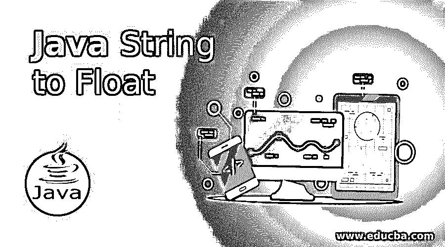

# 要浮动的 Java 字符串

> 原文：<https://www.educba.com/java-string-to-float/>




## Java 字符串浮动简介

如果我们必须对包含浮点类型数字的字符串数据执行一些数学计算，通常会使用字符串到浮点的转换。有些情况下，我们以字符串的形式读取数据，我们需要将它转换为 float 来执行所需的操作。在这些情况下，我们需要使用 Java API 将字符串类型转换为浮点型。

### Java 中如何将 String 转换成 Float？

在 java 中，将字符串转换为浮点主要有四种不同的方法:

<small>网页开发、编程语言、软件测试&其他</small>

*   **Using float.valueOf():** 这是一个 Float 类的内置静态方法，它接受要转换为 Float 的给定字符串，并返回与传递的输入字符串相对应的 Float 值。如果传递的字符串不是有效数字，此方法可以引发 NumberFormatException，如果 null 作为输入传递，则引发 NullPointerException。这将返回一个 Float 类的原始对象。
*   **Using Float.parseFloat():** 这也是 Float 类的一个内置静态方法，它接受要转换为 Float 的给定字符串，并返回与传递的输入字符串相对应的 Float 值。这将返回一个原始的浮点值，这与 valueOf()方法不同，后者返回一个浮点对象。
*   **使用构造函数:**这仅仅涉及到使用 float 类构造，它接受 string 参数作为输入并返回一个 Float。
*   **使用 java.text.DecimalFormat 类:**该方法包括创建 java.text.DecimalFormat 类的一个实例，调用 DecimalFormat 类的 parse 方法，该方法接受要转换为 float 的字符串作为输入，然后调用方法 floatValue 来获取对应于给定字符串的 float 值。
*   根据我们的要求，上面提到的四种方法中的任何一种都可以用来将 float 转换成 string。

#### 句法

**1 .Float.valueOf ()**

```
public static Float valueOf(String input) throws NumberFormatException
```

在上面的语法中，input 是要转换为 float 的字符串。上述方法的返回类型是浮动包装类的一个对象。

**2。Float.parseFloat** ()

```
public static float parseFloat(String input) throws NumberFormatException
```

在上面的语法中，input 是要转换为 float 的字符串。上述方法的返回类型是一个浮点值。

**3。使用构造函数**

```
new Float(String input)
```

使用要转换为 float 的字符串作为输入来调用上面的构造函数，会给出对应于给定字符串的 float 值。

**4 .文本.十进制格式**

```
DecimalFormat format= new DecimalFormat (“#”);
format.parse(String input).floatValue();
```

在上面的方法中，首先创建 java.text.DecimalFormat 的实例，然后使用 parse 方法接受 string 作为输入类型，然后使用 floatValue()方法获取浮点值。

**Note:** All the above methods may throw an exception in case an invalid string is passed as input.

### 要浮动的 Java 字符串示例

下面是要浮动的 Java 字符串的各种例子:

#### 示例#1

此示例显示了如何使用 parseFloat()方法将 string 转换为 Float。

**代码:**

```
public class StringToFloatDemo{
public Float convertStringToFloat(String stringvalue){
try{
float floatValue= Float.parseFloat(stringvalue);
return floatValue;
}
catch(NumberFormatException e){
System.out.println ("NumberFormatException occurred.");
System.out.println(stringvalue + " is not a valid number.");
return null;
}
}
public static void main(String args[])
{
StringToFloatDemo demo = new StringToFloatDemo();
String input= "201.5";
float output= demo.convertStringToFloat("201.50");
System.out.println("Float Value of " + input + " is : " + output);
}
}
```

**输出:**


在出现异常的情况下，让我们考虑如果将“Edubca”作为输入传递给 convertStringToFloat 函数，那么它将显示以下输出:


#### 实施例 2

在这个例子中，我们将展示如何使用构造函数方法将 string 转换为 float。

**代码:**

```
public class StringToFloatDemo{
public Float convertStringToFloat(String stringvalue){
try{
float floatValue = new Float(stringvalue);
return floatValue;
}
catch(NumberFormatException e){
System.out.println ("NumberFormatException occurred.");
System.out.println(stringvalue + " is not a valid number.");
return null;
}
}
public static void main(String args[])
{
StringToFloatDemo demo = new StringToFloatDemo();
String input= "200";
float output= demo.convertStringToFloat(input);
System.out.println("Float Value of " + input + " is : " + output);
}
}
```

**输出:**


与示例 1 类似，如果一个无效字符串作为输入传递，那么将生成 NumberFormatException。

#### 实施例 3

在这个例子中，我们将展示如何使用 float 类的 valueOf()方法将 string 转换为 Float。

**代码:**

```
public class StringToFloatDemo{
public Float convertStringToFloat(String stringvalue){
float floatValue;
try{
floatValue= Float.valueOf(stringvalue);
return floatValue;
}catch (NumberFormatException e)
{
System.out.println ("NumberFormatException occurred.");
System.out.println(stringvalue + " is not a valid number.");
return null;
}
}
public static void main(String args[])
{
StringToFloatDemo demo = new StringToFloatDemo();
String input= "200";
float output= demo.convertStringToFloat(input);
System.out.println("Float Value of " + input + " is : " + output);
}
}
```

**输出:**


类似于示例 1 和 2，如果一个无效的字符串作为输入被传递，那么 NumberFormatException 将被生成。

#### 实施例 4

在这个例子中，我们将展示如何使用 DecimalFormat 类将 string 转换成 float。

**代码:**

```
import java.text.DecimalFormat;
import java.text.ParseException;
public class StringToFloatDemo{
public Float convertStringToFloat(String stringvalue){
float floatValue;
DecimalFormat decimalFormat = new DecimalFormat("#");
try {
floatValue = decimalFormat.parse(stringvalue).floatValue();
return floatValue;
} catch (ParseException e) {
System.out.println("Parse Exception Occurred");
System.out.println(stringvalue + " is not a valid number.");
return null;
}
}
public static void main(String args[])
{
StringToFloatDemo demo = new StringToFloatDemo();
String input= "200";
float output= demo.convertStringToFloat(input);
System.out.println("Float Value of " + input + " is : " + output);
}
}
```

**输出:**


如果一个无效的字符串作为输入被传递，那么将会产生解析异常。

让我们考虑这样一种情况，当我们将“Edubca”而不是 200 作为上述程序的输入时；那么将产生以下错误:


### 推荐文章

这是一个 Java 字符串浮动指南。这里我们讨论基本概念，例子，以及如何在 Java 中将字符串转换成浮点。您也可以看看以下文章，了解更多信息–

1.  [Java 文字](https://www.educba.com/java-literals/)
2.  [备忘单 JavaScript](https://www.educba.com/cheat-sheet-javascript/)
3.  [Java 用户输入](https://www.educba.com/java-user-input/)
4.  [Java 流过滤器](https://www.educba.com/java-stream-filter/)


