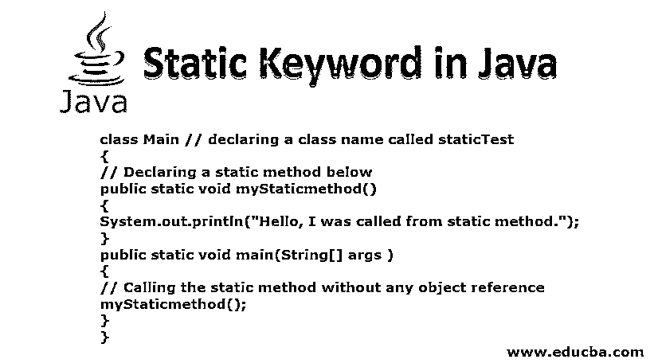

# Java 中的静态关键字

> 原文：<https://www.educba.com/static-keyword-in-java/>




## Java 中静态关键字介绍

Java 是一种流行的编程语言，用于开发软件程序和应用程序，开发于 90 年代中期。Java 与所有现代操作系统兼容。它的流行是因为它提供了某些条款来确保应用程序范围的安全性和可重用性，比如静态成员。在 Java 中，static 关键字主要用于确保高效的系统内存管理和公共属性的可重用性。我们可以对变量、方法、嵌套类以及代码块使用 static 关键字。Static 在 Java 中用作非访问修饰符。Static 关键字指示特定成员属于某个类型本身，而不是该特定类型的单个实例。这意味着只能创建该静态成员的一个实例，并在该类的所有实例之间共享。

### 创建静态方法

要声明一个静态成员，不管它是块、变量、方法还是嵌套类，我们都需要在成员前面加上关键字 static。当我们将一个成员声明为静态时，我们可以在创建它的任何类对象之前访问它，因为它独立于它的类对象。

<small>网页开发、编程语言、软件测试&其他</small>

在下面的示例中，我们将创建一个静态方法，看看如何在不引用其类的情况下调用它:

**代码:**

```
class Main // declaring a class name called staticTest
{
// Declaring a static method below
public static void myStaticmethod()
{
System.out.println("Hello, I was called from static method.");
}
public static void main(String[] args )
{
// Calling the static method without any object reference
myStaticmethod();
}
}
```

**输出:**


### 创建一个包含多个静态块的类

有时我们需要执行某些计算来初始化我们的静态变量。在这种情况下，我们可以声明一个静态块，在类第一次执行时只加载一次。

**举例:**

**代码:**

```
class Main
{
// Declaring a static variable below
static int a = 10;
static int b;
// Declaring a static block below
static
{
System.out.println( " In static block now. " );
b = a*2;
}
public static void main( String[] args )
{
System.out.println(" Value of b : " + b);
}
}
```

**输出:**


现在转到静态变量，它们主要是全局变量，因为当一个变量被声明为静态变量时，只有该变量的一个副本被创建并在一个类中的所有对象之间共享。我们需要考虑我们只能在类的层次上创建一个静态变量。如果一个程序既有静态变量又有静态块，那么静态变量和静态块将按照它们在程序中被写入的顺序执行。

一个方法是 Java 当[用前面的静态关键字](https://www.educba.com/static-keyword-in-c-sharp/)声明时，它被称为静态方法。Java 中最常用的静态方法是 main 方法。[Java](https://www.educba.com/methods-in-java/)中用静态关键字声明的方法也伴随着几个限制。

其中一些列举如下:

*   静态方法只允许调用其他静态方法。
*   静态方法只能直接访问静态数据。
*   静态方法在任何情况下都不能引用 this 或 super。

**为什么 Java 中的 Main 方法是静态的？**

*   Java 中的 main 方法是静态的，因为我们不要求对象能够调用 main 方法。
*   如果它是一个非静态方法，那么我们将首先需要 JVM ( [Java 虚拟机](https://www.educba.com/what-is-jvm/))来调用类对象，这将不是一个内存高效的过程，因为它将需要额外的内存来这样做。

### 静态成员的用例

你可能会想，在什么情况和场景下我们应该使用静态成员和变量？

我们可以对所有对象共有的任何属性使用静态变量。例如，如果我们有一个名为 student 的类，那么所有的 Student 对象将共享 college name 的相同属性，在这种情况下可以声明为一个静态变量。当静态变量的值独立于它们的类对象时，我们也可以使用静态变量。

**举例:**

**代码:**

```
class Student
{
int roll_no; // declaring an instance variable
String name;
static String college_name ="KC College"; // declaring a static variable for common property college name
//declaring the class constructor below
Student(int r, String n)
{
roll_no = r;
name = n;
}
// declaring a method to display the values
void display ()
{
System.out.println(roll_no+" "+name+" "+college_name);
}
}
//Declaring a test class to display the values of objects
public class Main{
public static void main(String args[]){
Student st1 = new Student(111,"Karan");
Student st2 = new Student(222,"Arjun");
//below we have changed the college name which was a common property of all objects with a single line of code
Student.college_name ="Jain Hind College";
st1.display();
st2.display();
}
}
```

**输出:**


### Java 中的静态嵌套类

*   在 Java 中，我们不能将顶级类声明为静态的，但是如果需要的话，我们可以将它的嵌套类声明为静态的。这样的类称为嵌套静态类。
*   Java 中的静态方法在运行时被识别，由于覆盖是[运行时多态性](https://www.educba.com/what-is-polymorphism/)的一部分，静态方法不能被覆盖。我们不能将抽象方法声明为静态的。

### 结论 Java 中的静态关键字

通过上面的例子和解释，我们可以得出结论，Java 提供了一些特性和属性，如静态和抽象，这使得它使用起来安全可靠。对于开发安全性是首要考虑的系统来说，Java 仍然是一个非常受欢迎的选择。

### 推荐文章

这是一个 Java 中静态关键字的指南。这里我们讨论如何创建一个静态方法，并使用静态成员用例及其代码实现。你也可以看看下面的文章来了解更多-

1.  [Java 命令](https://www.educba.com/java-commands/)
2.  [Java 中的 Case 语句](https://www.educba.com/case-statement-in-java/)
3.  [Java 中的单例类](https://www.educba.com/singleton-class-in-java/)
4.  [Java 中的递归](https://www.educba.com/recursion-in-java/)


