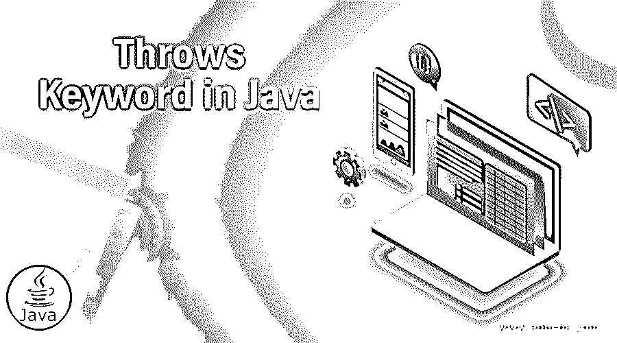
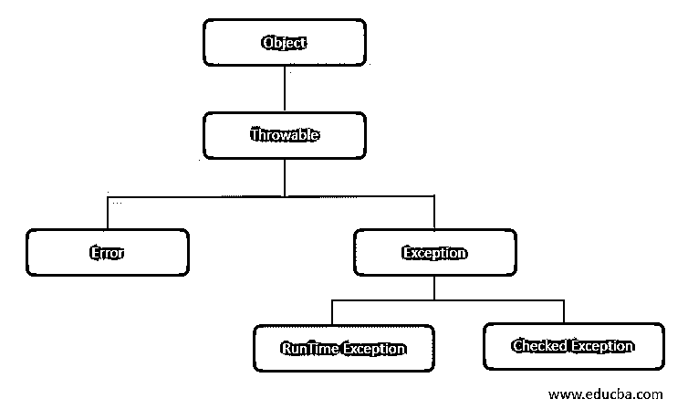

# 在 Java 中抛出关键字

> 原文：<https://www.educba.com/throws-keyword-in-java/>




## Java 中 Throws 关键字简介

Java throws 是一个用方法名声明的关键字，方法名在被调用时可能会被抛出。声明一个关键字有助于异常处理，并让编译器知道特定的方法抛出了一个检查过的异常，这需要在编译时声明，如 IOException、ClassNotFoundException。如果没有使用 try-catch 块或 throws 关键字来处理检查过的异常，编译器将抛出一个编译时错误。这个关键字还可以帮助程序员开发一个高效的应用程序，因为他们知道正在使用的方法会抛出异常。

**语法**:

<small>网页开发、编程语言、软件测试&其他</small>

```
Access_specifierreturn_typemethod_namethrowsexception_name
```

这里，

*   **Access_specifier** :这是指告诉 JVM 从哪里可以访问特定方法的关键字。例如私有/公共或受保护的。
*   **Return_type** :表示被调用方法返回的对象的数据类型的关键字，如 int、Boolean 或 String 等。
*   **Method_name** :指需要调用的方法的名称。
*   **exception_name** 可以是一个内置异常，也可以是一个自定义异常，方法在运行程序流时可能会引发该异常。

**例如:**

```
public void my_method() throws MyException
```

### Throws 关键字在 Java 中是如何工作的？

错误和异常对于一个 java 应用程序来说非常重要。它有助于确定发生了什么不合适的事情，如语法错误或输入的内容与数据不匹配。此外，错误是不可避免的，只会导致编译错误，并以不可预测的方式停止应用程序的执行；在某种程度上可以处理异常。




处理异常意味着，如果发生异常，如何以正确和果断的方式停止执行。

因为有两种类型的例外:

*   **未检查的异常**:这些类型的异常是运行时异常，如果它们在代码中被处理，编译器不会检查它们。示例-算术异常、IndexOutOfBoundsException 等。对这些类型的异常使用 throws 关键字是没有意义的。
*   **已检查的异常**:这些是编译器在编译时检查的异常类型，无论它们是否正在被处理。因此，如果不处理这些异常，编译器会抛出错误——未处理的异常类型。示例–io exception，ClassNotFoundException。

#### 双向手柄

因此，有两种方法来处理检查异常:

##### 1.试着接住

使用 try-catch，可以将可能引发异常的语句放在 try 块中，如果出现异常，控制权将转到 catch 块中的语句并执行它们。这样，我们可以在出现异常的情况下控制应用程序的流程。

**代码:**

```
//package Proc;
class MyCustomeException extends Throwable{
MyCustomeException(String s){
super(s);
}
}
public class prac1
{
public static void main(String[] args)    {
try{
System.out.println("Now exception is being raised");
throw new MyCustomeException("Custom exception is thrown");
}
catch(MyCustomeException e){
System.out.println("Here exception is caught and handled");
}
}
}
```

**输出:**


**解释:**在上面的例子中，我们声明了一个自定义异常，并使用 throw 关键字在 main 方法中显式地抛出它。一旦 control 进入方法 control 并引发异常，它就直接转到 catch 块，执行那些语句，然后退出程序。

##### 2.Throws 关键字

用方法名声明这个关键字告诉编译器该方法可以抛出异常。这个关键字很容易与 throw 关键字混淆，throw 关键字是用来在我们的代码中故意抛出一个异常，或者在处理自定义异常时抛出。

*   Throws 关键字-only 让我们在发生异常时执行语句。它不能用来避免异常的发生。因此，它用于异常处理。
*   Throws 关键字经常与用于显式抛出异常的 throw 混淆。投掷是用来处理它的。
*   Throws 关键字有助于程序员使程序在异常发生时也能平稳有效地运行。

### 用 Java 实现 Throws 关键字的例子

我们可以以两种方式使用 throws 关键字:

#### 示例#1

首先，我们可以在抛出异常的方法声明中使用 throws。

**代码:**

```
/package Proc;
public class prac1
{
public static void main(String[] args)throws IllegalAccessException
{
System.out.println("Hello Everyone lets start our learning with throws keyword");
throw new IllegalAccessException("My Exception");
}
}
```

**输出:**


**解释:**在上面的例子中，我们使用了 throws 关键字来处理使用 throw 关键字抛出的异常。如果出现异常，也不会阻止程序的异常终止；相反，它有助于说服编译器。此外，它有助于通知程序员该方法可能会抛出异常，需要异常处理。

#### 实施例 2

第二，我们在调用可能抛出异常的方法时使用 try-catch 块。我们在这里创建了一个名为 MyCustomeException 的自定义异常，它是由 throwsDemo 方法抛出的。

**代码:**

```
//package Proc;
class MyCustomeException extends Throwable{
MyCustomeException(String s){
super(s);
}
}
public class prac1
{
static void throwsDemo() throws MyCustomeException
{
System.out.println("We are Inside the method");
throw new MyCustomeException("Custom exception is thrown");
}
public static void main(String[] args)throws IllegalAccessException
{
try{
System.out.println("Now exception is being raised");
throwsDemo();
}
catch(MyCustomeException e){
System.out.println("Here exception is caught and handled");
}
}
}
```

**输出:**


解释:在上面的例子中，我们有一个抛出新异常的方法。这是使用 throws 关键字指示的。但是当在 main 方法中调用该方法时，我们可以在 main 方法中使用 try-catch 块或声明 throws 关键字来处理异常。

### 结论

Throws 关键字用于 java 中的异常处理，当检查到的异常发生时，需要处理程序的流程。这与 throw 关键字不同，必须只与 checked 异常一起使用，因为它不能防止异常的发生，但有助于在发生异常时执行什么。

### 推荐文章

这是 Java 中 Throws 关键字的指南。这里我们讨论一个 Java 中 Throws 关键字的介绍，语法，它是如何与编程实例一起工作的。您也可以浏览我们的其他相关文章，了解更多信息——

1.  [Java 中的最终关键字](https://www.educba.com/final-keyword-in-java/?source=leftnav)
2.  [Java 中的超级关键字](https://www.educba.com/super-keyword-in-java/?source=leftnav)
3.  [Java 中的函数重载](https://www.educba.com/function-overloading-in-java/?source=leftnav)
4.  [在 Java 中覆盖](https://www.educba.com/overriding-in-java/?source=leftnav)


