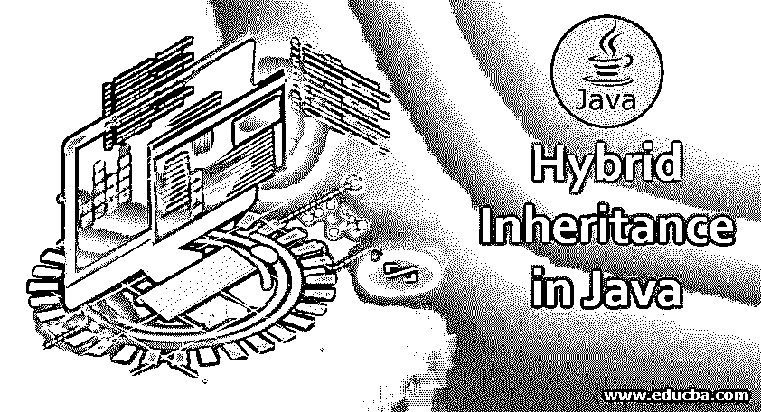
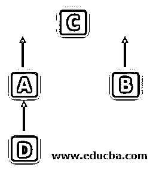

# Java 中的混合继承

> 原文：<https://www.educba.com/hybrid-inheritance-in-java/>




## Java 混合继承简介

继承是 [JAVA 语言的一个属性，其中一个类的函数和成员中的](https://www.educba.com/java-programming-language-features/)可以被其他类继承和使用。这有助于促进干净代码的使用和可重用性。JAVA 确实提供了不同种类的继承，但是有多重继承。为了克服这个缺点，JAVA 在接口的帮助下使用了混合继承。混合遗传是不同类型遗传的组合(特别是单一和[多级遗传](https://www.educba.com/multilevel-inheritance-in-c-plus-plus/))。

### 混合继承在 Java 中是如何工作的？

例如，有不同的类命名为“A”、“B”、“C”和“D”。假设类“A”和“B”扩展了类“C”。另外，另一个类“D”扩展了类“A”。这里，类“A”是子类“D”的父类，也是父类“C”的子类。这可以通过下图来证明:

<small>网页开发、编程语言、软件测试&其他</small>




混合继承的语法与普通继承没有什么不同。这里唯一需要注意的是，在同一个程序中实现了多个继承来获得结果。这种功能的优势是可以在现有功能的基础上增加功能，从而减少编码人员从头开始编写代码的工作。

### Java 中混合继承的例子

解释:下面的代码片段演示了混合继承在 JAVA 中的工作。在下面的代码中，用函数名 display()声明了四个类。Display()函数返回 void，但在内部调用 println()函数在输出屏幕中打印字符串。Println()函数是 java 的一个标准函数，使用 JAVA 输入输出库在输出屏幕上打印一个字符串。它将一个字符串作为分号下捕获的参数。

这里的主类是 test4。主类是声明主函数的类。这里主类被声明为:

```
public static void main(String args[])
```

这个主函数将一个字符串作为输入参数，并返回 void。默认情况下，这个函数是公共的，是程序执行时调用的第一个函数。main 函数创建了一个主类“test4”的对象。类 test4 的对象是“object”。此对象正在调用函数显示。因此，test4 的显示函数中的字符串被打印出来。

这里要注意的是 test4 类继承了 test1 类的属性。反过来，Test1 继承了 test3 的属性。Test 2 继承了 test3 的属性。因此，有两个类继承了 test 3，它们是:test 1 和 test2。因此，在这里我们可以看到不同类型的继承，如单一继承和层次继承。上面的例子是一个等级和单一继承的例子。

类 test1 和 test2 扩展了类 test3 →层次继承

类 test4 扩展了类 test1 →单一继承

下面的代码可以用来理解工作。

**代码:**

```
//Class test3 which works as a parent class for other two child classes.
class test3
{
// this function is used to class print function. This function name is used in other class as well but with other string in it. This feature in JAVA is called as function overloading.
public void display()
{
System.out.println("the program control is in class test3");
//JAVA standard function to print the string in the output screen.
}
}
//Here test1 class in extending test3’s function. This is hierarchal inheritance.
class test1 extends test3
{
//JAVA function overloading. Same function name is used again in the other class.
public void display()
{
System.out.println("the program control is in class test1");
}
}
//Here test2 class in extending test3’s function. This is hierarchal inheritance.
class test2 extends test3
{
public void display()
{
System.out.println("the program control is in class test2");
}
}
//This is the main class which is extending test1\. Such inheritance is called a single inheritance.
class Main extends test1
{
public void display()
{
System.out.println("The program control is in class test4 and It is an example \n to demonstrate the working of hybrid inheritance in JAVA.");
}
public static void main(String args[]){
//”object” objet is created by instantiating test4 class. His class is then used to call display() function from class test4.
Main object = new Main();
object.display();
}
}
```

**输出:**

既然 main 类在 test4 中，那么 java 程序应该从名字“test4.java”中保存。

在 CMD 中，我们需要导航到保存该文件的路径。在这种情况下，我将文件保存在桌面上。然后输入“JAVAC test4”来编译程序。JAVA”。编译完成后，可以在桌面上看到一个名为“test4.class”的新文件。这是 JAVA 的可执行文件。它由系统以与主文件名相同的名称保存，但只有名称从。然后我们可以使用命令“JAVA test4”执行该文件，并找到输出结果。


### 结论

混合继承是在一个继承中实现两种不同继承类型功能的好方法。JAVA 提供的这一特性支持代码重用。JAVA 不支持多重继承，但是可以借助接口和继承来享受这种功能。当我们试图让代码重用、[多态、](https://www.educba.com/polymorphism-in-java/)和[封装等标准实践符合行业标准时，这非常有用。这些实践确保了在更长的一段时间内易于代码维护。](https://www.educba.com/encapsulation-in-java/)

### 推荐文章

这是一个 Java 混合继承的指南。这里我们讨论混合继承在 Java 中是如何工作的？以及示例。您也可以看看以下文章，了解更多信息–

1.  [Java 中的方法](https://www.educba.com/methods-in-java/)
2.  [JAVA 中的 Swing 程序](https://www.educba.com/swing-program-in-java/)
3.  [Java 私有](https://www.educba.com/private-in-java/)
4.  [Java 本地时间](https://www.educba.com/java-localtime/)


