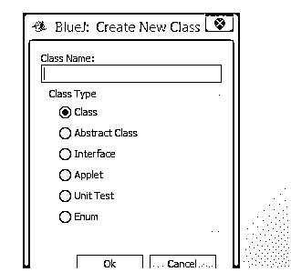
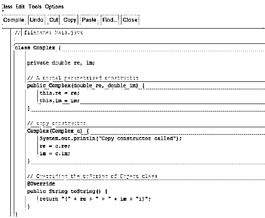
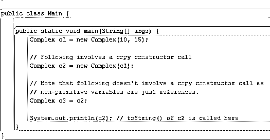
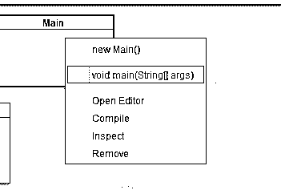
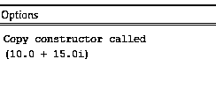
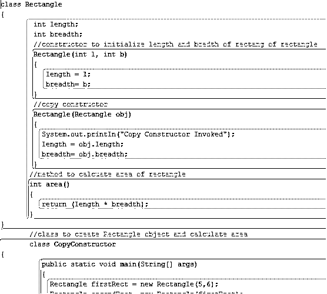
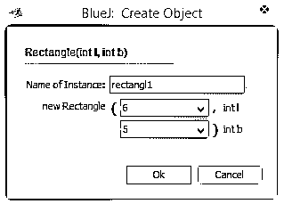
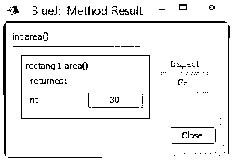

# 用 Java 复制构造函数

> 原文：<https://www.educba.com/copy-constructor-in-java/>

## Java 中的复制构造函数简介

Java 中的复制构造函数与类名同名，它们没有任何类似 int、float 和 decimal 的返回值。它们在为类创建对象时非常有用。Java 中的复制构造函数创建一个已经注册的构造函数的对象并执行它。Java 语言是一种[面向对象的编程语言](https://www.educba.com/object-oriented-programming-in-java/)，支持构造函数。当没有给相应的变量赋值时，通常会分配一个构造函数。构造函数确保这样做。通常调用复制构造函数来初始化变量中的空值。

在创建对象时会自动调用构造函数。创建 Java 程序时，很容易创建复制构造函数。在本文中，我将介绍 Java Blue J 平台中的复制构造函数。像构造函数一样，复制构造函数也没有返回类型，它与类名同名。它可以是参数化或非参数化的构造函数。复制构造函数用于创建与现有对象具有相同值的对象的精确副本。构造函数没有任何返回值。void 被认为是返回值类型之一，所以即使是 void 也不允许作为构造函数的返回值之一。

<small>网页开发、编程语言、软件测试&其他</small>

### 在 Java 中使用复制构造函数

复制构造函数的工作方式与构造函数非常相似。它复制构造函数的值并创建一个对象。最初，在 BlueJ 中通过给出类名来创建一个类。类名的类型可以是可变的。它可以是一个[抽象类、接口](https://www.educba.com/java-interface-vs-abstract-class/)、Applet、单元测试或者 Enum 或枚举。于是相应地给出了类名，给出了构造函数的名字，与类名相同。这就是我们在 Java Blue J 平台中初始化类的方法。

在下面提到的程序中，有两个构造函数。这两个构造函数与类名同名，并且它们没有任何返回类型。注释部分清楚地描述了正在初始化的两个相关的构造函数。它们也是构造函数内部的变量，称为“re”和“I m”第一个构造函数是一个参数化的构造函数，将“re”作为 double，将“im”作为 double。在这个()的帮助下，变量被赋予用户想要输入的值。又创建了另一个构造函数，称为复制构造函数，也像第一个例子中那样复杂。每当调用复制构造函数时，它都会打印一条名为“复制构造函数已调用”的消息它将值存储在对象“c”中。有一个 toString()也在 main()中返回值。它具有指定的特定打印格式，并且将被打印。

下面的代码是在 BlueJ 平台上运行的。BlueJ 是用 Java 语言编写代码的最著名的平台之一。可以非常容易地编写代码并将其合并到 Blue J 中，以获得所需的输出和结果。

下面的代码显示了 main()和字符串 args[]用于防止任何未知的参数和干扰进程。注释部分清楚地描述了正在初始化的不同构造函数。第一个对象是“c1”，其中值 10 和 15 通过参数化的构造函数传递。接下来，对象“c2”也被创建，对象 c1 通过参数化的构造函数传递。最后，对象“c3”也被创建，其中包含“c2”的值。然后使用打印功能打印 c2。

下面的代码显示了被调用的 main()。main()将创建一个对象，如果调用 void main()，程序将显示相应的输出。还有一些选项可以打开编辑器，检查我们编写的代码，并对可以在平台上执行的合适代码进行更改。此外，通过选择平台上的 Remove 选项，可以从 BlueJ 平台上删除以下代码。

每当我们点击代码时，我们都会非常顺利地得到给定的输出。输出以 print 语句中给定的格式平滑地打印输出。打印声明中也给出了括号。

因此，复制构造函数用于复制对象中的构造函数。复制构造函数很有用，因为它们可以用来清晰地复制我们想要创建的构造函数的对象。另一个示例代码和输出如下图所示。

rectangle()要求矩形的长度和宽度有两个值。输入的值分别是 6 和 5。

矩形的面积值在输出选项卡中给出，如下所示。它返回值 30 作为矩形的面积。

### 结论

我们通过这段代码非常耐心地注意到，Blue J 平台可以运行构造函数，也可以复制构造函数。简单地说，复制构造函数用于创建一个已经存在的构造函数的对象。复制构造函数被用在许多编程语言中，如 [C++和 Java](https://www.educba.com/c-plus-plus-vs-java/) 。示例 Java 代码清楚地描述了已经显示的输出。“复制构造函数调用”消息已经清楚地显示出来，打印的格式也显示出来。

在第二个代码中，打印矩形的区域，其输出如上所示。复制构造函数在许多程序中并不使用，除非是在有一系列复杂打印语句的地方。这是一个非常类似于 Java 和许多编程语言中使用的递归的概念。Copy，顾名思义，就是正在使用的构造函数的复印件。本文展示并总结了在 BlueJ 这样的编程语言中，如何构造一个与类名同名的构造函数，并创建它的副本或复制品来打印特定的语句。

### 推荐文章

这是一个在 Java 中复制构造函数的指南。这里我们讨论 Java 中复制构造函数的介绍，并且它正在工作。您也可以浏览我们推荐的其他文章，了解更多信息——

1.  [最佳 Java 编译器](https://www.educba.com/best-java-compilers/)
2.  [Java 中的构造函数和析构函数](https://www.educba.com/constructor-and-destructor-in-java/)
3.  [复制 C++中的构造函数](https://www.educba.com/copy-constructor-in-c/)
4.  [Java 中的构造函数](https://www.educba.com/constructor-in-java/)

