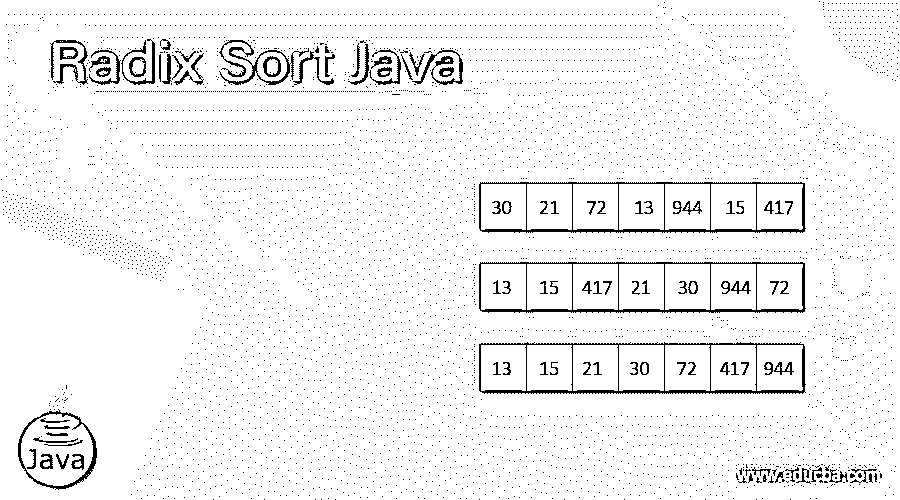

# 基数排序 Java

> 原文：<https://www.educba.com/radix-sort-java/>




## 基数排序 Java 简介

Java 中的基数排序是一种整数排序算法，它使用整数键，并用共享相同有效位置和位值的单个数字对键进行分组。然后，按照升序/降序对元素进行排序。基数排序的主要思想是从最低有效位到最高有效位逐位进行排序。它使用计数排序作为子例程来排序一组数字。基数排序结合了计数排序，因此它可以对大量的多位数进行排序，而不必通过增加算法排序的关键字范围来降低效率。让我们更深入地研究基数排序，用几个例子看看基数排序在 Java 中是如何工作的。

**语法**

<small>网页开发、编程语言、软件测试&其他</small>

基数排序有算法步骤或如何执行排序的流程图。那么我们来看看基数排序的算法。

### 基数排序算法

**第一步:**首先我们需要找到数组中最大的元素，即 max 元素。让我们把 X 看作最大元素的位数。

我们需要计算 X，因为我们需要遍历最大元素的位置值。

**第二步:**现在，我们需要遍历最大元素的每个位置值。

**第三步:**我们需要使用任何稳定的排序算法对每个有效位值的数字进行排序。

**步骤 4:** 元素现在根据单位位值{X=0}的位数进行排序

**第五步:**然后，根据十位数{X=10}对元素进行排序

**第六步:**然后，根据百位数{X=100}对元素进行排序

**步骤 7:** 如果数组中的元素还有位置值，即基于 X 值，则重复上述步骤。

### Java 中基数排序是如何执行的？

让我们用一些例子来检查基数排序是如何实现的。

#### 示例#1

**代码:**

```
import java.util.*;
public class radixSorting {
static int get_maxVal(int radixArr[], int arrLen) {
int maxVal = radixArr[0];
for (int i = 1; i < arrLen; i++)
if (radixArr[i] > maxVal)
maxVal = radixArr[i];
return maxVal;
}
static void countSorting(int radixArr[], int arrLen, int exp) {
int resultArray[] = new int[arrLen];
int i;
int countVal[] = new int[10];
Arrays.fill(countVal,0);
for (i = 0; i < arrLen; i++)
countVal[ (radixArr[i]/exp)%10 ]++;
for (i = 1; i < 10; i++)
countVal[i] += countVal[i - 1];
for (i = arrLen - 1; i >= 0; i--) {
resultArray[countVal[ (radixArr[i]/exp)%10 ] - 1] = radixArr[i];
countVal[ (radixArr[i]/exp)%10 ]--;
}
for (i = 0; i < arrLen; i++)
radixArr[i] = resultArray[i];
}
static void radix_array_sort(int radixArr[], int arrLen) {
int m = get_maxVal(radixArr, arrLen);
for(int exp = 1; m/exp > 0; exp *= 10)
countSorting(radixArr, arrLen, exp);
}
public static void main (String[] args) {
int radixArr[] = {32,456,71,10,9,892,55,90,23,667};
int arrLen = radixArr.length;
System.out.println("Array after radix sort is ");
radix_array_sort(radixArr, arrLen);
for (int i=0; i<arrLen; i++)
System.out.print(radixArr[i]+" ");
}
}
```

**输出:**


在这里，我们可以看到输入数组已经使用基数排序和计数排序进行了排序。

#### 实施例 2

**代码:**

```
import java.util.Arrays;
public class RadixSorting {
public static void sorting(int[] inputArray) {
RadixSorting.sorting(inputArray, 10);
}
public static void sorting(int[] inputArray, int radix) {
if (inputArray.length == 0) {
return;
}
int minVal = inputArray[0];
int maxVal = inputArray[0];
for (int i = 1; i < inputArray.length; i++) {
if (inputArray[i] < minVal) {
minVal = inputArray[i];
} else if (inputArray[i] > maxVal) {
maxVal = inputArray[i];
}
}
int exponentVal = 1;
while ((maxVal - minVal) / exponentVal >= 1) {
RadixSorting.countingSort_by_digit(inputArray, radix, exponentVal, minVal);
exponentVal *= radix;
}
}
private static void countingSort_by_digit(
int[] inputArray, int radix, int exponentVal, int minVal) {
int bucket_index;
int[] bucket = new int[radix];
int[] output = new int[inputArray.length];
for (int i = 0; i < radix; i++) {
bucket[i] = 0;
}
for (int i = 0; i < inputArray.length; i++) {
bucket_index = (int)(((inputArray[i] - minVal) / exponentVal) % radix);
bucket[bucket_index]++;
}
for (int i = 1; i < radix; i++) {
bucket[i] += bucket[i - 1];
}
for (int i = inputArray.length - 1; i >= 0; i--) {
bucket_index = (int)(((inputArray[i] - minVal) / exponentVal) % radix);
output[--bucket[bucket_index]] = inputArray[i];
}
for (int i = 0; i < inputArray.length; i++) {
inputArray[i] = output[i];
}
}
public static void main(String args[])
{
RadixSorting rs = new RadixSorting();
int radix_input[] = {72, 15, 30, 21, 13, 944, 417};
System.out.println("Original Input Array:");
System.out.println(Arrays.toString(radix_input));
rs.sorting(radix_input);
System.out.println("Sorted Array using Radix Sort:");
System.out.println(Arrays.toString(radix_input));
}
}
```

**输出:**


所以在这里，我们使用不同的逻辑来获得使用基数排序的输入数组。

现在，让我用一个实例来解释或展示基数排序是如何完成的，

我们将输入数组取为[72，15，30，21，13，944，417]

**第一步:**从数组中取出最大值，即 944。因此，现在 X 值将是 3，即 X =最大元素中的位数，这实际上意味着数组的排列将进行三次

**第二步:**所以，现在我们将尝试根据最低有效位来排列数字。

考虑到单元中所有元素的位置值，将数组重新排列如下，

[30, 21, 72, 13, 944, 15, 417]

考虑到所有元素的十位值，将数组重新排列如下，

[13, 15, 417, 21, 30, 944, 72]

考虑到所有元素的百位值，如果有的话，将重新排列数组如下，

[13, 15, 21, 30, 72, 417, 944]

**第三步:**这就对数组进行了排序。

### 结论

至此，我们将结束文章“Java 中的基数排序”我们已经看到什么是基数排序，以及如何使用计数排序来实现它。这是最简单的排序形式之一，如果键很短，即元素的范围较小，则速度更快。在过去的几年里，排序技术已经被广泛应用于日常算法中。但是，也有一些缺点；基数排序非常依赖于输入，即字母或数字，因此不如其他排序灵活。

### 推荐文章

这是一个基数排序 Java 的指南。这里我们讨论 Java 中基数排序的性能，以及它的代码实现和输出的例子。您也可以看看以下文章，了解更多信息–

1.  [Java 中的排序字符串](https://www.educba.com/sort-string-in-java/)
2.  [Java Base64 解码](https://www.educba.com/java-base64-decode/)
3.  [Java 扫描器类](https://www.educba.com/java-scanner-class/)
4.  [numpy.sort](https://www.educba.com/numpy-sort/)


