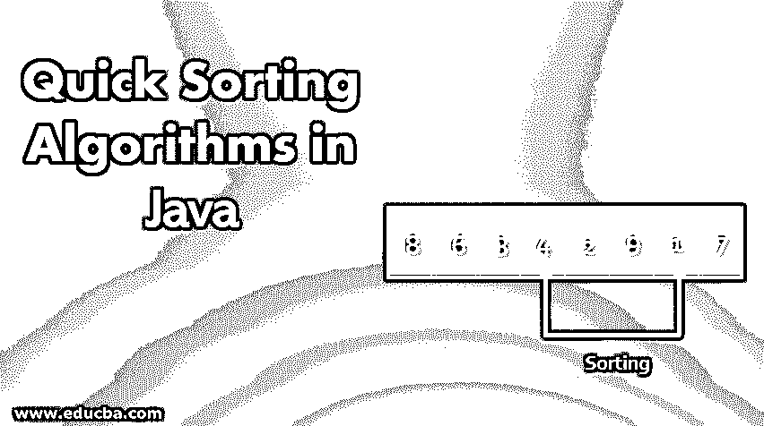

# Java 中的快速排序算法

> 原文：<https://www.educba.com/quick-sorting-algorithms-in-java/>




## Java 快速排序算法简介

java 中的快速排序，也称为分区交换排序，是一种分治排序算法。快速排序是最好地利用 CPU 缓存的算法的一个很好的例子，因为它的划分和征服性质。快速排序算法(Quicksort algorithm)是[使用最多的排序算法](https://www.educba.com/sorting-algorithms-in-javascript/)之一，尤其是对大型列表的排序，大部分编程语言都实现了。快速排序算法将原始数据分为两部分:单独排序，然后合并以产生排序后的数据。

让我们考虑数组{8，6，3，4，9，2，1，7}需要使用快速排序来排序[。](https://www.educba.com/quick-sort-in-data-structure/)

<small>网页开发、编程语言、软件测试&其他</small>

### 实现快速排序算法的步骤

1.从数组中选择一个名为 pivot 的元素。通常，选择中间元素作为支点。让我们以 4 为支点。

2.将数组重新排列成两部分，使小于轴心的元素出现在轴心之前，大于轴心的元素出现在轴心之后。遵循以下步骤:

*   选取最左边的元素，即 8；由于 4 是支点，而 8 大于 4，所以需要将 8 移到 4 的右边；在右侧，我们保留 7，因为它大于 4，并选择 1 与 8 交换，因此交换后数组变为:1，6，3，4，9，2，8，7
*   选择左下一个元素，即 6；由于 4 是支点，6 大于 4，6 需要移到 4 的右边；在右侧，我们保留 7，8，因为它们大于 4，选择 2 与 6 交换，因此交换后数组变为:1，2，3，4，9，6，8，7
*   现在，因为枢轴左边的所有元素都小于枢轴，枢轴右边的所有元素都大于枢轴，所以我们用 4 作为枢轴。

3.对左侧子数组(元素少于轴心的数组)和右侧子数组(元素多于轴心的数组)递归应用步骤 1 和 2。如果数组只包含一个或零个元素，那么该数组被认为是混合的。

### 实现快速排序算法的程序

这是一个使用快速排序算法对整数数组进行排序的 java 程序。

**代码:**

```
import java.lang.*;
import java.util.*;
public class Main {
private int array[];
private int length;
public void sort(int[] inputArrayArr) {
if (inputArrayArr == null || inputArrayArr.length == 0) {
return;
}
this.array = inputArrayArr;
length = inputArrayArr.length;
performQuickSort(0, length - 1);
}
private void performQuickSort(int lowerIndex, int higherIndex) {
int i = lowerIndex;
int j = higherIndex;
// calculate pivot number
// middle element taken as pivot
int pivot = array[lowerIndex+(higherIndex-lowerIndex)/2];
// Divide into two subarrays
while (i <= j) {
/**
* In each iteration, find an element from left side of the pivot which
* is greater than the pivot value, and also find an element
* From right side of the pivot which is less than the pivot value. Once the search
* is complete, we exchange both elements.
*/
while (array[i] < pivot) {
i++;
}
while (array[j] > pivot) {
j--;
}
if (i <= j) {
swapNumbers(i, j);
//move index to next position on both sides
i++;
j--;
}
}
// call performQuickSort() method recursively
if (lowerIndex < j)
performQuickSort(lowerIndex, j);
if (i < higherIndex)
performQuickSort(i, higherIndex);
}
private void swapNumbers(int i, int j) {
int temp = array[i];
array[i] = array[j];
array[j] = temp;
}
public static void main(String args[]){
Main quickSort = new Main();
int[] inputArray = {8,6,3,4,9,2,1,7};
quickSort.sort(inputArray);
System.out.println("Sorted Array " + Arrays.toString(inputArray));
}
}
```

**输出:**


### 快速排序算法的优势

以下是快速排序算法的优点:

*   **出色的引用局部性:**引用局部性是指处理器在短时间内重复访问相同内存位置的能力。java 中的快速排序提供了一个很好的引用局部性，因为缓存缺失的数量非常少，这在现代体系结构中对于性能来说是至关重要的。
*   **快速排序是可并行化的:**一旦将数组划分成更小区域的初始步骤完成，所有单个子数组都可以并行地独立排序。由于这个原因，快速排序的性能更好。

### 快速排序的复杂性分析

快速排序是一种快速的尾递归算法，其工作原理是分而治之。以下是最佳、一般和最差情况下的复杂性分析:

*   **最佳情况复杂度:**如果一个数组或者一个列表包含 n 个元素，那么第一次运行就需要 O (n)。现在排序剩下的两个子数组需要 2*O (n/2)。这就得出最好情况下 O (n logn)的复杂度。
*   **平均案例复杂度:**快速排序的平均案例为 O (n log n)。
*   **最坏情况复杂性:**选择第一个或最后一个会导致近似排序或近似反向排序数据的最坏情况性能。快速排序在最坏的情况下执行 O (n^2)。

在 Java 中，数组。Sort()方法使用快速排序算法对数组进行排序。

### 推荐文章

这是一个 Java 快速排序算法的指南。在这里，我们讨论了用 java 实现快速排序算法的步骤、优点和复杂性分析，以及程序。您也可以阅读以下文章，了解更多信息——

1.  [Java 中的插入排序](https://www.educba.com/insertion-sort-in-java/)
2.  [Java 中的 do-while 循环](https://www.educba.com/do-while-loop-in-java/)
3.  [Java 中的 JComponent](https://www.educba.com/jcomponent-in-java/)
4.  [Java 中的方块](https://www.educba.com/squares-in-java/)


