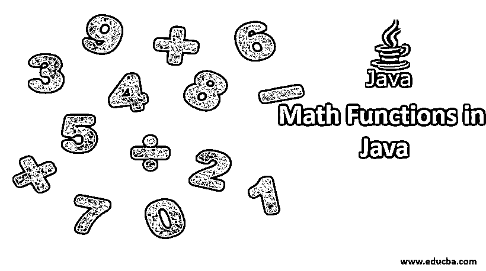
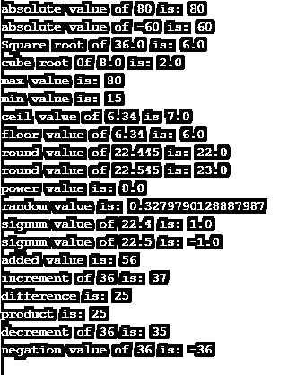
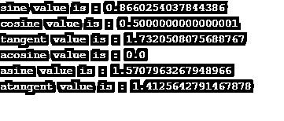

# Java 中的数学函数

> 原文：<https://www.educba.com/math-functions-in-java/>




## Java 中的数学函数介绍

Java 是最有用的编程语言之一。它有多种应用，如建筑，解决科学计算，建筑地图等。为了简化这些任务，java 提供了一个 java.lang.Math 类或 Java 中的数学函数，用于执行一些运算，如平方、指数、ceil、对数、立方、abs、三角学、平方根、floor 等。

这个类提供了两个领域，它们是数学类的基础。他们是，

<small>网页开发、编程语言、软件测试&其他</small>

*   e '是自然对数的底数(718281828459045)
*   圆周率是圆的周长与其直径之比(141592653589793)

### Java 中的各种数学函数

Java 提供了大量的数学方法。它们可以分类如下:

*   基本数学方法
*   三角数学方法
*   对数数学方法
*   双曲线数学方法
*   角度数学方法

现在，让我们详细研究一下。

#### 1.基本数学方法

为了更好地理解，我们可以在 Java 程序中实现上述方法，如下所示:

| **方法** | **返回值** | **自变量** | **例子** |
| abs() | 参数的绝对值。即正值 | 长整型、整型、浮点型、双精度型 | int n1 = Math.abs (80) //n1=80int n2 =Math.abs (-60) //n2=60 |
| sqrt() | 论点的平方根 | 两倍 | double n= Math.sqrt (36.0) // n=6.0 |
| cbrt() | 自变量的立方根 | 两倍 | double n= Math.cbrt (8.0) // n=2.0 |
| 最大() | 参数中传递的两个值的最大值 | 长整型、整型、浮点型、双精度型 | int n=Math.max(15，80) //n=80 |
| 最小值() | 参数中传递的两个值的最小值 | 长整型、整型、浮点型、双精度型 | int n=Math.min(15，80) //n=15 |
| 细胞() | 将浮点值向上舍入为整数值 | 两倍 | double n=Math.ceil(6.34) //n=7.0 |
| 地板() | 将浮点值向下舍入为整数值 | 两倍 | double n = math . floor(6.34)//n = 6.0 |
| 圆形() | 将 float 或 double 值向上或向下舍入为整数值 | 双精度浮点型 | double n = math . round(22.445)；//n = 22.0 double N2 = math . round(22.545)；//n=23.0 |
| 功率() | 第一个参数的值乘以第二个参数 | 两倍 | double n= Math.pow(2.0，3.0) //n=8.0 |
| 随机() | 介于 0 和 1 之间的随机数 | 两倍 | double n = math . random()//n = 0.2594036953954201 |
| 符号() | Sign of the passed parameter.如果为正，将显示 1。如果为负，将显示-1。如果为 0，将显示 0 | 双精度浮点型 | 双 n =数学。signum(22.4)；//n=1.0 double n2 = Math。signum(-22.5)；//n=-1.0 |
| addExact() | 参数的总和。如果获得的结果溢出 long 或 int 值，将引发异常。 | int，long | int n= Math.addExact(35，21)//n=56 |
| incrementExact() | 参数增加 1。如果获得的结果溢出 int 值，将引发异常。 | int，long | int n =数学。incrementExact(36) //n=37 |
| 减法器() | 参数的差异。如果获得的结果溢出 int 值，将引发异常。 | int，long | int n= Math.subtractExact(36，11) //n=25 |
| multiplyExact() | 参数的总和。如果获得的结果溢出 long 或 int 值，将引发异常。 | int，long | int n= Math.multiplyExact(5，5)/(n = 25) |
| 减量精确() | 参数递减 1。如果获得的结果溢出 int 或 long 值，将引发异常。 | int，long | int n =数学。decrementExact (36) //n=35 |
| negateExact() | 参数的否定。如果获得的结果溢出 int 或 long 值，将引发异常。 | int，long | int n =数学。negateExact(36) //n=-36 |
| 版权标志() | 第一个参数的绝对值以及第二个参数中指定的符号 | 双精度浮点型 | double d= Math.copySign(29.3，-17.0) //n=-29.3 |
| floorDiv() | 将第一个参数除以第二个参数，执行地板运算。 | 长整型 | int n = math . flood ov(25，3)/(n = 8) |
| 海波 | 参数的平方和并执行平方根运算。中间溢出或下溢不应该在那里。 | 两倍 | double n=Math.hypot(4，3) //n=5.0 |
| getExponent() | 无偏指数。这个指数用双精度或浮点表示 | （同 Internationalorganizations）国际组织 | double n = math . get exponent(50.45)//n = 5 |

**代码:**

```
//Java program to implement basic math functions
public class JavaMathFunctions {
public static void main(String[] args) {
int n1 = Math.abs(80);
System.out.println("absolute value of 80 is: "+n1);
int n2 = Math.abs(-60);
System.out.println("absolute value of -60 is: "+n2);
double n3 = Math.sqrt(36.0);
System.out.println("Square root of 36.0 is: "+n3);
double n4 = Math.cbrt(8.0);
System.out.println("cube root 0f 8.0 is: "+n4);
int n5= Math.max(15,80);
System.out.println("max value is: "+n5);
int n6 =Math.min(15,80);
System.out.println("min value is: "+n6);
double n7 = Math.ceil(6.34);
System.out.println("ceil value of 6.34 is "+n7);
double n8 = Math.floor(6.34);
System.out.println("floor value of 6.34 is: "+n8);
double n9 = Math.round(22.445);
System.out.println("round value of 22.445 is: "+n9);
double n10 = Math.round(22.545);
System.out.println("round value of 22.545 is: "+n10);
double n11= Math.pow(2.0, 3.0);
System.out.println("power value is: "+n11);
double n12= Math.random();
System.out.println("random value is: "+n12);
double n13 = Math. signum (22.4);
System.out.println("signum value of 22.4 is: "+n13);
double n14 = Math. signum (-22.5);
System.out.println("signum value of 22.5 is: "+n14);
int n15= Math.addExact(35, 21);
System.out.println("added value is: "+n15);
int n16=Math. incrementExact(36);
System.out.println("increment of 36 is: "+n16);
int n17 = Math.subtractExact(36, 11);
System.out.println("difference is: "+n17);
int n18 = Math.multiplyExact(5, 5);
System.out.println("product is: "+n18);
int n19 =Math. decrementExact (36);
System.out.println("decrement of 36 is: "+n19);
int n20 =Math. negateExact(36);
System.out.println("negation value of 36 is: "+n20);
}
}
```

**输出:**




#### 2.三角数学方法

下面是实现表中提到的三角数学函数的 Java 程序:

| **方法** | **返回值** | **自变量** | **例子** |
| 罪恶() | 参数的正弦值 | 两倍 | double num1 = 60//值到弧度的转换double value = math . tora dians(num 1)；print math . sine(value)//输出值为 0.86602484861 |
| cos() | 参数的余弦值 | 两倍 | double num1 = 60//值到弧度的转换double value = math . tora dians(num 1)；print math . cos(value)//输出为 0.50000000000001 |
| 谭() | 参数的正切值 | 两倍 | double num1 = 60//值到弧度的转换double value = math . tora dians(num 1)；print math . tan(value)//输出结果为 1.736887687881 |
| 阿辛() | 参数的反正弦值。或者参数的反正弦值 | 两倍 | math . asin(1.0)//1 . 5686086386867 |
| acos() | 参数的反余弦值或反余弦值 | 两倍 | math . acos(1.0)/(0.0) |
| 阿坦() | 参数的反正切值或参数的反正切值 | 两倍 | math . atan(6.267)//1。36866.68666666667 |

**代码:**

```
//Java program to implement trigonometric math functions
public class JavaMathFunctions {
public static void main(String[] args) {
double num1 = 60;
// Conversion of value to radians
double value = Math.toRadians(num1);
System.out.println("sine value is : "+Math.sin(value));
System.out.println("cosine value is : "+Math.cos(value));
System.out.println("tangent value is : "+Math.tan(value));
double num2 = 1.0;
System.out.println("acosine value is : "+Math.acos(num2));
System.out.println("asine value is : "+Math.asin(num2));
double num3 = 6.267;
System.out.println("atangent value is : "+Math.atan(num3));
Output:
```




#### 3.对数数学方法

以下是实现对数数学方法的示例程序:

| **方法** | **返回值** | **自变量** | **例子** |
| expm1() | 计算 E 的幂并从中减去 1。e 是欧拉数。所以这里，是 e <sup>x</sup> -1。 | 两倍 | double n = math . exp m1(2.0)//n = 6.38905609893065 |
| exp() | e 的给定参数的幂。也就是 e <sup>x</sup> | 两倍 | double n = math . exp(2.0)//n = 7.38905609893065 |
| 日志() | 参数的自然对数 | 两倍 | double n = math . log(38.9)//n = 3.6609942506244004 |
| 日志 10() | 参数以 10 为底的对数 | 两倍 | double n = math . log 10(38.9)//n = 1.589567676787 |
| log1p() | 参数和的自然对数。ln(x+1) | 两倍 | double n = math . log1p(26)//n = 3.295836866004329 |

**代码:**

```
//Java program to implement logarithmic math functions
public class JavaMathFunctions {
public static void main(String[] args) {
double n1 = Math.expm1(2.0);
double n2 = Math.exp(2.0);
double n3 = Math.log(38.9);
double n4 = Math.log10(38.9);
double n5 = Math.log1p(26);
System.out.println("expm1 value of 2.0 is : "+n1);
System.out.println("exp value of 2.0 is : "+n2);
System.out.println("log of 38.9 is : "+n3);
System.out.println("log10 of 38.9 is : "+n4);
System.out.println("log1p of 26 is : "+n5);
}}
```

**输出:**


#### 4.双曲线数学方法

下面是实现表中提到的双曲数学函数的 Java 程序:

| **方法** | **返回值** | **自变量** | **例子** |
| 辛赫() | 参数的双曲正弦值。即(ex–E-x)/2 这里，E 是欧拉数。 | 两倍 | double num 1 = math . sinh(30)//输出为 5.343237290762231E12 |
| 科斯() | 参数的双曲余弦值。即(ex + e -x)/2 这里 E 是欧拉数。 | 两倍 | double num 1 = math . cosh(60.0)//输出为 5.710036949078421E25 |
| tanh() | 参数的双曲正切值 | 两倍 | double num 1 = math . tanh(60.0)//输出为 1.0 |

**代码:**

```
//Java program to implement HYPERBOLIC math functions
public class JavaMathFunctions {
public static void main(String[] args) {
double n1 = Math.sinh (30);
double n2 = Math.cosh (60.0);
double n3 = Math.tanh (60.0);
System.out.println("Hyperbolic sine value of 300 is : "+n1);
System.out.println("Hyperbolic cosine value of 60.0 is : "+n2);
System.out.println("Hyperbolic tangent value of 60.0 is : "+n3);
}
}
```

**输出:**


#### 5.角度数学方法

| **方法** | **返回值** | **自变量** | **例子** |
| toRadians() | 度数角度转换为弧度角度 | 两倍 | double n = math . tora dians(180.0)//n = 3.1415265358874767 |
| 托代格里斯() | 弧度角度转换为度角度 | 两倍 | 双 n =数学。toDegrees(数学。PI) //n=180.0 |

现在，让我们看一个演示角度数学方法的示例程序。

**代码:**

```
//Java program to implement Angular math functions
public class JavaMathFunctions {
public static void main(String[] args) {
double n1 = Math.toRadians(180.0);
double n2 = Math. toDegrees (Math.PI);
System.out.println("Radian value of 180.0 is : "+n1);
System.out.println("Degree value of pi is : "+n2);
}
}
```

**输出:**


### 结论

Java 提供了各种各样的数学函数来执行不同的任务，如科学计算、架构设计、结构设计、构建地图等。这份文件讨论了几个基本的，三角，对数和角度的数学函数，并附有示例程序和例子。

### 推荐文章

这是一个 Java 数学函数的指南。这里我们讨论 Java 中数学函数的 5 种方法，包括代码和输出。您也可以浏览我们的其他相关文章，了解更多信息-

1.  [PHP 数学函数](https://www.educba.com/php-math-functions/)
2.  [Python 中的数学函数](https://www.educba.com/math-functions-in-python/)
3.  [C 语言中的数学函数](https://www.educba.com/math-functions-in-c/)
4.  [c#中的数学函数](https://www.educba.com/math-functions-in-c-sharp/)


