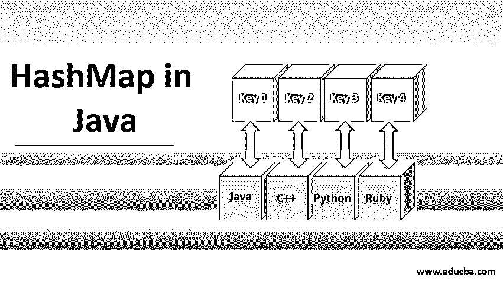

# Java 中的 HashMap

> 原文：<https://www.educba.com/hashmap-in-java/>




## Java 中 HashMap 的介绍

在 Java 中，可以使用数组存储数据，但是每当需要以键和值的方式存储或检索数据时，就必须使用 HashMap。Hashmap 是 Java 中的一个集合，属于名为 map 的接口的层次结构下的[。在本文中，我们将从 Java 编程的角度讨论 Hashmap。](https://www.educba.com/hierarchy-in-tableau/)

**语法:**

<small>网页开发、编程语言、软件测试&其他</small>

要在代码中使用 HashMap，必须导入(导入 java.util.HashMap 包)或其父类。

```
import java.util.HashMap;
import java.util.Map;
HashMap<datatypeOfkey, dataytpeOfValue> <name_of_hashMap> =new HashMap<datatypeOfkey, dataytpeOfValue> ();
```

其中，datatypeOfkey 和 dataytpeOfValue 可以是整数或字符串。

**举例:**

```
Map<String, String> newHashMap = new HashMap<>();
```

### HashMap 在 Java 中是如何工作的？

Hashmap 使用散列技术来存储和检索元素。对于存储，它使用一个被称为桶的链表。它在键上使用了两种方法:equals()和 hashCode()用于插入和检索操作。插入时，hashCode 决定存储的桶。之后，hashCode 再次检查是否已经有一个 hashCode 相等的键；如果是，该值将被新值替换。如果没有，则创建新的映射，并将值存储到该映射中。在检索数据时，hashCode 决定了搜索的桶。之后，hashCode()和 equals()获取值并返回该值。如果没有值，则返回 null。

### Java 中的 HashMap 构造函数

它有四个构造函数，如下所述。

1.  **HashMap():** 是默认的一个，加载因子为 0.75，容量为 16。
2.  **HashMap(int<capacity>):**使用参数中定义的容量创建 HashMap。负载系数是这里的默认值。
3.  **HashMap(int < capacity >，float < load_Factor > ):** 使用其参数中定义的容量和负载因子创建 HashMap。
4.  **HashMap(Map < K，V > m):** 创建参数映射中定义的 HashMap。

### Java 中 HashMap 的 13 大方法

这里讨论的所有下面的方法都可以在任何版本的 Java 中使用。

1.  **public value get(Object key):**用于获取对应 key 的值。
2.  **public value put(K key，V value):** 插入在相应键的参数中提到的值。
3.  **public boolean contains Key(Object key):**判断 key 是否存在，注意返回类型是 Boolean。
4.  **public boolean containsValue(对象值):**判断值是否存在，注意返回类型是 boolean。
5.  **public V remove(Object key):**清除代码中指定的特定键及其值形式的 HashMap。
6.  **public void clear():** 如上所述，清除 HashMap 中的所有键和值。
7.  **public boolean isEmpty():** 验证 HashMap 是否为空。
8.  这个方法返回一个 HashMap 的映射，用于克隆另一个 HashMap。
9.  **public int size():** 返回大小，即一个 HashMap 中有多少个键值对。
10.  **公共集<地图。Entry < K，V>T5】entry set():**HashMap 中映射的集合通过这个方法返回。
11.  **public Set<K>keySet()**:HashMap 中的键集通过这个方法返回。
12.  **public void putAll(Map<Map _ name>):**将整个地图内容复制到对方。
13.  **集合值():**你可以得到一个 HashMap 的所有值的集合。

### Java 中散列表的例子

HashMap 是一个基于映射的集合类，用于存储键/值对。让我们看几个例子。

#### 示例#1

我们将在这里讨论 HashMap 的一些代码示例。您应该通过自己编写代码来练习，并在 java 编译器上运行来检查输出。您可以将输出与给定的输出进行匹配以进行验证。创建 HashMap 并在其中插入数据。

**代码:**

```
import java.util.HashMap;
import java.util.Map;
public class CreateHashMapExample {
public static void main(String[] args) {
// Creating a HashMap
Map<String, String> newHashMap = new HashMap<>();
// Addition of key and value
newHashMap.put("Key1", "Java");
newHashMap.put("Key2", "C++");
newHashMap.put("Key3", "Python");
// Addition of new key and value
newHashMap.putIfAbsent("Key4", "Ruby");
System.out.println(newHashMap);
}
}
```

**输出:**


#### 实施例 2

让我们再举一个例子，我们将一个字符串作为键，将一个整数作为值。这里我们将测量键及其相应的英寸值作为值。

**代码:**

```
import java.util.HashMap;
public class CreateHashMapExample2 {
public static void main(String[] args) {
// Create a HashMap object called measurement
HashMap<String, Integer> ms = new HashMap<String, Integer>();
// Add keys and values (Name and phone number of the person)
ms.put("S", 35);
ms.put("M", 38);
ms.put("L", 40);
ms.put("XL", 42);
for (String key : ms.keySet()) {
System.out.println("measurement of " + key + " in inch is: " + ms.get(key));
}
}
}
```

**输出:**


#### 实施例 3

在这里，我们将做多件事。我们将首先创建一个散列表；然后我们将逐个获取它的值。之后，我们将把散列表的所有数据复制到一个全新的散列表中。之后，我们将删除一个项目，并获得他们的大小。如果尺寸降低了一个，则确认通过移除减小了尺寸。

**代码:**

```
import java.util.Collection;
import java.util.HashMap;
import java.util.Map;
public class HashMapInJava {
public static void main(String[] args) {
Map<String, String> newHashMap = new HashMap<>();
// Addition of key and value
newHashMap.put("Key1", "Lenovo");
newHashMap.put("Key2", "Motorola");
newHashMap.put("Key3", "Nokia");
newHashMap.put("Key4", null);
newHashMap.put(null, "Sony");
System.out.println("Original map contains:" + newHashMap);
//getting size of Hashmap
System.out.println("Size of original Map is:" + newHashMap.size());
//copy contains of one Hashmap to another
Map<String, String> copyHashMap = new HashMap<>();
copyHashMap.putAll(newHashMap);
System.out.println("copyHashMap mappings= " + copyHashMap);
//Removal of null key
String nullKeyValue = copyHashMap.remove(null);
System.out.println("copyHashMap null key value = " + nullKeyValue);
System.out.println("copyHashMap after removing null key = " + copyHashMap);
System.out.println("Size of copyHashMap is:" + copyHashMap.size());
}
}
```

**输出:**


当我们打印键和值的时候，你是否注意到了所有例子中 HashMap 输出的一点？这张照片没有按顺序排列。Hashmap 不像数组，扫描和打印需要排序；它可以根据自己的哈希值选择随机。

### 结论

当您的代码或用例需要处理键值对中的数据时，您应该使用 HashMap。在本文中，我们通过代码示例学习了 Java 中的 hashmaps。但是，首先，您应该自己练习编写代码来掌握这个主题。

### 推荐文章

这是 Java 中散列表的指南。在这里，我们讨论 Java 中 HashMap 及其方法的介绍，以及代码实现和输出。您也可以浏览我们推荐的文章，了解更多信息——

1.  [HTML 框架](https://www.educba.com/html-frames/)
2.  [HTML 属性](https://www.educba.com/html-attributes/)
3.  [什么是 JVM？](https://www.educba.com/what-is-jvm/)
4.  [Java class not found exception](https://www.educba.com/java-classnotfoundexception/)


