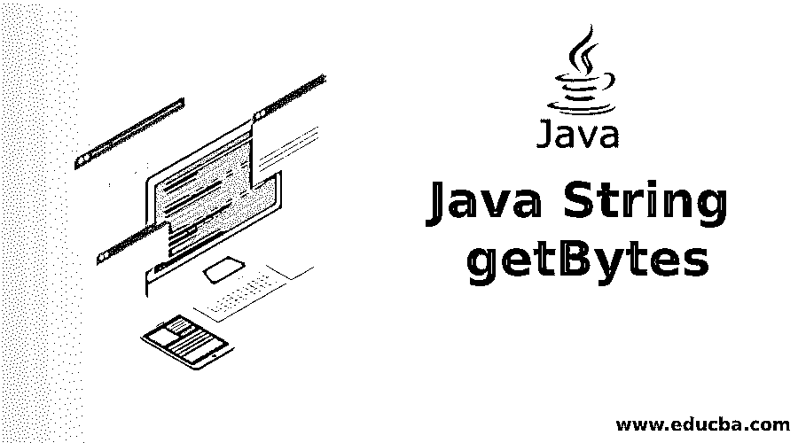
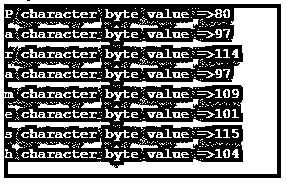
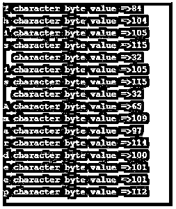
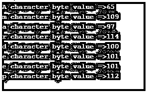
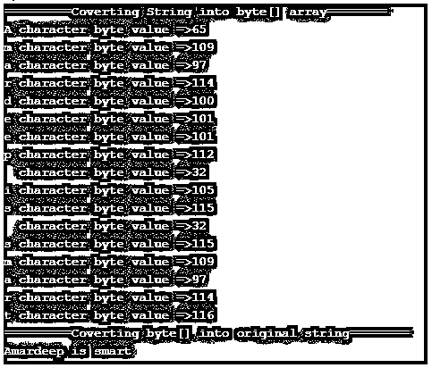
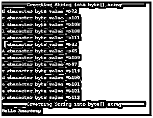

# Java String getBytes

> 原文：<https://www.educba.com/java-string-getbytes/>




## Java 字符串 getBytes 简介

Java 中的 getBytes()方法定义为“将字符串转换成一个字节的数组”。getBytes()方法返回 byte[]数组。Java 中的 getBytes()方法仅适用于字符串。字节数组中的每个字符串值都被转换成它的等效 ASCII(美国信息交换标准代码)值。我们可以说它是数据的一种编码形式，以防止对数据的未知操作。

**实时应用:**当我们要将字符串转换成字节数组时，那么 getBytes()方法就进入了画面。

<small>网页开发、编程语言、软件测试&其他</small>

### getBytes()在 Java 中是如何工作的？

Java getBytes()方法以 3 种方式基于字符串值工作:

*   公用位元组[]个位元组()

**语法:**

```
String str="Some String";
Byte[] byteArray=Str.getBytes();
```

*   public byte[]getBytes(String String)引发 UnsupportedEncodingException。java 应用程序中支持字符集的标准如下:

*   **US-ASCII:** 是 7 位 ASCII 字符。
*   **ISO-8859-1:** 是 ISO(印度标准组织)拉丁字母。
*   **UTF-8:** 是一种 8 位通用编码字符集格式。
*   **UTF-16BE:** 这是按照大端顺序的 16 位通用编码字符集格式。
*   **UTF-16LE:** 这是按小端顺序排列的 16 位通用编码字符集。
*   **UTF-16:** 16 位通用编码字符集格式。

**语法:**

```
String str=”UTF-16”;
Byte[] byteArray=Str.getBytes();
```

**Note:** If the given data is not convertible, then it throws an UnsupportedEncodingException exception**.**

*   公共字节[] getBytes(字符集字符集)

**语法:**

```
Byte[] byteArray=Str.getBytes(“ASCII”);
```

### Java 字符串 getBytes 的示例

以下是 Java 字符串 getBytes 的示例:

#### 示例#1

公用位元组[]个位元组()

**代码:**

```
package com.getbytes;
public class GetBytesOfNames {
public static void main(String args[]) {
String name = "Paramesh"; /// defining a string
byte[] nameByteArray = name.getBytes(); // converting string into byte array
for (int i = 0; i < nameByteArray.length; i++) {// iterating byte array values
System.out.println(name.charAt(i) + " character byte value =>" + nameByteArray[i]);// displaying values
}
}
}
```

**输出:**




**说明:**

*   正如您在输出中看到的，通过应用 getBytes()方法，相应的字符给出了它的等价 ASCII 代码。

#### 实施例 2

公用位元组[]个位元组()

**代码:**

```
package com.getbytes;
public class GetBytesOfSpaceValues{
public static void main(String args[]) {
String name = "This is Amardeep"; /// defining a string
byte[] nameByteArray = name.getBytes(); // converting string into byte array
for (int i = 0; i < nameByteArray.length; i++) {// iterating byte array values
System.out.println(name.charAt(i) + " character byte value =>" + nameByteArray[i]);// displaying values
}
}
}
```

**输出:**




**说明:**

*   正如您在输出中看到的，通过应用 getBytes()方法，相应的字符给出了它的等价 ASCII 代码。
*   甚至空格也有 ASCII 值。

#### 实施例 3

public byte[] getBytes(String 字符串)

**代码:**

```
package com.getbytes;
import java.io.UnsupportedEncodingException;
public class GetBytesString {
public static void main(String args[]) {
String name = "Amardeep"; // defining a string
byte[] nameByteArray;
try {
nameByteArray = name.getBytes("UTF-8");
for (int i = 0; i < nameByteArray.length; i++) {// iterating byte array values
System.out.println(name.charAt(i) + " character byte value =>" + nameByteArray[i]);// displaying values
}
} catch (UnsupportedEncodingException e) {
// TODO Auto-generated catch block
e.printStackTrace();
} // converting string into byte array
}
}
```

**输出:**




**说明:**

*   正如您在输出中看到的，通过应用 getBytes()方法，相应的字符给出了它的等价的 UTF-8 代码。

#### 实施例 4

public byte[] getBytes(String 字符串)

**代码:**

```
package com.getbytes;
import java.io.UnsupportedEncodingException;
public class GetBytesOfNames {
public static void main(String args[]) {
String name = "Amardeep is smart"; // defining a string
byte[] nameByteArray;
try {
nameByteArray = name.getBytes("UTF-8");
System.out.println("=========Coverting String into byte[] array========");
for (int i = 0; i < nameByteArray.length; i++) {// iterating byte array values
System.out.println(name.charAt(i) + " character byte value =>" + nameByteArray[i]);// displaying values
}
String string=new String(nameByteArray);//converting byte array into string
System.out.println("=========Coverting byte[] into original string========");
System.out.println(string);
} catch (UnsupportedEncodingException e) {
// TODO Auto-generated catch block
e.printStackTrace();
} // converting string into byte array
```

**输出:**




**说明:**

*   正如您在输出中看到的，通过应用 getBytes()方法，相应的字符给出了它的等价的 UTF-8 代码。
*   UTF-8 字节数组再次转换成原来的字符串。它的结论是原始信息不能丢失。

#### 实施例 5

公共字节[] getBytes(字符集字符集)

**代码:**

```
package com.getbytes;
import java.nio.charset.Charset;
public class GetBytesCharSet {
public static void main(String args[]) {
String name = "Hello"; // defining a string
byte[] nameByteArray = name.getBytes(Charset.forName("ASCII"));
System.out.println("=========Coverting String into byte[] array========");
for (int i = 0; i < nameByteArray.length; i++) {// iterating byte array values
System.out.println(name.charAt(i) + " character byte value =>" + nameByteArray[i]);// displaying values
}
}
}
```

**输出:**


**说明:**

*   正如您在输出中看到的，通过应用 getBytes()方法，相应的字符给出了它的等价 ASCII 代码。

#### 实施例 6

公共字节[] getBytes(字符集字符集)

**代码:**

```
package com.getbytes;
import java.nio.charset.Charset;
public class GetBytesOfCharSetAndString {
public static void main(String args[]) {
String name = "Hello Amardeep"; // defining a string
byte[] nameByteArray = name.getBytes(Charset.forName("ASCII"));
System.out.println("=========Coverting String into byte[] array========");
for (int i = 0; i < nameByteArray.length; i++) {// iterating byte array values
System.out.println(name.charAt(i) + " character byte value =>" + nameByteArray[i]);// displaying values
}
String string=new String(nameByteArray);
System.out.println("=========Coverting String into byte[] array========");
System.out.println(string);
}
}
```

**输出:**




**说明:**

*   正如您在输出中看到的，通过应用 getBytes()方法，相应的字符给出了它的等价 ASCII 代码。
*   ASCII 码字节数组再次转换成原始字符串。它的结论是原始信息不能丢失。

### 结论

基于 getBytes()、getBytes(String 字符串)和 getBytes(Charset 字符集)，可以将 String 转换成其等价的 ASCII 码、UTF 码、ISO 码。

### 推荐文章

这是一个 Java 字符串 getBytes 的指南。这里我们讨论基本概念、例子，以及 getBytes()在 Java 中是如何工作的，还有不同的例子。您也可以看看以下文章，了解更多信息–

1.  [Java 字符串操作符](https://www.educba.com/java-string-operators/)
2.  [JavaScript 拆分字符串](https://www.educba.com/javascript-split-string/)
3.  [Java 中的选择排序](https://www.educba.com/selection-sort-in-java/)
4.  [Java 字符串串联](https://www.educba.com/java-string-concatenation/)


