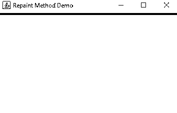
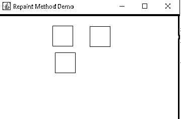
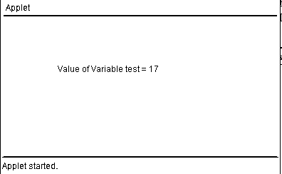

# 用 Java 重画

> 原文：<https://www.educba.com/repaint-in-java/>


## Java 中的 repaint 方法介绍

java 中的 repaint 方法在 java.applet 中可用，applet 类是我们在调用 paint 方法的同时想调用 update 方法时使用的最后一个方法；调用 update 方法清除当前窗口，执行更新，然后调用 paint 方法。

**语法:**

<small>网页开发、编程语言、软件测试&其他</small>

```
package <packagename>;
// class extending applet
public class <classname> extends Applet{
public method <methodName>(<arguments>){
repaint();             // calling repaint method when required
}
}
```

上面的语法显示了如何在 java 中使用 repaint 方法。repaint 方法是 java.applet.Applet 类的一部分，不能被覆盖。因此，repaint 方法可以直接从一个类扩展 Applet 或它的子类中调用。

### Java 中的 repaint 是如何工作的？

repaint 方法是 Applet 类中可用的最后一个方法，这就是它不能被覆盖的原因。无论何时使用 repaint 方法，都应该从 Applet 类的子类中直接调用。repaint 方法负责处理 applet 绘制周期的更新。每当我们想要一个组件重画它自己的时候，我们需要调用 repaint 方法。如果我们已经对组件的外观进行了更改，但没有对其大小进行任何更改，那么我们可以调用 repaint 方法来更新图形用户界面上组件的新外观。repaint 方法是 applet 类的异步方法。当调用 repaint 方法时，它会执行一个擦除请求，并在一小段时间延迟后执行组件的重绘。

每当从一个组件调用 repaint 方法时，就向图形用户界面发送一个请求，该请求与图形用户界面通信，以便在将来的某个时刻执行某个动作。repaint 方法背后的整个思想是避免直接调用 paint()方法。

### 用 Java 实现 repaint 方法的例子

现在我们将看到一些 java 示例，展示 repaint 方法的用法:

#### 示例#1

下面的例子展示了如何在 java 中使用 repaint 方法:

**代码:**

```
package com.edubca.repaintdemo;
import java.awt.*;
import java.awt.event.*;
import javax.swing.*;
import java.util.*;
import java.applet.Applet;
// class extending applet component and implementing mouse event listener
public class RepaintDemo extends Applet implements MouseListener {
private Vector vector;
public RepaintDemo() {
vector = new Vector();
setBackground(Color.red);
addMouseListener(this);
}
public void paint(Graphics graphics) { // paint method implementation
super.paint(graphics);
graphics.setColor(Color.black);
Enumeration enumeration = vector.elements();
while(enumeration.hasMoreElements()) {
Point p = (Point)(enumeration.nextElement());
graphics.drawRect(p.x-20, p.y-20, 40, 40);
}
}
public void mousePressed(MouseEvent mouseevent) {
vector.add(mouseevent.getPoint());
repaint(); // call repaint() method
}
public void mouseClicked(MouseEvent mouseevent) {}
public void mouseEntered(MouseEvent mouseevent) {}
public void mouseExited(MouseEvent mouseevent) {}
public void mouseReleased(MouseEvent mouseevent) {}
public static void main(String args[]) {
JFrame frame = new JFrame(); // creating a jFrame object
frame.getContentPane().add(new RepaintDemo());      // Adding Window
frame.setTitle("Repaint Method Demo");       // set title of the window
frame.setDefaultCloseOperation(JFrame.EXIT_ON_CLOSE);
frame.setLocationRelativeTo(null);
frame.setSize(375, 250);    // set size of window
frame.setVisible(true);        // set window as visible
}
}
```

**输出:**




执行鼠标单击事件后，以下形状将显示为黑色边框。请注意，这是通过 repaint 方法完成的，该方法调用 update and then paints 方法，因此我们能够在执行 click 事件后立即看到可见的形状。




#### 实施例 2

为了更清楚地说明 repaint 方法的用法，下面是另一个示例:

**代码:**

```
import java.awt.*;
import java.awt.event.*;
import java.util.*;
import java.applet.Applet;
import java.awt.Graphics;
// class extending
public class RepaintDemo extends Applet  {
int test=2;
public void paint(Graphics graphics)
{
super.paint(graphics);
setBackground(Color.cyan);   // set backgroung color of window
graphics.setColor(Color.black);   // set color of Text appearing on window
graphics.drawString("Value of Variable test = "+test, 80, 80);
try
{
Thread.sleep(1000);
}
catch(InterruptedException ex){}
// increasing value of variable by 1 and update its value of GUI
test++;
repaint();
}
}
```

**输出:**




在上面的例子中，我们有一个 applet，其中声明了一个名为 test 的变量。我们不断增加变量 test 的值，我们希望确保变量的更新值在用户界面上可见。因此，我们使用 repaint 方法来确保在 paint 方法之前调用 update 方法。上述程序的输出。在测试的这个窗口值中，变量总是递增的，更新后的值在 GUI 上是可见的。

### 结论

上面的例子提供了对 repaint 方法及其功能的清晰理解。当我们希望调用 applet 的更新和绘制周期时，我们应该调用 repaint 方法。调用 repaint 方法对组件的外观进行即时更新。

### 推荐文章

这是一个用 Java 重画的指南。在这里，我们讨论 repaint 方法在 Java 中是如何工作的，以及它的例子和代码实现。您也可以浏览我们推荐的其他文章，了解更多信息——

1.  [Java 编译器](https://www.educba.com/java-compilers/)
2.  [Java 缓冲器](https://www.educba.com/java-bufferedreader/)
3.  [Java RuntimeException](https://www.educba.com/java-runtimeexception/)
4.  [Java 运行时类](https://www.educba.com/java-runtime-class/)


