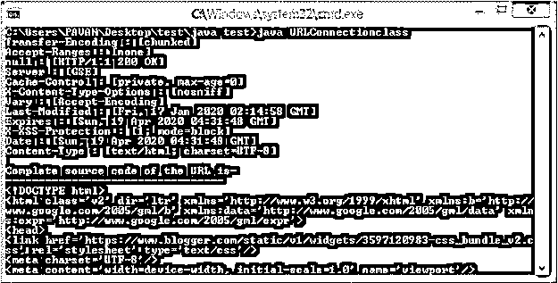

# Java URLConnection

> 原文：<https://www.educba.com/java-urlconnection/>


## Java URLConnection 简介

URLConnection 是一个 Java 编程语言类，通常表示 URL 和应用程序之间的一个通信链接或链接。这个 URLConnection 类帮助读写特定/指定资源的数据，这实际上是由 URL 引用的。它是所有类的超类之一。这个 URLConnection 类的实例有助于读取和写入，而且是针对特定 URL 引用的资源。这里，将一个连接连接到一个特定的 URL 是一种多步骤过程。

### 句法

```
URLConnection openConnection()
```

**说明:**URL 类的 open connection()方法/函数会返回 URLConnection 类的对象。

<small>网页开发、编程语言、软件测试&其他</small>

### 在 Jav **a** 中 URLConnection 是如何工作的

URLConnection 类通过提供许多方法来工作。在连接一个 URL 的多步骤过程中涉及到 openConnection()和 connect()方法。openConnection()有助于操作可能影响远程资源连接的参数。connect()方法有助于与资源进行交互，它对于查询标题内容和字段很有帮助。

连接对象实际上是通过调用 URL 上的 openConnection 方法或函数创建的。将操作连接对象的设置参数和对属性的一般请求。到远程对象的实际和通常的连接是在连接方法用法的帮助下进行的。它的远程对象变得可用，并且可以访问其中一个远程对象的头字段及其内容。getInputStream()方法或函数将帮助返回特定流中特定或指定 URL 的所有数据，这些数据可用于读取和显示。

Java 编程语言的 URLConnection 类实际上是通过提供尽可能多的方法来显示网页或博客的所有数据，这只是借助于 getInputStream()方法或方法，但是 getInputStream()方法/函数在借助于流中提到的特定 URL 返回所有网站数据方面帮助很大。这个 URL 将用于阅读和显示网站或博客的源代码；要获得所有源代码，必须使用循环来显示多种类型的源代码。

只有两个子类扩展了 Java 的 URLConnection 类。它们是 HttpURLConnection 和 JarURLConnection。HttpURLConnection 帮助我们连接到实际使用“HTTP”作为协议的任何类型的 URL 然后，将使用 HttpURLConnection 类。JarURLConnection 将帮助我们尝试建立一个到万维网上特定 jar 文件的连接；然后，将使用 JarURLConnection。

### 方法

一些重要的方法有助于在连接建立后使用来读取或写入或获取一些信息。它们是:

**1。URL connection open connection():**这个方法有助于打开到特定或指定 URL 的连接。

**2。Object getContent():** 它会检索 URLConnection 的一些内容。

**3。Map < String，List > getHeaderFields():** 它将获取包含特定 HTTP 文件夹中各种头字段的一些值的映射。

**4。getContentEncoding():** 它将返回内容编码头字段的某个值。

**5。getContentLength():** 它将返回内容头字段的长度。

**6。getDate():** 它将返回头字段的日期值

**7。getHeaderField (int-i):** 它将返回头的第 I 个索引值

**8。getHeaderField(String-Field):**它将返回某个标题中名为“Field”的字段，以获取所有标题字段的列表。

**9。output stream get output stream():**它将返回一个连接的输出流。

10。InputStream getInputStream():它将向打开的连接返回一个输入流。

**11。setAllowUserInteraction(boolean):**它将设置为真值，这意味着用户可以与页面进行交互。默认情况下，它的值为 TRUE。

**12。setDefaultUseCaches(boolean):**它会将 useCache 字段的默认值设置为所提供的值。

13。setDoInput(boolean): 仅当用户是否被允许接受特定的输入时，它才会被设置

**14。setDoInput(boolean):** 只有当用户现在允许在特定页面上书写时，它才会被设置。默认情况下，它的值为 FALSE，因为最重要的是，URL 甚至不允许写入。

### 实现 Java URLConnection 的示例

下面是实现 java URLConnection 的示例:

#### 示例#1

这演示了使用 URLConnection 类读写博客/网站 URL。首先，导入不同类型的 java 库。然后创建公共类以及用于 java 代码填充的公共 main 方法。然后创建 URL 变量，以便在 URL 命令的帮助下添加特定的网站/博客 URL。然后使用“URLConnection”打开到上述 URL 的连接。然后使用 Map 来获取特定 HTTP 报头的所有字段映射。然后打印网站 URL 的所有字段及其值，因为使用了循环。然后使用 BufferedReader 获取打开的连接的 inputstream。然后逐行打印源代码，同时使用循环。While loop 将打印所有的源代码，代码中提到的网站/博客 url。

**代码:**

```
import java.io.*;
//importing java input output functions
import java.net.*;
import java.util.ArrayList;
import java.util.Date;
import java.util.HashMap;
import java.util.List;
import java.util.Map;
public class URLConnectionclass1
{
public static void main(String[] args)
{
try
{
URL url1 = new URL("https://www.profitloops.in");
URLConnection urlcon1 = url1.openConnection();
Map<String, List<String>> header = urlcon1.getHeaderFields();
for (Map.Entry<String, List<String>> mp1 : header.entrySet())
{
System.out.print(mp1.getKey() + " : ");
System.out.println(mp1.getValue().toString());
}
System.out.println();
System.out.println("The Complete source code of the provided URL is-");
System.out.println(":---------------------------------:");
BufferedReader br1 = new BufferedReader(new InputStreamReader
(urlcon1.getInputStream()));
String i1;
while ((i1 = br1.readLine()) != null)
{
System.out.println(i1);
}
}
catch (Exception e1)
{
System.out.println(e1);
}
}
}
```

**输出:**




### 结论

我们希望您学习了 Java URLConnection 的定义及其语法和解释，URLConnection 类在 Java 编码语言中是如何工作的，以及各种示例，以便更好地理解 Java URLConnection 的概念和 so easily。

### 推荐文章

这是一个 Java URLConnection 的指南。这里我们讨论 Java URLConnection 的介绍，语法，它是如何工作的，方法和例子。您也可以浏览我们的其他相关文章，了解更多信息——

1.  [Java 8 中的可选类](https://www.educba.com/optional-class-in-java-8/)
2.  [禁用 JavaScript](https://www.educba.com/disable-javascript/)
3.  [爪哇的 EJB](https://www.educba.com/ejb-in-java/)
4.  [Java min()](https://www.educba.com/java-min/)


