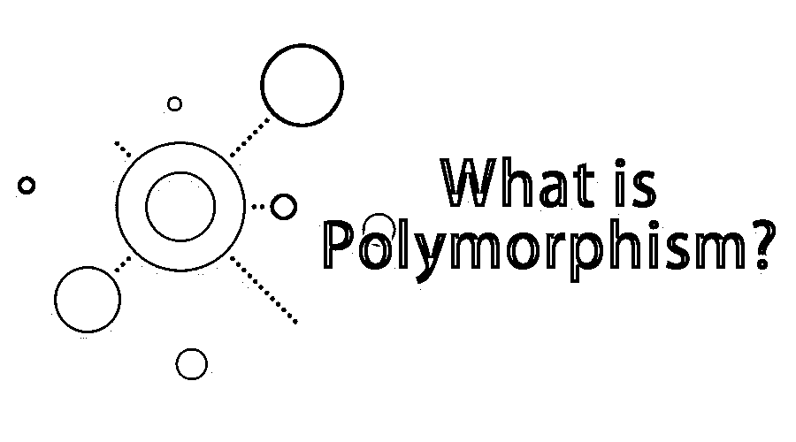

# 什么是多态性？

> 原文：<https://www.educba.com/what-is-polymorphism/>

## 多态性介绍

多态是这样一个概念，在它的帮助下，单个动作可以以不同的方式执行。它来源于两个希腊单词:poly 和 morphs。“poly”表示很多，“morphs”表示形式。从今以后，多态性意味着许多形式。面向对象编程可以被定义为一种编程语言，它能够根据对象的类或数据类型来处理不同的对象。基本上，我们可以将其定义为派生类重定义方法的能力。

### 谅解

两种类型的多态性是编译时多态性和运行时多态性。编译时多态是通过方法重载实现的，运行时多态是通过方法重写实现的。运行时多态性，也称为动态方法分派，是一个过程，其中对被重写方法的调用在运行时解决，而不管编译时。在这里，被覆盖的方法通过父类的引用变量来调用。此外，数据成员无法实现运行时多态性。

<small>网页开发、编程语言、软件测试&其他</small>

### 多态是如何让工作变得如此简单的？

这是面向对象编程的特点。使用多态性，一个类可以表现出不同的功能，即使它们有一个共同的接口。因此，我们可以说这个长期解释了一个基本概念。关于多态性值得注意的是，各种类中的所有工作代码都不需要知道它所使用的类，因为它们的使用方式是相同的。

这是面向对象编程的特点。使用多态性，一个类可以表现出不同的功能，即使它们有一个共同的接口。因此，我们可以说这个长期解释了一个非常基本的概念。值得注意的是，各种类中的所有工作代码都不需要知道它所使用的类，因为它们的使用方式是相同的。

考虑一个现实世界的多态性场景。以一个按钮为例。我们知道我们可以通过施加一些压力来点击按钮，但我们不知道按下按钮的输出或其使用的参考。这里要注意的一点是，结果不会影响它的使用方式。

所以它的基本目标是根据需要制造可互换的物体。

### 你能用多态性做什么？

当一个子类拥有与父类中声明的方法相同的方法时，我们称之为方法覆盖。

或者换句话说，如果一个子类提供了它的父类已经声明的方法的实现，这就叫做方法重写。在方法重写中要记住的某些事情是:

*   该方法必须与父类中提到的方法同名
*   该方法还必须具有与父类中提到的参数相同的参数。
*   肯定是有传承的，也就是说是-A 关系。

### 使用多态性？

当一个类有多个同名但参数不同的方法时，就称为方法重载。

假设我们只需要执行一个操作，那么与方法同名会增加程序的可读性。Java 中重载方法的方法是:

*   更改参数的数量
*   更改数据类型

然而，在 Java 中，如果我们只改变方法的返回类型，这是不可能的。

### 优势

*   它帮助程序员重用曾经编写过的代码和类，以便进行测试和实现。(代码的可重用性)
*   一个变量名可以存储多种数据类型的变量(int、float、double、long 等)。).
*   增加程序的可读性。

### 为什么要使用多态性？

除了动态多态性和静态多态性之外，一些 Java 编程特性还表现出除了这两种主要类型之外的多态性。

这些是强制、多态参数和运算符重载

#### 强迫

让我们用一个非常简单的例子来理解强制。考虑一个值为“强制类:”的字符串。考虑另一个值为 1 的整数。现在，当你把一个字符串值和一个整数值连接起来会发生什么？这种连接的输出将是“强制类:1”。这就是所谓的强制。隐式类型转换是为了防止类型错误。编译器会这样做。

#### 运算符重载

在开始操作符重载(也称为方法重载)之前，让我们看一个例子。假设一个字符串的值为“Operator ”,另一个字符串为“Overloading”。对这两个字符串使用加号(+)，就像将两个整数相加一样。(+)将连接这两个字符串。在两个整数的情况下，返回两个整数的和。当一个符号或操作符能够根据它们的使用方式改变它们的含义时，所表现出的多态性类型就称为操作符重载。

#### 因素

在多态中，一个对象可能以多种形式出现。在 Java 中，它指的是允许以下列方式之一访问对象，如

1.使用其父类或超类的引用变量

2.使用它所在的类的引用变量。

### 为什么我们需要多态性？

需要多态的主要原因是这个概念在实现继承中被广泛使用。它在允许对象在共享同一个外部接口时具有不同的内部结构方面起着重要的作用。它被清楚地陈述为一个为许多人映射的人。

#### 范围

绑定是将方法调用连接到方法体。我们有两种装订方式。

**静态绑定(早期绑定):**在编译时确定对象的类型。

**动态绑定(后期绑定):**运行时确定对象类型时。

### 结论

因此，它被认为是面向对象编程的非常重要的特征之一。如果你谈一个现实生活中多态性的例子，那可能是一个人同时可以有不同的特征；例如，一个男人同时是儿子、丈夫、雇员。所以同一个人在不同的情况下会有不同的行为。用面向对象的术语来说，这叫做多态，这是面向对象编程的一个重要特征。

### 推荐文章

这是什么是多态性的指南？这里我们讨论多态的工作、范围、需求和优点。您也可以浏览我们推荐的其他文章，了解更多信息——

1.  [JavaScript 是什么？](https://www.educba.com/what-is-javascript/)
2.  [什么是 HTML](https://www.educba.com/what-is-html/)
3.  [c#中的多态性](https://www.educba.com/polymorphism-in-c-sharp/)
4.  [Java 中的类型转换](https://www.educba.com/type-conversion-in-java/)

