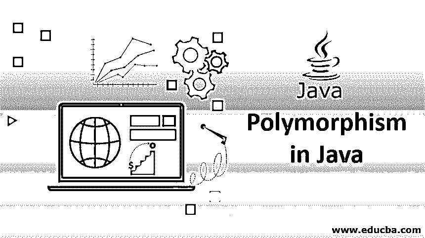

# Java 中的多态性

> 原文：<https://www.educba.com/polymorphism-in-java/>




## Java 中的多态性介绍

多态性被定义为这样一个概念，在这个概念中，随着一个动作以多种方式被执行。这个词起源于两个希腊词，它们既是多义词也是异形词。在这里，你可能知道，“poly”意味着许多，而“morphs”意味着许多形式。因此,“多态性”一词可能意味着许多形式。现在让我们详细了解 java 中的多态性。

### Java 中的多态是如何工作的？

多态性是 OOO 编程的一个特点。每当我们使用它时，一个类就有能力展示许多功能，即使它们展示的是公共接口。因此，我们可以假设这个长词实际上讲述了一个非常简单的概念。

<small>网页开发、编程语言、软件测试&其他</small>

关于多态性值得注意的一点是，大量类中的整个工作代码并不真正需要理解它以相同的方式使用的类。

让我们假设现实世界中的多态例子。让我们假设按钮。你们都知道，如果我们施加一点压力，你们就能按下按钮；然而，我们不知道按压按钮的输出和使用的目的。所以，这里要注意的一点是，无论哪种方式，结果都不会影响正在使用的程序。

所以多态性的基本目标是根据需要制造可互换的对象。

### Java 中多态性的类型

*   两种类型的多态性是编译时多态性和运行时多态性。编译时多态性通过方法重载来执行，运行时多态性通过[方法覆盖](https://www.educba.com/method-overriding-in-java/)来执行。
*   [运行时多态性](https://www.educba.com/runtime-polymorphism-in-java/)，也称为动态方法分派，是一个过程，其中对被覆盖方法的调用在运行时被解析，尽管是在编译时。在这里，被覆盖的方法通过父类的引用变量来调用。此外，数据成员无法实现运行时多态性。

### 重要

如果我们抛弃动态多态和静态多态，在编程中存在一些 Java 的编程特性，这些特性表现出除了这两种重要类型之外的多态。

它们是——强制、操作符重载和多态参数。

#### 1.强迫

让我们试着通过这个例子来理解强制的含义。假设字符串的值为 co 值:假设第二个数字的值为 2。现在，当你把这个字符串值和这个数字连接在一起的时候会发生什么呢？我们从这种连接中得到的结果将是“co 值:2”。这就是所谓的强制。这是一个隐式类型的转换，执行该转换是为了防止错误。

#### 2.运算符重载

当我们从运算符重载的概念开始时，让我看一下一个场景。假设该字符串的值为“操作”，2 个<sup>和 2 个</sup>的值为“过载”。然后，我们将利用加号(+)以同样的方式增加 2 个数字。这个(+)表示串联。如果我们考虑两个整数，那么将这两个数相加将会返回。每当一个符号或操作符有能力改变所使用的过程的解释时，所完成的多态性类型被称为操作符重载。

#### 3.多态参数

这意味着允许以下列方式访问任何对象，如下所示

*   使用属于任一父类的引用变量。
*   使用属于存在的类的引用变量。

#### 4.多态性范围

绑定意味着将方法调用连接到方法体。存在两种绑定:

*   1 <sup>st</sup> 是静态绑定，这意味着只要在编译期间确定了对象的类型。
*   2 <sup>nd</sup> 是[动态绑定](https://www.educba.com/dynamic-binding-in-java/)，这意味着只要在运行时已经确定了对象的类型。

为什么需要多态的唯一原因是在继承的实现中非常需要它的概念。它还在允许对象在共享接口时继承大量结构方面起着至关重要的作用。多态性已经被清楚地提到是唯一一个被映射的。

### Java 中多态性的例子

下面给出了 Java 中多态的不同例子:

#### 示例#1

展示方法重载的 Java 程序。

**代码:**

```
class methodOverload {
static int multi(int x, int y)
{
return x * y;
}
// Method with the same name but with 2 double arguments
static double multi(double x, double y)
{
return x * y;
}
}
class Main {
public static void main(String[] args)
{
System.out.println(methodOverload.multi(6, 2));
System.out.println(methodOverload.multi(1.2, 1.2));
}
}
```

**输出:**


#### 实施例 2

展示操作符重载的 Java 程序。

**代码:**

```
class operator {
void oper(String s, String s2)
{
String s = s + s2;
System.out.println("Concatenated String is"
+ s);
}
void oper(int a, int b)
{
int c = a + b;
System.out.println("Sum is : " + c);
}
}
class Main {
public static void main(String[] args)
{
operator o = new operator();
o.oper(1, 2);
o.oper("hi", "bye");
}
}
```

**输出:**


#### 实施例 3

方法重载的 Java 程序。

**代码:**

```
class Multi {
// Method with 2 parameter
static int Multi(int a, int b)
{
return a * b;
}
static int Multi(int a, int b, int c)
{
return a * b * c;
}
}
class Main {
public static void main(String[] args)
{
System.out.println(Multi.Multi(2, 3));
System.out.println(Multi.Multi(2, 3, 3));
}
}
```

**输出:**


### 结论

为什么需要多态的唯一原因在于它的概念在继承的[实现中非常需要。它还在允许对象在共享接口时继承大量结构方面起着至关重要的作用。多态性已经被清楚地提到是唯一一个被映射的。](https://www.educba.com/inheritance-in-java/)

### 推荐文章

这是一本关于 Java 多态性的指南。在这里，我们讨论 Java 中多态性的工作方式，它的类型、重要性、不同的例子和代码实现。您也可以阅读以下文章，了解更多信息——

1.  [Java 中的计数排序](https://www.educba.com/counting-sort-in-java/)
2.  [Java 中的 JTextField](https://www.educba.com/jtextfield-in-java/)
3.  [什么是 Java 继承？](https://www.educba.com/what-is-java-inheritance/)
4.  [Java 中的重载](https://www.educba.com/overloading-in-java/)


