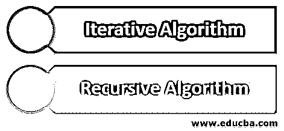

# Java 中的反向链表

> 原文：<https://www.educba.com/reverse-linked-list-in-java/>


## Java 中的反向链表介绍

由节点组成的数据结构，其中数据和指针出现在每个节点中，指针指向下一个节点，这种结构称为链表，它不同于数组，当这样的链表反转时，称为反转链表。其中链表分为两部分，称为链表的首节点和链表的其余部分，其中对链表的其余部分调用反函数，链表的其余部分链接到首节点，头指针是固定的。在这个主题中，我们将学习 Java 中的反向链表。

### Java 中反向链表的使用

在 java 中，可以使用两种算法来反转链表。它们是:

<small>网页开发、编程语言、软件测试&其他</small>




#### 1.迭代算法

以下步骤描述了迭代算法的工作原理:

*   必须初始化三个指针，它们被称为 ptrA、ptrB 和 ptrC。
*   ptrA 在第一时间指向。这是 ptrA 的任务。ptrB 使用 ptrA 作为参考点返回。由于反转列表中的最后一个节点为空，所以最初，该指针也将为空。
*   ptrB 指向第二位。这是主要指针。ptrB 的下一个指针指向 ptrA，这就是现有指针链接的反转方式。
*   第三名被 ptrC 指出。使用这个指针是为了备份，以确保列表不会在 ptrB 之前丢失；否则，会导致 ptrB 之前的引用丢失。
*   链表的反转从初始化 ptrA 为空开始。它必须设置为 null，因为 ptrA 将是反向链表后的尾节点。
*   ptrB 的下一个链接到 ptrA，因为指向第一个节点的 ptrB 成为反向列表中的尾节点。
*   如果只包含一个节点的列表需要反转，那么按照上面的两个步骤就可以完成任务。
*   当 ptrB 的 next 指向 ptrA 时，对 ptrB 前面的列表的引用将丢失。因此，在将 ptrB 指向 ptrA 之前，我们将使用 ptrC 作为 ptrB 提前列表的备份。
*   重复上述步骤，直到 ptrB 指向 null，这意味着所有原始列表节点都被反转。

#### 2.递归算法

以下步骤描述了递归算法的工作原理:

*   该算法从考虑头部的节点电流开始。
*   如果节点 current 为 null，则返回它。
*   如果当前节点的下一个元素为空，则表明它是列表中的最后一个节点。反向列表的头必须是最后一个节点，因此最后一个节点必须作为头，然后返回。
*   递归地遍历列表。
*   当前设置为 current.next.next。
*   Null 被设置为 current.next

### Java 中反向链表的例子

下面举几个例子

#### 示例#1

使用迭代算法反转单链表的 Java 程序

**代码:**

```
class List
{
static Node head1;
static class Node
{
int data1;
Node nex;
Node(int d1)
{
data1 = d1;
nex = null;
}
}
//The linked list is reversed using this function
Node reverselist(Node node1)
{
Node previous = null;
Node curr = node1;
Node nex = null;
while (curr != null)
{
nex = curr.nex;
curr.nex = previous;
previous = curr;
curr = nex;
}
node1 = previous;
return node1;
}
// The contents of linked list are printed
void printL(Node node1)
{
while (node1 != null)
{
System.out.print(node1.data1 + " ");
node1 = node1.nex;
}
}
public static void main(String[] args)
{
//The values to be inserted in the list before reversing are given here
List l = new List();
l.head1 = new Node(30);
l.head1.nex = new Node(40);
l.head1.nex.nex = new Node(50);
l.head1.nex.nex.nex = new Node(60);
System.out.println("The items in the linked list that needs to be reversed are");
l.printL(head1);
//Function to reverse the list is called here
head1 = l.reverselist(head1);
System.out.println("");
System.out.println("The items in the reversed linked list are");
l.printL(head1);
}
}
```

**输出:**


#### 实施例 2

使用迭代算法反转单链表的 Java 程序

**代码:**

```
class List {
static Node head1;
static class Node {
int data1;
Node nex;
Node(int d1)
{
data1 = d1;
nex = null;
}
}
// A recursive function to reverse the linked list
Node reverse(Node current, Node previous)
{
//Last node is marked as head
if (current.nex == null) {
head1 = current;
//previous node is updated with next
current.nex = previous;
return head1;
}
//current.nex node is saved for the recursive call
Node nex1 = current.nex;
//nex is updated
current.nex = previous;
reverse(nex1, current);
return head1;
}
// Content of the reversed linked list are printed
void printL(Node node)
{
while (node != null) {
System.out.print(node.data1 + " ");
node = node.nex;
}
}
//Main method is called which prints the reversed linked list by calling the function
public static void main(String[] args)
{
//The values to be inserted in the list before reversing are given here
List list = new List();
list.head1 = new Node(20);
list.head1.nex = new Node(30);
list.head1.nex.nex = new Node(40);
list.head1.nex.nex.nex = new Node(50);
System.out.println("The items in the linked list that needs to be reversed are");
list.printL(head1);
//Function to reverse the list is called here
Node result = list.reverse(head1, null);
System.out.println("");
System.out.println("");
System.out.println("The items in the reversed linked list are");
list.printL(result);
}
}
```

**输出:**


### 结论

在本教程中，我们通过定义理解了反转链表的概念，解释了反转链表的逻辑。介绍了链表逆序的两种算法，这是一种迭代算法，介绍了递归算法，并给出了用 java 实现这两种算法的编程实例。

### 推荐文章

这是一个用 Java 实现反向链表的指南。这里我们讨论 Java 中反向链表的例子以及代码和输出。您也可以看看以下文章，了解更多信息–

1.  [C 语言中的链表](https://www.educba.com/linked-list-in-c/)
2.  [Java LinkedHashMap](https://www.educba.com/java-linkedhashmap/)
3.  [JavaScript 中的 linked list](https://www.educba.com/linkedlist-in-javascript/)
4.  [JavaScript 中的 linked list](https://www.educba.com/linkedlist-in-javascript/)


