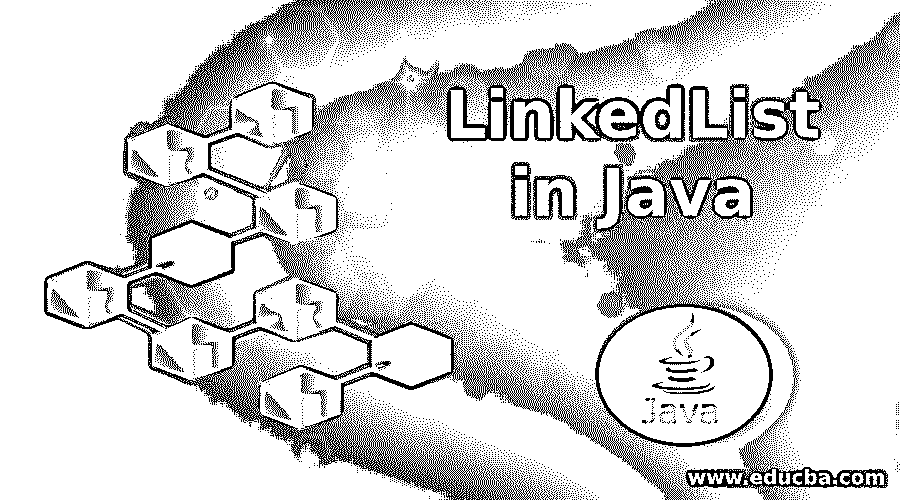

# Java 中的链接列表

> 原文：<https://www.educba.com/linkedlist-in-java/>




## Java 中的 LinkedList 简介

Java 中的 LinkedList 是不同于数组的线性数据结构。在 Java 程序中使用链表既有优点也有缺点。linkedlist 中的每个元素都存储在一个称为 Node 的单元中。每个节点都有一个特定的地址。LinkedList 的主要缺点是不容易在每个点访问节点。存在用于寻址每个节点的指针，并且为了访问特定节点，必须从头开始，然后到达要访问该节点的特定指针。LinkedList 类也像其他 Java 接口一样由许多构造函数和方法组成。在本文中，我们将看到 LinkedList 中使用的两个构造函数。它们是:

*   **LinkedList():** 用于分配一个空的 LinkedList()。
*   **LinkedList(Collection C):** 这用于创建一个有序列表，包含指定集合的所有元素，由集合的迭代器返回。

### Java 中 LinkedList 的方法

有许多方法或函数是 Java LinkedList 类的一部分。在本文中，我们将看到 Java LinkedList 类中的一些函数。它们是:

<small>网页开发、编程语言、软件测试&其他</small>

*   **add(int a，I Element):** 这个方法用于在这个列表中的特定位置插入一个特定的元素。
*   **add( E e):** 这个方法将指定的元素固定在列表的末尾。
*   **add(int index，Collection C):** 这个方法在列表中插入所有指定的元素，从起始位置开始。
*   **offerFirst ():** 这个方法在这个列表的前面插入指定的元素。
*   **addLast():** 这个方法用于在列表的末尾插入一个元素。
*   **void clear():** 这个方法用于从 Linkedlist 中删除所有的元素。
*   poll (): 删除列表的第一个元素。
*   **lastIndexOf ():** 用于返回指定元素在列表中最后一次出现的索引。
*   **getLast():** 该函数用于返回 LinkedList 中的最后一个元素。
*   **offer ():** 这个方法将指定的元素作为列表的尾部元素插入。
*   **offerLast ():** 这个方法在这个列表的末尾插入指定的元素。
*   peek (): 它获取列表的第一个元素。
*   **peekFirst ():** 该方法用于检索列表的最后一个元素，如果列表为空，则返回 null。
*   **addFirst():** 这个方法用于在列表的开头插入元素。
*   **peekLast ():** 该方法用于检索列表的最后一个元素，如果列表为空，则返回 null。
*   **pollFirst ():** 该方法用于检索和删除列表的第一个元素，如果列表为空，则返回 null。
*   **contains():** 如果 LinkedList 包含节点处的特定元素，则该函数返回 true。
*   **pollLast ():** 该方法移除列表中的最后一个元素，如果列表为空，则返回 null。
*   **removeFirst ():** 这个方法返回列表中的第一个元素。
*   元素():这个方法检索但不删除列表的头部。
*   **getFirst():** 该方法用于返回 LinkedList 的第一个元素。
*   **remove ():** 这个方法删除 LinkedList 的第一个元素。
*   **remove (int index):** 该方法删除列表中指定位置的元素。
*   **removeLast ():** 这个方法返回列表中的最后一个元素。
*   **set (int index，E element):** 这个方法用指定的元素替换这个列表中指定位置的元素。
*   **size ():** 这个方法返回列表中元素的个数。

### Java 中的 LinkedList 示例

下面是一些例子:

#### 示例#1

在这个编码示例中，我们将看到 LinkedList 方法，这些方法在 linkedlist 中插入某些元素，然后删除它们，最后显示 linkedlist。

**代码:**

```
import java.util.*;
public class Example3
{
public static void main(String args[])
{
LinkedList<String> object = new LinkedList<String>();
// Adding elements to the linked list
object.add("A");
object.add("B");
object.addLast("C");
object.addFirst("D");
object.add(2, "E");
object.add("F");
object.add("G");
System.out.println("Linked list : " + object);
object.remove("C");
object.remove(3);
object.removeFirst();
object.removeLast();
System.out.println("Linked list after deletion: " + object);
}
}
```

**输出:**


在示例输出中，我们看到 linkedlist 中有某些元素，最后，某些元素被删除，然后显示所有元素删除后的 linkedlist。

#### 实施例 2

在这个程序中，我们将看到 LinkedList 中的四个名字按顺序打印出来。我们使用一个 String LinkedList 并使用它来打印可以是任何数字的名字。我们在这里使用 While 循环来打印程序中出现的名字。

**代码:**

```
import java.util.*;
public class LinkedList1
{
public static void main(String args[])
{
LinkedList<String> al=new LinkedList<String>();
al.add("Ishankamal Mitra");
al.add("Sourya Mukherjee");
al.add("Satyaki Das");
al.add("Debodooty Sarkar");
Iterator<String> itr=al.iterator();
while(itr.hasNext())
{
System.out.println(itr.next());
}
}
}
```

**输出:**


在这个程序中，我们检查编码如何帮助我们按顺序打印 LinkedList 中提到的四个名字。在下一个节目中，我们将看到顺序是如何改变的；也就是说，名称按输入的相反顺序打印。

#### 实施例 3

在这段代码中，程序输入姓名，然后以相反的顺序打印姓名。

**代码:**

```
import java.util.*;
public class LinkedList4
{
public static void main(String args[])
{
LinkedList<String> ll=new LinkedList<String>();
ll.add("Ishankamal Mitra");
ll.add("Sourya Mukherjee");
ll.add("Satyaki Das");
//Going through the list of elements in Reverse order
Iterator i=ll.descendingIterator();
while(i.hasNext())
{
System.out.println(i.next());
}
}
}
```

**输出:**


在这个程序中，我们使用 DescendingIterator()，并使用它以与输入相反的顺序打印名称。通过节目我们可以看得很清楚。

### 结论

在本文中，我们看到了 LinkedList 类中存在的不同构造函数和方法。另外，我们看到一个 Java 程序来演示在 LinkedList 中插入和删除元素。我们还看到了在数组上使用 LinkedList 的优点和缺点。它们包含不易访问的节点，必须通过 LinkedList head 访问。我们还注意到三个编码示例，其中名称以逆序、顺序打印，以及从 LinkedList 中删除元素。这些程序帮助我们理解 LinkedList 类的方法论。

### 推荐文章

这是 Java 中 LinkedList 的指南。这里我们讨论 linkedlist 的介绍和方法，以及不同的例子和它的代码实现。您也可以阅读以下文章，了解更多信息——

1.  [Java 队列接口](https://www.educba.com/java-queue-interface/)
2.  [Java 中的队列函数](https://www.educba.com/queue-in-java/)
3.  [Java 中的迭代器](https://www.educba.com/iterator-in-java/)
4.  [JavaScript 中的 linked list](https://www.educba.com/linkedlist-in-javascript/)


