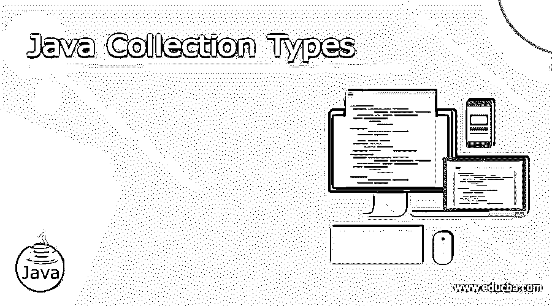
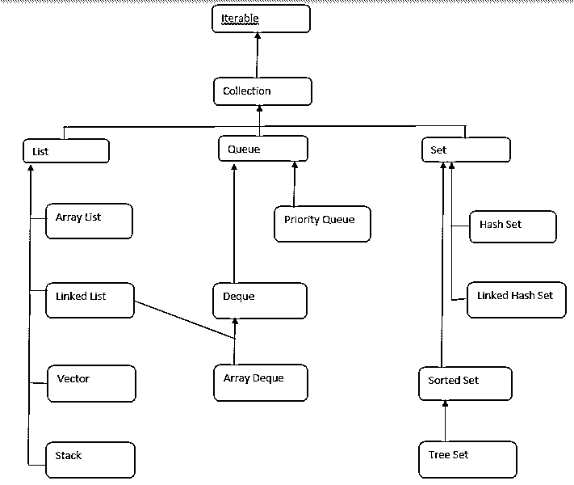

# Java 集合类型

> 原文：<https://www.educba.com/java-collection-types/>




## Java 集合类型介绍

Java 集合类型，也称为集合框架，提供了许多接口和类，有助于实现可重用的集合数据结构。这些集合类型提供了存储一组对象并为其提供操作的体系结构。在 Java 中，被表示为一个单元的任何一组单独的对象被称为对象集合。基于此，JDK 1.2 引入了集合框架和类型，它拥有所有的集合类和接口。一些现成的集合，如列表、集合、映射、队列和堆栈等。解决用户处理一组同质和异质对象的常见问题。让我们更深入地探讨集合类型的主题，并了解所有类型的语法。

### Java 集合类型/框架的层次结构




<small>网页开发、编程语言、软件测试&其他</small>

Java 中的集合类型由多个接口组成，每个接口用于存储特定的数据类型

#### 可迭代接口

它是集合框架的根接口。集合接口扩展了 Iterable 接口。因此，所有的类和接口都实现这个接口。它只包含一个抽象方法，即迭代器。

**语法:**

```
Iterator iterator();
```

#### 收集界面

它扩展了 iterable 接口，并由集合框架的所有类实现。它包含所有的方法，每个集合都有像删除数据，添加数据或清除数据等。

#### 列表界面

它是集合接口的子接口，专用于列表类型的数据，用于存储有序的数据集合，也允许重复。list 接口由 Vector、Array List、Stack 等各种类实现。因为所有这些子类都实现了一个列表，所以用户可以实例化列表对象。

**语法:**

```
List<T> array_list = new ArrayList<>();
List<T> linked_list = new LinkedList<>();
List<T> vector = new Vector<>();
```

“T”是对象的类型。

#### 数组列表

它在 Java 中提供了动态数组。如果集合增大，数组列表的大小会增大；如果从集合中移除对象，数组列表的大小会缩小。在 Java 中，数组列表可以随机访问，不能用于原始类型，在这种情况下需要包装类。语法如上所示。

#### 链接列表

这个类是链表数据结构的一个实现。它是一种线性数据结构，其中元素不是连续存储的，每个元素都是一个具有数据和地址部分的独立对象。使用地址和指针将元素链接起来，每个元素称为一个节点。语法如上所示。

#### 矢量

这个类提供动态数组。它比标准数组慢，但在需要大量操作的程序中很有用。它类似于数组列表，但向量是同步的，数组列表是不同步的。语法如上所示。

#### 堆

这个类建模并实现堆栈数据结构，并且基于后进先出的基本原则。除了基本的 push pop 操作，这个类还提供了清空、查看和搜索功能。也可称为载体的亚类。

**语法:**

```
Stack<T> stack = new Stack<>();
```

#### 队列接口

该接口保持先进先出的顺序，类似于队列。它专用于存储元素顺序重要的所有元素。它还包括各种类，如队列、优先级队列、数组队列等。因为所有的子类都实现了队列，所以用户可以实例化队列对象。

**语法:**

```
Queue<T> array_queue = new ArrayQueue<>();
Queue<T> priority_queue = new PriorityQueue<>();
```

#### 优先队列

当对象应该基于它们的优先级被处理时，使用它..基于优先级堆。优先级队列中的元素根据自然排序或使用比较器进行排序。上面给出了语法。

#### 数组队列

这个类是在框架中实现的，允许用户拥有一个可调整大小的数组。它是一种特殊的数组，允许用户从队列的两端删除或添加元素。它没有限制，如果需要还会增长。语法如上所示。

#### 退出界面

这个接口是队列数据结构的一个微小变化。它也被称为双端队列，因为可以在两端添加和删除元素。该接口实例化类 ArrayDeque。

**语法:**

```
Deque<T> deque = new ArrayDeque<>();
```

#### 设置接口

这个类是哈希表数据结构的固有实现。插入到 HashSet 中的对象不保证元素会以相同的顺序插入。基于 hashcode 插入对象，也允许插入空元素。

**语法:**

```
HashSet<T> hashset = new HashSet<>();
```

#### 链接散列集

它与哈希集非常相似，但使用双向链表通过保持元素的顺序来存储数据

**语法:**

```
LinkedHashSet<T> linked_hashset = new LinkedHashSet<>();
```

#### 有序集合界面

这个接口与 Set 接口非常相似。它有额外的方法来维护元素的顺序。接口是通过实例化 is 树集来实现的。

**语法:**

```
SortedSet<T> sorted_Set = new TreeSet<>();
```

#### 树集合

这个类使用树来存储。通过使用自然排序来维持元素的排序，否则需要外部比较器。

**语法:**

```
TreeSet<T> tree_set = new treeSet<>();
```

#### 地图界面

这个接口 Map 是一个具有键值映射数据的数据结构。它不支持重复，因为同一个键不能有多个映射。Map 接口是由 Hash Map、Tree Map 等类实现的。

**语法:**

```
Map<T> hash_map = new HashMap<>();
Map<T> tree_map = new TreeMap<>();
```

#### Hash Map

它提供了 Java Map 接口的基本实现。要访问哈希映射中的值，必须知道密钥。有一种将大字符串转换成小字符串的技术

**语法:**

```
HashMap<T, T> hashmap = new HashMap<T, T>();
```

### 结论

至此，我们结束了我们的主题“Java 集合类型”。我们已经看到了各种接口，也看到了接口是通过哪个 Iterable 产生的。我们已经研究了各种接口，如 Set、Java List 和 Map 接口，还涵盖了 Java 集合框架的子类型，即堆栈、队列和队列。这里给出的所有语法将有助于编写逻辑并以编程方式实现它。我们还看到了 Java 集合框架的层次结构。

### 推荐文章

这是一个 Java 集合类型的指南。这里我们讨论 Java 集合类型框架的介绍、语法、层次结构和各种接口。您也可以看看以下文章，了解更多信息–

1.  [在 Java 中排序字符串数组](https://www.educba.com/sort-string-array-in-java/)
2.  [Java 中的排序字符串](https://www.educba.com/sort-string-in-java/)
3.  [Java 中的异常类型](https://www.educba.com/types-of-exception-in-java/)
4.  [Java 中的数据类型](https://www.educba.com/data-types-in-java/)


