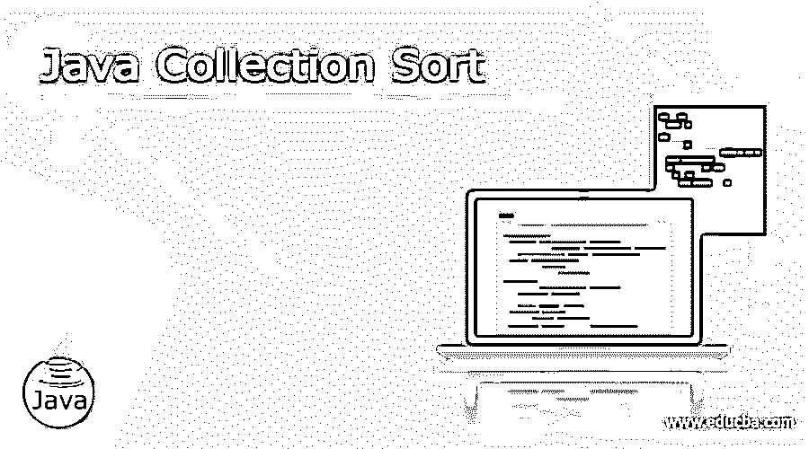
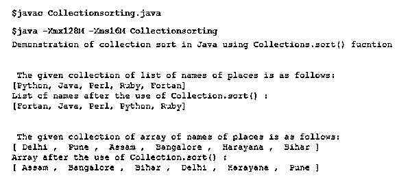
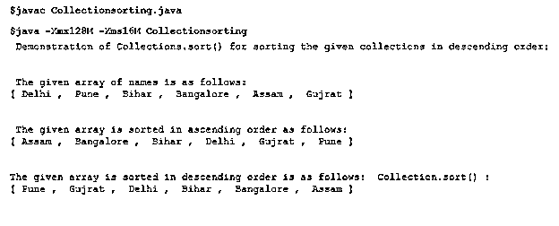

# Java 集合排序

> 原文：<https://www.educba.com/java-collection-sort/>




## Java 集合排序简介

在 java 中，有一个被称为 Java 的类来对集合进行排序。util.collection，它在其中提供了一个函数 sort()，该函数用于对给定的列表或集合进行排序，该列表或集合在 java 程序中被声明或指定为数组或列表。通常，java 集合排序被定义为提供 java 的 java 编程语言中的一个实用程序类。util。集合类提供了名为 sort()(Java . util . collection . sort())的静态方法，用于对给定集合进行排序。默认情况下，它将按升序或自然顺序排列未排序的数组或列表，但要按降序对给定集合进行排序，集合实用程序类 collection.reverseOrder()中有另一个函数。

**语法:**

<small>网页开发、编程语言、软件测试&其他</small>

```
import java.util.collections;
Collections.sort( names_of_elements or list or array )
```

上述语法只有在 java。util。collections 类被导入到 java 程序中，上面的语法对给定的集合进行排序，比如列表、数组、集合等等，按照升序或自然顺序。要以逆序或降序对给定集合进行排序，同一类中有不同的语法，如下所示:

```
Collections.sort( names_of_elements or list or array, Collections.reverseOrder() );
```

**上述语法的参数为:**

*   **Names_of_elements 或 lists 或 array:** 此参数表示在此参数中指定的集合名称。集合可以是任何名称，如带有名称的元素列表或名称数组、名称集等。
*   **Collection.reverseOrder():**在降序排序的语法中，我们必须在将第一个参数指定为任何名称列表或名称数组或名称集等之后，将 collection . reverse order()函数指定为第二个参数。

### Collection.sort()函数在 Java 中是如何工作的？

在 Java 中，集合就是包含一组元素的集合，比如一组名字、列表或数组等等。因此，为了对这样的集合进行排序，java 提供了一个 sort()函数。util。集合类，其中这个排序函数由 java 程序中的这个函数导入，然后我们可以在程序中使用它。首先，我们使用 collection.sort()函数定义一个名称数组或一个名称列表来对元素或名称进行排序。列表或数组名称在函数中被指定为需要排序的参数。默认情况下，该函数按升序排序。要按降序排序，我们需要指定 collections.reverseOrder()作为函数中指定列表或数组名称后的第二个参数。

现在让我们看看下面的例子，如何在下面的 Java 程序中使用 sort()函数对数组和名称列表进行排序。

#### 示例#1

**代码:**

```
import java.util.*;
public class Collectionsorting
{
public static void main(String[] args)
{
ArrayList<String> coll1 = new ArrayList<String>();
coll1.add(" Delhi ");
coll1.add(" Pune ");
coll1.add(" Assam ");
coll1.add(" Bangalore ");
coll1.add(" Harayana ");
coll1.add(" Bihar ");
List<String> names = Arrays.asList("Python", "Java", "Perl", "Ruby", "Fortan");
System.out.println( "Demonstration of collection sort in Java using Collections.sort() fucntion ");
System.out.println("\n");
System. out.println(" The given collection of list of names of places is as follows: ");
System.out.println(names);
Collections.sort(names);
System.out.println("List of names after the use of" +
" Collection.sort() :\n" + names);
System.out.println("\n");
System. out.println(" The given collection of an array of names of places is as follows: ");
System.out.println(coll1);
Collections.sort(coll1);
System.out.println("Array after the use of" +
" Collection.sort() :\n" + coll1);
}
}
```

**输出:**




在上面的例子中，我们可以看到首先我们已经导入了 Java。util。集合类，或者我们也可以像 java 一样导入。util*表示可以导入属于 util 的所有类。然后在主类中，我们首先声明了一个数组，然后使用 add()函数插入了每个元素或名称，还直接使用数组声明了一个列表。list()和所有名称都用双引号括起来，并用逗号分隔。然后，我们显示使用系统声明的所有名称。println 然后我们声明集合。排序(名称)和集合。sort(coll1)按升序对列表和数组中指定的名称进行排序。上面的截图可以看到上面程序的输出。

现在让我们看另一个使用集合的例子。sort()用于升序和降序。

#### 实施例 2

**代码:**

```
import java.util.*;
public class Collectionsorting
{
public static void main(String[] args)
{
ArrayList<String> coll1 = new ArrayList<String>();
coll1.add(" Delhi ");
coll1.add(" Pune ");
coll1.add(" Bihar ");
coll1.add(" Bangalore ");
coll1.add(" Assam ");
coll1.add(" Gujrat ");
System.out.println(" Demonstration of Collections.sort() for sorting the given collections in descending order: ");
System.out.println("\n");
System.out.println(" The given array of names is as follows: ");
System.out.println(coll1);
System.out.println("\n");
Collections.sort(coll1);
System.out.println(" The given array is sorted in ascending order as follows: ");
System.out.println(coll1);
System.out.println("\n");
Collections.sort(coll1, Collections.reverseOrder());
System.out.println("The given array is sorted in descending order is as follows: " +
" Collection.sort() :\n" + coll1);
}
}
```

**输出:**




在上面的例子中，我们可以看到它与前面的例子相似，我们首先导入了使用 collections 类来提供 sort()函数的实用程序类。然后我们声明了一个名字数组，我们在其中添加了每个元素，然后我们使用系统显示了这个名字数组。println()那么我们已经声明了集合。sort(coll1)以升序对给定数组“coll1”进行排序，然后以降序显示，我们声明了 Collections.sort(coll1，Collections.reverseOrder())以降序显示名称。在本例中，按升序显示姓名意味着按字母顺序显示姓名，按降序意味着按升序的逆序显示姓名。上面例子的输出如上面截图所示。

### 结论

在本文中，我们得出结论，集合是在 utility 类中定义的类，导入该类是为了使用 Java 程序中的 Collections.sort()函数。在本文中，这取决于用户是否希望以自然顺序或逆序显示细节。集合可以是任意的，比如字符串、数字集合等等，以任何特定的顺序对数组进行排序，但是这里我们只能按升序或降序进行排序，使用 collections 类提供的 sort()函数很容易做到这一点。

### 推荐文章

这是一个 Java 集合排序的指南。在这里我们讨论介绍，参数，语法，如何收集。sort()函数在 Java 中工作，示例代码实现。您也可以看看以下文章，了解更多信息–

1.  [Java 中的排序字符串](https://www.educba.com/sort-string-in-java/)
2.  [在 Java 中排序字符串数组](https://www.educba.com/sort-string-array-in-java/)
3.  [Javafx Scrollpane](https://www.educba.com/javafx-scrollpane/)
4.  [JavaScript 表单](https://www.educba.com/javascript-modulo/)


