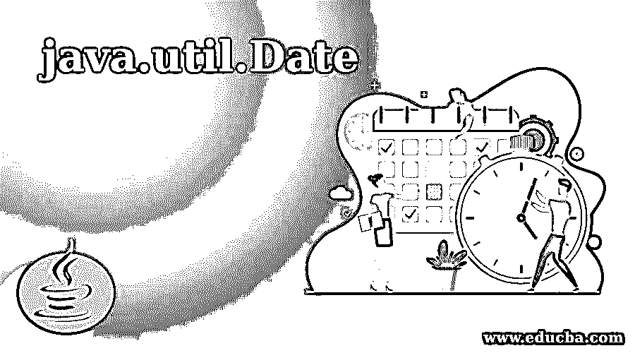

# java.util.Date

> 原文：<https://www.educba.com/java-util-date/>




## java.util.Date 简介

java 中的日期和时间由一个名为 java.util.Date 类的类表示，该类提供了处理 java 中的时间和日期的方法和构造函数，可序列化、可比较的<date>和可克隆的接口由 java.util.Date 类实现，java.sql.Date、java.sql.Time 和 java.sql.Timestamp 接口是 java.util.Date 类的基类。</date>

### java.util.Date 的构造函数

java.util.Date 类的构造函数有:

<small>网页开发、编程语言、软件测试&其他</small>

**1。date():** 创建一个 Date 对象，使用 Date()构造函数表示当前的时间和日期。

**2。Date(long milliseconds):** 通过使用 Date(long milliseconds)构造函数，创建一个 Date 对象，该对象是从时间 1<sup>ST</sup>1970 年 1 月 1 日 00:00:00 GMT 开始的指定毫秒数。

### java.util.Date 的方法

java.util.Date 类的方法有:

**1。Boolean after(Date Date):**Boolean after(Date Date)方法用于检查当前日期是否在作为参数的指定日期之后。

**2。Boolean before(Date Date):**Boolean before(Date Date)方法用于检查当前日期是否在指定日期之前，作为一个 qparameter。

以下是 java.util.Date 的示例:

**代码:**

```
import java.util.Date;
public class Example
{
public static void main(String[] args)
{
// a variable called dat1 is defined to store one date
Date dat1=new Date(2020,6,01);
//a variable called dat2 is defined to store another date
Date dat2=new Date(2021,6,01);
//boolean after(Date date) method is used to check if dat1 comes after dat2 date
System.out.println("The date represented by the variable dat1 is after the date represented by the variable dat2 : "+dat1.after(dat2));
//boolean before(Date date) method is used to check if dat1 comes before dat2 date
System.out.println("The date represented by the variable dat1 is before the date represented by the variable dat2 : "+dat1.before(dat2));
}
}
```

**输出:**


**说明:**在上面的程序中，定义了一个名为 dat1 的变量来存储一个日期。然后定义一个名为 dat2 的变量来存储另一个日期。然后使用 boolean after(Date date)方法检查 dat1 是否在 dat2 日期之后，返回的输出是真还是假。然后使用 boolean before(Date date)方法检查 dat1 是否在 dat2 日期之前，返回的输出是真还是假。

**3。object clone():**object clone()方法用于返回当前日期的克隆对象。

以下是 java.util.Date 的示例:

**代码:**

```
import java.util.Date;
public class Main
{
public static void main(String[] args)
{
//an instance of the date class is created
Date dat=new Date(2020,6,01);
//clone method is called on the instance of the date class to create a clone of the given date
System.out.println("The clone of the given date is : "+dat.clone());
}
}
```

**输出:**


**解释:**在上面的程序中，创建了一个 date 类的实例。然后在 date 类实例上调用 clone 方法来创建给定日期的克隆。

**4。int compare to(Date Date):**int compare to(Date Date Date)方法用于将当前日期与参数中指定的日期进行比较。如果当前日期与参数中指定的日期相同，则输出返回零。如果当前日期在参数指定的日期之前，则返回小于零的输出。如果当前日期在参数指定的日期之后，则返回大于零的输出。

**5。booleanequals(日期日期):** boolean equals(日期日期)方法用于比较当前日期和指定为相等参数的日期。如果当前日期与参数中指定的日期相同，则输出返回 true，否则输出返回 false。

以下是 java.util.Date 的示例:

**代码:**

```
import java.util.Date;
public class Example
{
public static void main(String[] args)
{
//an instance of the date class is created to store one date
Date dat1=new Date(2020,6,01);
//an instance of the date class is created to store another date
Date dat2=new Date(2021,6,01);
//compareTo method is used to compare the two dates stored using the two variables defined before
int comp=dat1.compareTo(dat2);
//the result is displayed after comparing the two dates
System.out.println("The result after comparing the two values is : "+comp);
//Equals() method of date class is used to check if the two dates specified are equal
System.out.println("The dates stored in the two variables are equal : "+dat1.equals(dat2));
}
}
```

**输出:**


**解释:**在上面的程序中，创建了一个 date 类的实例来存储一个日期。然后创建 date 类的一个实例来存储另一个日期。然后使用 compareTo 方法比较使用前面定义的两个变量存储的两个日期。然后在比较两个日期后显示结果。然后使用 equals 方法检查使用前面定义的两个变量存储的两个日期是否相等。

**6。static Date from(Instant Instant):**static Date from(Instant Instant)方法用于从即时日期返回 Date 对象的实例。

7 .**。long getTime():** long getTime()方法用于返回 date 对象表示的时间。

**8。inthashCode():**int hashCode()方法用于返回由 date 对象表示的散列码值。

**9。Instant to Instant():**Instant to Instant()方法用于将当前日期转换为即时对象。

10。string toString():string toString()方法用于将给定的日期转换成即时对象。

以下是 java.util.Date 的示例:

**代码:**

```
import java.time.Instant;
import java.util.Date;
public class Example
{
public static void main(String[] args)
{
//an instance of the date class is created which stores the present date
Date dat=new Date();
//instant date and time is obtained using instant.now() method
Instant inst= Instant.now();
//the instant date and time is displayed by using from() method
System.out.println("The instant date is  : "+dat.from(inst));
//getTime() method is used to obtain the number of milliseconds since January 1st 1970
System.out.println("The number of milliseconds since January 1, 1970, 00:00:00 GTM : "+dat.getTime());
//hashcode() method is used to obtain the hash code of the given date
System.out.println("The hash code for the given date is : "+dat.hashCode());
//toInstant() method is called to convert the present date to the instant object
System.out.println("The instant object after converting the present date : "+dat.toInstant());
//toString() method is used to convert the date to string
System.out.println("The date after conversion to string is : "+dat.toString());
}
}
```

**输出:**


**解释:**在上面的程序中，创建了一个 date 类的实例来存储当前日期。然后使用 instant.now()方法获得即时日期和时间。然后使用()方法显示即时日期和时间。然后使用 getTime()方法获得自 1970 年 1 月 1 日以来的毫秒数。然后使用 hashcode()方法获取给定日期的哈希代码。然后调用 toInstant()方法将当前日期转换为即时对象。然后使用 toString()方法将日期转换为字符串。

**11。void setTime(long time):**void setTime(long time)方法用于将当前日期和时间设置为参数指定的时间。

以下是 java.util.Date 的示例:

**代码:**

```
import java.util.Date;
public class Example
{
public static void main(String[] args)
{
//an instance of the date class is created to store one date
Date dat=new Date(2020,6,01);
long lil=2000;
//settime() method is used to set the time to the given time specified
dat.setTime(lil);
System.out.println("The time after setting the time to given time is : "+dat.toString());
}
}
```

**输出:**


**解释:**在上面的程序中，创建了一个 date 类的实例来存储一个日期。然后 setTime()方法 id 用于将当前时间设置为给定日期。

### 结论

在本教程中，我们通过定义来理解 java 中 java.util.Date 的概念，通过编程实例及其输出来理解它的构造函数和方法。

### 推荐文章

这是一个 java.util.Date 的指南。在这里，我们讨论 java.util.Date 的概念，通过定义和它们的方法，以及编程示例和它们的输出。您也可以浏览我们推荐的其他文章，了解更多信息——

1.  [JavaScript 数学函数(示例)](https://www.educba.com/javascript-math-functions/)
2.  [Java 布局介绍](https://www.educba.com/layout-in-java/)
3.  [9 大类 Java 编译器](https://www.educba.com/java-compilers/)
4.  [Java 中的合并排序指南](https://www.educba.com/merge-sort-in-java/)


