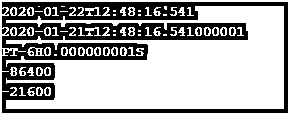
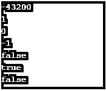
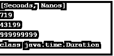

# Java 持续时间

> 原文：<https://www.educba.com/java-duration/>


## Java Duration 简介

java 中 Duration 是一个类，用于以秒和纳秒为单位测量时间。java 中 duration 类的包是 java.time.Duration，Duration 类对象指定时间段或者用来确定两个时间的差别。Duration 对象是不可变的，也是线程安全的，因为 Duration 对象是不可变的，所以一旦它被创建，我们就不能改变它的值。但是，我们可以基于另一个持续时间对象创建新的持续时间对象。Duration 类继承了一个 object 类(因为 object 是 java 中所有类的超类),并实现了 Comparable 接口。

**语法**

<small>网页开发、编程语言、软件测试&其他</small>

java 中 Duration 类声明的语法是:

```
public final class Duration extends Object implements Comparable < Duration >,
TemporalAmount, Serializable
{
//
variables and method of the class Duration}
```

### 持续时间列表

下面用示例代码解释了 Duration 类方法的列表；示例代码可进一步用于类似的方法(对于未给出的每个方法示例代码):

*   **Duration abs()** :这个方法返回一个长度为正的 Duration 的副本。
*   **long get(TemporalUnit unit)**:返回请求单位的值。
*   **static Duration between(Temporal start inclusive，Temporal endExclusive)** :返回 Duration 对象，即两个时态对象之间的持续时间。

#### 示例#1

我们通过下面的示例 java 代码理解了上述方法。

**代码:**

```
package p1;
import java.time.Duration;
import java.time.LocalTime;
import java.time.temporal.ChronoUnit;
public class DurationClassDemo {
public static void main(String[] args) {
Duration d = Duration.between(LocalTime.MAX,LocalTime.MIN);
System.out.println(d.get(ChronoUnit.SECONDS));
Duration absd = d.abs();
System.out.println(absd.get(ChronoUnit.SECONDS));
}
}
```

**输出:**


*   **Temporal addTo(Temporal Temporal)**:返回 Temporal 和 this duration 对象相加的 duration 对象。
*   **duration dividedBy(长除数)**:返回 Duration 对象，就是这个 Duration 除以除数。

#### 实施例 2

我们通过下面的示例 java 代码理解了上述方法:

**代码:**

```
package p1;
import java.time.Duration;
import java.time.*;
import java.time.temporal.ChronoUnit;
public class DurationClassDemo {
public static void main(String[] args) {
Duration d = Duration.between(LocalTime.MAX,LocalTime.MIN);
LocalDateTime date = LocalDateTime.now();
System.out.println(date);
date = (LocalDateTime)d.addTo(date);
System.out.println(date);
Duration d1 = d.dividedBy(4);
System.out.println(d1);
System.out.println(d.getSeconds());
System.out.println(d1.getSeconds());
}
}
```

**输出:**




*   **int compare to(Duration other Duration)**:此持续时间与指定的持续时间进行比较。
*   **boolean equals(Object other Duration)**:用指定的持续时间检查此持续时间并返回 Boolean。
*   **boolean isNegative()** :如果持续时间为负，则返回 True。
*   **boolean isZero()** :如果持续时间长度为零，则返回 True。

#### 实施例 3

我们通过下面的示例 java 代码理解了上述方法:

**代码:**

```
package p1;
import java.time.Duration;
import java.time.*;
import java.time.temporal.ChronoUnit;
public class DurationClassDemo {
public static void main(String[] args) {
Duration d = Duration.between(LocalTime.NOON,LocalTime.MAX);
Duration d1 = Duration.between(LocalTime.NOON,LocalTime.MIN);
System.out.println(d1.getSeconds());
System.out.println(d.compareTo(d1));
System.out.println(d1.compareTo(d1));
System.out.println(d1.compareTo(d));
System.out.println(d1.equals(d));
System.out.println(d1.isNegative());
System.out.println(d1.isZero());
}
}
```

**输出:**




*   **static Duration from(TemporalAmount amount)**:从一个 temporal amount 中获取一个 Duration 的实例。

#### 实施例 4

我们通过下面的示例 java 代码理解了上述方法:

**代码:**

```
package p1;
import java.time.Duration;
import java.time.*;
import java.time.temporal.ChronoUnit;
public class DurationClassDemo {
public static void main(String[] args) {
Duration d = Duration.from(ChronoUnit.DAYS.getDuration());
System.out.println(d.toMinutes());
}
}
```

**输出:**


*   **int getNano()** :返回持续时间，单位为纳秒。
*   **long getSeconds()** :返回持续时间，以秒为单位。
*   **List<temporal unit>get units():**返回该持续时间支持的单位集。
*   **int hashCode()** :返回本次持续时间的哈希代码。

#### 实施例 5

我们通过下面的示例 java 代码理解了上述方法:

**代码:**

```
package p1;
import java.time.Duration;
import java.time.*;
import java.time.temporal.ChronoUnit;
public class DurationClassDemo {
public static void main(String[] args) {
Duration d = Duration.between(LocalTime.NOON,LocalTime.MAX);
System.out.println(d.getUnits());
System.out.println(d.toMinutes());
System.out.println(d.getSeconds());
System.out.println(d.getNano());
System.out.println(d.getClass());
}
}
```

**输出:**




*   **持续时间减去(持续时间)** :-返回该持续时间减去指定持续时间的结果。
*   **Duration MINUS(long amountto subtract，temporal unit):**返回此持续时间减去指定持续时间后的结果对象。
*   **Duration MINUS days(long days to subtract):**返回此持续时间减去标准 24 小时制中指定持续时间的结果。
*   **Duration MINUS hours(long hours to subtract):**返回此持续时间减去以小时为单位的指定持续时间后的结果。
*   **Duration MINUS millis(long millisto subtract):**返回此持续时间减去以毫秒为单位的指定持续时间后的结果对象。
*   **Duration MINUS minutes(long minutes to subtract):**返回此持续时间减去以分钟为单位的指定持续时间后的结果。
*   **Duration MINUS nanos(long nanos subtract):**返回此持续时间减去以纳秒为单位的指定持续时间后得到的对象。
*   **Duration MINUS seconds(long seconds to subtract):**返回此持续时间减去以秒为单位的指定持续时间后的结果对象。
*   **持续时间乘以(长被乘数):**返回此持续时间乘以标量所得的对象。
*   **Duration negated()–**返回一个对象，该对象是此持续时间的结果，其长度被取反。
*   **static Duration of(long amount，TemporalUnit unit):** 返回以指定单位表示金额的 Duration 对象。
*   **静态持续天数(长天数):**返回标准 24 小时天数的持续时间对象。
*   **静态小时持续时间(长小时):**返回小时的持续时间对象。
*   **静态持续时间毫秒(长毫秒):**返回持续时间毫秒对象。
*   **静态持续时间(长分钟):**返回持续时间对象分钟。
*   **nanos(long nanos)的静态持续时间:**返回纳秒的持续时间对象。
*   **秒的静态持续时间(长秒):**返回秒的持续时间对象。
*   **秒的静态持续时间(long seconds，long nanoAdjustment):** 返回秒和纳秒调整的持续时间对象。

#### 实施例 6

我们通过下面的示例 java 代码理解了上述方法:

**代码:**

```
package p1;
import java.time.Duration;
import java.time.*;
import java.time.temporal.ChronoUnit;
public class DurationClassDemo {
public static void main(String[] args) {
Duration d = Duration.ofDays(6);
System.out.println(d.getSeconds());
Duration d1 = d.minusDays(3);
System.out.println(d1.getSeconds());
d = Duration.ofHours(6);
System.out.println(d.getSeconds());
d1 = d.minusHours(2);
System.out.println(d1.getSeconds());
}
}
```

**输出:**

#### 


*   **静态持续时间解析(CharSequence text):** 从文本中返回持续时间对象，示例 PnDTnHnMn.nS。
*   **duration plus(Duration Duration):**返回该 Duration 加上指定 Duration 的 Duration 对象。
*   **duration plus(long amountToAdd，TemporalUnit unit):** 返回此 duration 加上指定 Duration 的 Duration 对象。
*   **duration plus days(long days toadd):**返回此 duration 的 Duration 对象，并在 24 小时内添加指定的 Duration。
*   **duration plusHours(long hoursToAdd):**返回这个 duration 的 Duration 对象，加上指定的 Duration，以小时为单位。
*   **duration plus millis(long millistoad):**返回这个 duration 的 Duration 对象，加上指定的 Duration，以毫秒为单位。
*   **duration plus minutes(long minutes toadd):**返回该 duration 的 Duration 对象，加上指定的 Duration(分钟)。
*   **duration plusNanos(long nanosToAdd):**返回这个 duration 的 Duration 对象，加上指定的以纳秒为单位的 Duration。
*   **duration plus seconds(long seconds toadd):**返回此 Duration 的 Duration 对象加上指定的以秒为单位的持续时间。

#### 实施例 7

我们通过下面的示例 java 代码理解了上述方法:

**代码:**

```
package p1;
import java.time.Duration;
import java.time.*;
import java.time.temporal.ChronoUnit;
public class DurationClassDemo {
public static void main(String[] args) {
Duration d = Duration.ofDays(6);
System.out.println(d.getSeconds());
Duration d1 = d.plusDays(2);
System.out.println(d1.getSeconds());
d = Duration.ofHours(6);
System.out.println(d.getSeconds());
d1 = d.plusHours(2);
System.out.println(d1.getSeconds());
}
}
```

**输出:**


*   **Temporal subtract from(Temporal Temporal):**返回从时态对象中减去该持续时间的结果。
*   **long toDays():** 返回此持续时间内的天数。
*   **long toHours():** 返回此持续时间的小时数。
*   **long toMillis():** 返回此持续时间的毫秒数。
*   **long toMinutes():** 返回该持续时间的分钟数。
*   **long toNanos():** 返回此持续时间内的纳秒数。
*   **String toString():** 以字符串表示形式返回此持续时间，例如 PT8H6M12.345S。

#### 实施例 8

我们通过下面的示例 java 代码理解了上述方法:

**代码:**

```
package p1;
import java.time.Duration;
import java.time.*;
import java.time.temporal.ChronoUnit;
public class DurationClassDemo {
public static void main(String[] args) {
Duration d = Duration.ofDays(6);
System.out.println(d.toHours());
Duration d1 =Duration.ofHours(24) ;
System.out.println(d1.toDays());
}
}
```

**输出:**


*   **Duration with nanos(int nanofsecond):**返回具有指定 nanofsecond 的 Duration 对象。
*   **Duration with seconds(long seconds):**返回该 Duration 对象的指定秒数。

#### 实施例 9

我们通过下面的示例 java 代码理解了上述方法:

**代码:**

```
package p1;
import java.time.Duration;
import java.time.*;
import java.time.temporal.ChronoUnit;
public class DurationClassDemo {
public static void main(String[] args) {
Duration d = Duration.ofDays(6);
System.out.println(d.toString());
d = d.withSeconds(3000);
System.out.println(d.toString());
}
}
```

**输出:**


### 结论

duration 类是 java 中的内置类之一，用于以秒和纳秒为单位测量时间，并添加、减去、转换持续时间，或者简单地说，Duration 类允许对时间或天持续时间进行性能操作。java 的 java.time.Duration 包中提供了 duration 类。

### 推荐文章

这是一个 Java 持续时间的指南。在这里，我们讨论基本概念、语法、Java 持续时间的前 50 个列表，以及带有适当代码和输出的不同示例。您也可以浏览我们的其他相关文章，了解更多信息——

1.  [Java 中的方法](https://www.educba.com/methods-in-java/)
2.  [Java 鼠标监听器](https://www.educba.com/java-mouselistener/)
3.  [Java 中的字符串初始化](https://www.educba.com/string-initialization-in-java/)
4.  [Java 中的不可变类](https://www.educba.com/immutable-class-in-java/)


