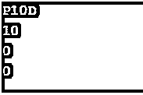
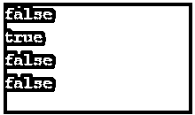
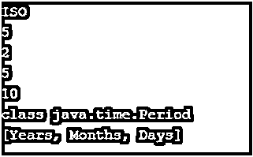
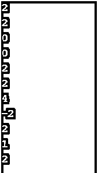
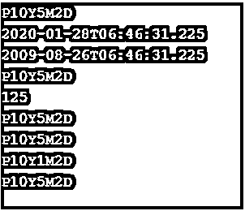

# 爪哇时期

> 原文：<https://www.educba.com/java-period/>


## Java 时期简介

Java 中的 period 是一个类，用于以年、月和日来度量时间。java 中的 Period 类的包是 java.time.Period，Period 类对象指定时间段或者用来确定年、月、日中两个时间的差值。Period 对象是不可变的，也是线程安全的，因为 Period 对象是不可变的，所以一旦它被创建，我们就不能改变它的值。但是，我们可以基于另一个周期对象创建新的周期对象。Period 类继承了 object 类(因为 object 是 java 中所有类的超类),并实现了 ChronoPeriod 接口。

**语法:**

<small>网页开发、编程语言、软件测试&其他</small>

java 中句点类声明的语法是:

```
public final class Period extends Object implements ChronoPeriod, Serializable
{
// variables and method of the class Period
}
```

### 解释 Java 时期的方法

下面用示例代码解释了 Period 类方法的列表；示例代码可进一步用于类似的方法(对于未给出的每个方法示例代码):

*   **long get(temporal unit unit):**返回请求单位的值。
*   **static Period between(local date start inclusive，local date end exclusive):**Return Period 对象是年、月、日数的两个日期之间的期间。

**代码:**

```
import java.time.Period;
import java.time.LocalDate;
import java.time.temporal.ChronoUnit;
public class PeriodClassDemo {
public static void main(String[] args) {
Period p = Period.between(LocalDate.ofYearDay(2017, 20), LocalDate.ofYearDay(2017, 30) );
System.out.println(p);
System.out.println(p.get(ChronoUnit.DAYS));
System.out.println(p.get(ChronoUnit.MONTHS));
System.out.println(p.get(ChronoUnit.YEARS));
}
}
```

**输出:**




*   **Temporal addTo(Temporal Temporal):**返回 Temporal 和 this Period 对象相加的 Period 对象。

**代码:**

```
import java.time.Period;
import java.time.LocalDate;
import java.time.temporal.ChronoUnit;
import java.time.LocalDateTime;
public class PeriodClassDemo {
public static void main(String[] args) {
Period period = Period.of(1,1,1);
LocalDateTime d = LocalDateTime.now();
System.out.println(d);
d = (LocalDateTime)period.addTo(d);
System.out.println(d);
}
}
```

**输出:**


*   **boolean equals(Object other Period):**用指定的周期检查这个周期并返回 Boolean。
*   **boolean isNegative():** 如果此周期为负，则返回 True。
*   **boolean isZero():** 如果此周期为负数，则返回 True。

**代码:**

```
import java.time.Period;
import java.time.LocalDate;
import java.time.temporal.ChronoUnit;
import java.time.LocalDateTime;
public class PeriodClassDemo {
public static void main(String[] args) {
Period p1 = Period.of(1,1,1);
Period p2 = Period.of(10,5,2);
Period p3 = Period.of(10,5,2);
System.out.println(p1.equals(p2));
System.out.println(p2.equals(p3));
System.out.println(p2.isNegative());
System.out.println(p2.isZero());
}
}
```

**输出:**




*   **static duration from(temporal amount amount):**从临时金额中获取 Period 的实例。

**代码:**

```
import java.time.Period;
import java.time.LocalDate;
import java.time.temporal.ChronoUnit;
import java.time.LocalDateTime;
public class PeriodClassDemo {
public static void main(String[] args) {
Period p = Period.from(Period.of(10, 5, 2) );
System.out.println(p);
}
}
```

**输出:**


*   **IsoChronology get chronology():**返回这段时间的年表，是 ISO 日历系统。
*   **int getDays():** 以天数表示的返回周期。
*   **int getMonths():** 以月为单位的返回周期。
*   **List<temporal unit>get units():**返回本周期支持的单位集。
*   **int hashCode():** 返回本期的哈希码。

**代码:**

```
import java.time.Period;
import java.time.LocalDate;
import java.time.temporal.ChronoUnit;
import java.time.LocalDateTime;
public class PeriodClassDemo {
public static void main(String[] args) {
Period p = Period.from(Period.of(10, 5, 2) );
System.out.println(p.getChronology());
System.out.println(p.get(ChronoUnit.MONTHS));
System.out.println(p.getDays());
System.out.println(p.getMonths());
System.out.println(p.getYears());
System.out.println(p.getClass());
System.out.println(p.getUnits());
}
}
```

**输出:**




*   **Period MINUS(temporal amount amount to subtract):**返回此周期减去指定周期后的结果对象。
*   **Period MINUS Days(long Days to subtract):**返回用指定天数减去的对象。
*   **Period minds months(long months):**返回 object，该值是这段时间减去指定月份的结果。
*   **Period MINUS years(long years):**返回 object，它是此期间减去指定年份的结果。
*   **Period multipliedBy(long 被乘数):**返回一个 Period 对象，该对象与标量相乘。
*   **Period negated():** 返回一个 Period 对象，该对象由长度被取反的周期产生。
*   **Period normalized():** 返回一个 Period 对象，该对象是此期间的结果，并按年和月进行了规范化。
*   **static Period of(int years，int months，int days):** 返回一个表示若干年、月和日的 Period 对象。
*   **静态天数周期(int days):** 返回天数的周期对象。
*   **static Period of months(int months):**返回一个包含多个月的 Period 对象。
*   **weeks 的静态周期(int weeks):** 返回周数的周期对象。
*   **静态年周期(int years):** 返回周数的周期对象。

**代码:**

```
import java.time.Period;
import java.time.LocalDate;
import java.time.temporal.ChronoUnit;
import java.time.LocalDateTime;
public class PeriodClassDemo {
public static void main(String[] args) {
Period p1 = Period.of(10,5,2);
Period p2 = Period.of(20,5,2);
System.out.println(p1.getDays());
System.out.println(p2.getDays());
System.out.println(p1.minus(p2).getDays());
System.out.println(p1.minusDays(2).getDays());
System.out.println(p1.minusMonths(1).getDays());
System.out.println(p1.minusYears(1).getDays());
System.out.println(p1.multipliedBy(2).getDays());
System.out.println(p1.negated().getDays());
System.out.println(p1.normalized().getDays());
Period p3 = Period.ofDays(1);
System.out.println(p3.getDays( ));
Period p4 = Period.ofMonths(2);
System.out.println(p4.getMonths());
}
}
```

**输出:**




*   **静态句点解析(CharSequence text):** 从文本中返回句点对象，示例 PnYnMnD。
*   **Period plus(temporal amount amountToAdd):**返回添加了指定期间的该期间的期间对象。
*   **Period plus days(long days toadd):**返回一个添加了指定天数的本周期的 Period 对象。
*   **Period plus months(long months toadd):**返回一个添加了指定月份的该期间的 Period 对象。
*   **Period plus years(long years toadd):**返回一个添加了指定年份的该期间的 Period 对象。

**代码:**

```
import java.time.Period;
import java.time.LocalDate;
import java.time.temporal.ChronoUnit;
import java.time.LocalDateTime;
public class PeriodClassDemo {
public static void main(String[] args) {
Period p1 = Period.of(10,5,2);
Period p2 = Period.parse("P1Y2M3D");
System.out.println(p2.getMonths());
Period p3 = p1.plus(Period.ofDays(5));
System.out.println(p3);
}
}
```

**输出:**


*   **Temporal subtract from(Temporal Temporal):**返回从一个时态对象中减去这个时间段。
*   **String toString():** 以字符串表示形式返回此句点，例如 PT8H6M12.345S。
*   **long toTotalMonths():** 返回此期间的总月数。
*   **Period withDays(int days):** 返回该期间指定天数的 Period 对象。
*   **Period with months(int months):**返回该期间指定月数的期间对象。
*   **Period with Years(int Years):**返回该期间指定年数的期间对象。

**代码:**

```
import java.time.Period;
import java.time.LocalDate;
import java.time.temporal.ChronoUnit;
import java.time.LocalDateTime;
public class PeriodClassDemo {
public static void main(String[] args) {
Period p1 = Period.of(10,5,2);
System.out.println(p1);
LocalDateTime d = LocalDateTime.now();
System.out.println(d);
d = (LocalDateTime)p1.subtractFrom(d);
System.out.println(d);
System.out.println(p1.toString());
System.out.println(p1.toTotalMonths());
System.out.println(p1.withDays(2));
System.out.println(p1.toString());
System.out.println(p1.withMonths(1));
System.out.println(p1.toString());
}
}
```

**输出:**




### 结论

period 类是 java 中的一个内置类，用于以年、月和日为单位测量时间，以及添加、减去、转换周期，或者简单地说，Period 类允许对日、月或年周期执行操作。java 的 java.time.Period 包中提供了 period 类。

### 推荐文章

这是一个 Java 时期的指南。这里我们分别讨论基本概念、带有示例代码的 Period 类方法列表和输出。您也可以浏览我们的其他相关文章，了解更多信息——

1.  [Java 7 特性](https://www.educba.com/java-7-features/)
2.  [Java 即时](https://www.educba.com/java-instant/)
3.  [Java 中的方法](https://www.educba.com/methods-in-java/)
4.  [Java 动画](https://www.educba.com/java-animation/)


