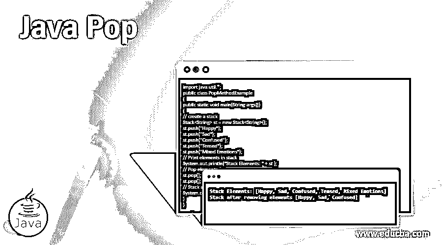

# Java Pop

> 原文：<https://www.educba.com/java-pop/>




## Java Pop 简介

在 Java 中，pop 是一种移除堆栈、数组、LinkedList 等中的元素的方法。可以使用 Stack.pop()方法从堆栈中移除一个元素，它将从顶部移除。对于 LinkedList，LinkedListObject.pop()方法用于从 LinkedList 表示的堆栈顶部移除。ArrayDequere 中的 LinkedBlockingDeque.pop()方法将元素从队列顶部移动。在接下来的章节中，我们将详细讨论每一个问题。

### 句法

让我们看看 stack、LinkedList 和 Deque 中 pop 方法的语法。

<small>网页开发、编程语言、软件测试&其他</small>

#### 1.堆

**语法:**

```
STACK.pop()
```

**参数:**该方法无参数。

**返回值:**返回元素并将其从栈顶移除。

#### 2.LinkedListObject

**语法:**

```
LinkedListObject.pop()
```

**参数:**该方法无参数。

**返回类型:**返回元素并将其从栈顶移除。

#### 3.链接阻塞队列

**语法:**

```
LinkedBlockingDeque.pop()
```

**参数:**该方法无参数。

**返回值:**返回元素并将其从栈顶移除。

### Java 中的 pop 方法是如何工作的？

pop 方法在 Stack、LinkedList 和 Deque 中的工作方式类似。为此，可以执行以下步骤。

1.根据需求创建一个堆栈、LinkedList 或 Deque。

```
Stack<String>s = new Stack<String>( );
LinkedList<Integer>li = newLinkedList<>( );
LinkedBlockingDeque<String> li = new LinkedBlockingDeque<String>(capacity);
```

2.使用 pop 方法从其中移除元素。

```
s.pop()
li.pop()
dq.pop()
```

### Java Pop 的例子

下面提到了不同的例子:

#### 示例#1

从堆栈中弹出字符串类型元素的 Java 程序。

**代码:**

```
import java.util.*;
public class PopMethodExample
{
public static void main(String args[])
{
// create a stack
Stack<String> st = new Stack<String>();
st.push("Happy");
st.push("Sad");
st.push("Confused");
st.push("Tensed");
st.push("Mixed Emotions");
// Print elements in stack
System.out.println("Stack Elements: " + st );
// Pop elements
st.pop();
st.pop();
// Stack after removing new elements
System.out.println("Stack after removing elements " + st);
}
}
```

**输出:**


首先，创建一个堆栈，并使用 push()方法添加元素。然后，打印堆栈并使用 pop()方法移除元素。因为调用了两个 pop()方法，所以在执行代码时将从堆栈顶部移除两个元素。最后，打印出去掉元素后的堆栈。

#### 实施例 2

从 LinkedList 弹出整数类型元素的 Java 程序。

**代码:**

```
import java.util.*;
public class PopMethodExample
{
public static void main(String args[])
{
// create a LinkedList
LinkedList<Integer> lis = new LinkedList<>();
lis.push(45);
lis.push(90);
lis.push(67);
lis.push(33);
lis.push(56);
// Print elements in LinkedList
System.out.println("LinkedList Elements: " + lis);
// Pop elements
lis.pop();
lis.pop();
// LinkedList after removing elements
System.out.println("LinkedList after removing elements " + lis);
}
}
```

**输出:**


创建一个 LinkedListlisand 并使用 push()方法添加整数类型的元素。然后，打印 LinkedListand 并使用 pop()方法移除元素。在执行代码时，可以显示移除元素之前和移除元素之后的 LinkedList。

#### 实施例 3

从堆栈中移除整数元素的 Java 程序。

**代码:**

```
import java.util.*;
public class PopMethodExample
{
public static void main(String args[])
{
// create a stack
Stack<Integer> st = new Stack<Integer>();
st.push(45);
st.push(90);
st.push(67);
st.push(33);
st.push(56);
// Print elements in stack
System.out.println("stack Elements: " + st);
// Pop elements
st.pop();
st.pop();
// stack after removing elements
System.out.println("stack after removing elements " + st);
}
}
```

**输出:**


首先创建一个接受整数元素的堆栈。创建后，使用 push()方法将元素添加到堆栈中。打印完堆栈中的当前元素后，将从堆栈中删除两个元素。为了检查这些元素是否来自堆栈，元素被打印一次。在执行代码时，可以看到从堆栈中删除了两个元素。

#### 实施例 4

从 LinkedList 中删除字符串元素的 Java 程序。

**代码:**

```
import java.util.*;
public class PopMethodExample
{
public static void main(String args[])
{
// create a LinkedList
LinkedList<String> lis = new LinkedList<>();
lis.push("Happy");
lis.push("Sad");
lis.push("Confused");
lis.push("Tensed");
lis.push("Mixed Emotions");
// Print elements in LinkedList
System.out.println("LinkedList Elements: " + lis );
// Pop elements
lis.pop() ;
lis.pop() ;
// LinkedList after removing elements
System.out.println("LinkedList after removing elements " + lis ) ;
}
}
```

**输出:**


创建一个 LinkedList li 并使用 push()方法添加 string 类型的元素。然后，打印 LinkedListand 并使用 pop()方法移除元素。在执行代码时，可以显示移除元素之前和移除元素之后的 LinkedList。

#### 实施例 5

从 linkedblockigdequeue 中删除字符串元素的 Java 程序。

**代码:**

```
import java.util.concurrent.LinkedBlockingDeque;
public class PopMethodExample {
public static void main(String[] args) {
LinkedBlockingDeque<String> dq = new LinkedBlockingDeque<String>(100);
dq.add("Hia");
dq.add("Ahi");
dq.add("Liba");
dq.add("Geru");
//Removes element from the top of the stack
String s = dq.pop();
System.out.println("First stack element  : "+ s);
System.out.println("Stack after removing element : "+ dq);
}
}
```

**输出:**


创建一个添加元素的队列。为此，使用 add()方法并添加字符串类型的元素。然后，打印 Deque 并识别其中的当前元素。打印完堆栈中的当前元素后，从堆栈中移除第一个元素。为了检查这些元素是否从队列中删除，元素被再次打印。在执行代码时，可以看到一个元素从队列中删除了。

#### 实施例 6

从 LinkedBlockigDeque 中删除整数元素的 Java 程序。

**代码:**

```
import java.util.concurrent.LinkedBlockingDeque;
public class PopMethodExample {
public static void main(String[] args) {
LinkedBlockingDeque<Integer> dq = new LinkedBlockingDeque<Integer>(100);
dq.add(34);
dq.add(45);
dq.add(56);
//Removes element from the top of the stack
Integer i = dq.pop();
System.out.println("First stack element  : "+ i );
System.out.println("Stack after removing element : "+ dq);
}
}
```

**输出:**


与上面的程序不同，使用 add()方法添加整数类型的元素。在执行代码时，可以看到一个元素从队列中删除了。

### 结论

Pop 是分别借助 Stack.pop()、LinkedList.pop()和 LinkedBlockingDeque.pop()从 stack、LinkedList、array 中移除元素的方法。在本文中，详细解释了 pop 方法的语法、工作原理和示例等细节。

### 推荐文章

这是 Java Pop 的指南。在这里，我们讨论 pop 方法在 Java 中是如何工作的，并举例说明代码和输出。您也可以看看以下文章，了解更多信息–

1.  [Java 模式类](https://www.educba.com/java-pattern-class/)
2.  [Java 瞬态](https://www.educba.com/java-transient/)
3.  [Java PrintWriter](https://www.educba.com/java-printwriter/)
4.  [Java 模式类](https://www.educba.com/java-pattern-class/)


