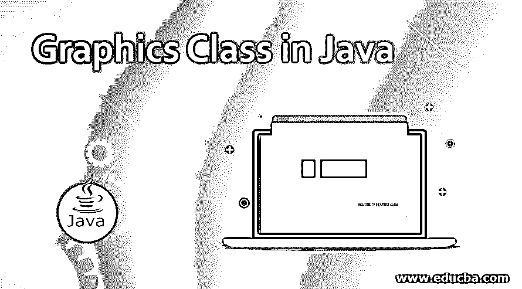
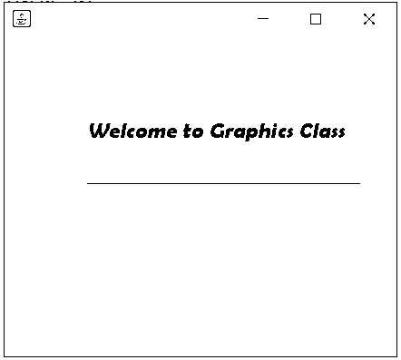
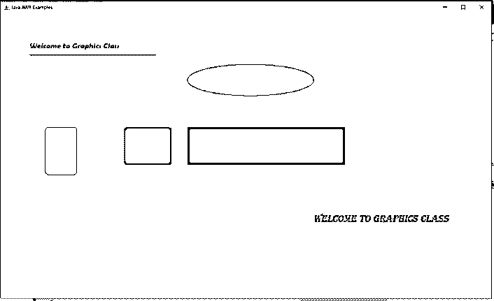

# Java 中的图形类

> 原文：<https://www.educba.com/graphics-class-in-java/>




## Java 中的图形类介绍

它是 java.awt 包中的一个抽象类，扩展了 java.lang 包的 Object 类，用作所有图形上下文的超类，允许在应用程序中绘制各种组件，这些组件可以很容易地在各种设备或许多真实图像上实现。

Graphics 类的每一个对象都是实现 applet 基本功能所需的所有方法的完整包，因此，它的状态包含与要绘制的组件、当前剪辑、当前颜色、XOR 替换颜色、字体或原始翻译相关的信息。

<small>网页开发、编程语言、软件测试&其他</small>

**带参数的语法**

```
public abstract class Graphics extends Object
```

图形类是抽象类；因此，我们不能制造它的对象；相反，我们需要使用它的一个子类，比如 DebugGraphics，Graphics2D。而且还是公共课；可以使用任何类来访问它。

它扩展了 java.lang 包中的 Object 类，从而扩展了它的所有功能，如 clone、equals 等。

### Java 中的 Graphic 类是如何工作的？

Graphics 类用于在屏幕上绘制不同的可视化组件，屏幕被视为由位于输出设备像素之间的无限数量的像素组成的画板。作为函数参数给出的所有坐标都被认为是相对于在触发该方法之前已经平移的原点。以下是我们在任一方法中给出不同点时的程序

1.  在绘制一个图形的轮廓时，在像素之间穿过一条无限细的路径，并在锚点的底部和右侧放置一只像素大小的笔。
2.  在绘制给定的矩形时，右边缘和下边缘的一个额外的行被占用，而在填充它时，相同的边界用于填充使用 setColor 方法设置的颜色。
3.  如果一个人写一个文本，该文本被写在基本坐标之上。
4.  为文本绘制基线时，文本正下方的像素被视为绘制线条。

可以执行的所有操作都会修改位于指定形状内的像素，并使用 Graphics 类的对象进行控制。该区域被称为用户剪辑，只能使用 setClip 和 clipReact 方法进行修改。

与上述用户剪辑组合的指定主剪辑区域的设备剪辑定义了复合剪辑，该复合剪辑定义了用于最终剪辑的区域。所有的绘图或书写都是用当前的颜色、当前的字体和当前的绘画模式完成的。

#### 1.drawRoundRect (int a1，int b1，int width，int height，int horArc，int vertArc)

该函数用于创建一个圆角矩形，其中

**a1**–该参数表示要绘制的矩形左上角的 x 坐标。

**B1**–该参数表示要绘制的矩形左上角的 y 坐标。

**宽度**–该参数表示要绘制的矩形的宽度。

**height**–该参数表示要绘制的矩形的高度。

**horArc**–该参数表示要绘制的矩形所有角的圆弧的水平直径。

**vertArc**–该参数表示要绘制的矩形所有角的弧的垂直直径。

左边缘= x，右边缘= x+宽度-1

上边缘= y，下边缘= y+高度-1

#### 2.公共抽象 void fillRoundRect (int x，int y，int width，int height，int arcWidth，int arcHeight)

此方法用于用指定为当前颜色的颜色填充圆角矩形。参数解释与 drawRoundRect()方法中给出的相同。

#### 3.公共抽象 void clipRect (int x，.int y，int width，int height)

此方法用于将当前剪辑与矩形的规格相交。在当前剪辑区域为空的情况下，指定的矩形被设置为可以使用 setClip 方法修改的新剪辑。这些操作不会影响剪辑区域的外部。

#### 4.public void fill3DRect(int a1，int b1，int width，int height，boolean leveled)

此方法用于绘制三维突出显示的矩形，该矩形用 setColor 方法指定的颜色填充。为了给图一个 3D 的外观，边缘将被倾斜到一定程度，并从左上角突出显示。

**参数:**

**a1**–该参数表示要绘制的矩形左上角的 x 坐标。

**B1**-该参数表示要绘制的矩形左上角的 y 坐标。

**宽度**–该参数表示要绘制的矩形的宽度。

**height**–该参数表示要绘制的矩形的高度。

**拉平**–一个布尔值，如果为真–制作的矩形将显示为在表面上方拉平；否则，它将显示在曲面的同一水平面上。

#### 5.公共抽象 void drawOval (int a，int b，int width1，int height1)

此方法用于在已指定尺寸的矩形边界上绘制空椭圆。这个椭圆的区域延伸到宽度+1 像素和高度+1 像素。

**参数:**

**a**–该参数表示椭圆左上角的 x 坐标。

**b**–该参数表示椭圆左上角的 y 坐标。

**width 1**–该参数表示椭圆的宽度。

**height 1**–该参数表示椭圆的高度。

#### 6.公共抽象 void setColor(颜色)

此方法用于设置图形对象的当前颜色。它将最后一个变量作为 java.awt 包中 color 类的颜色值。该行之后的所有操作都将使用这种特定的颜色。

**参数:**

c–新的颜色。

#### 7.公共抽象无效绘制线(int a1，int b1，int a2，int b2)

此方法用于使用当前颜色在此图形上下文的坐标系中的点(a1，b1)和(a2，b2)之间绘制一条线。

**参数:**

**a1**–直线起点的 x 坐标。

**B1**–直线起点的 y 坐标

**a2**–直线终点的 x 坐标。

**B2**–直线终点的 y 坐标。

### Java 中图形类的例子

下面提到了不同的例子:

#### 示例#1

让我们用 java 画一个简单的 applet

**代码:**

```
import java.awt.*;
import java.awt.event.*;
import <u>java.awt.geom</u>.*;
public class <u>Demo</u> extends Frame {
public Demo(){
prepareWindow();
}
@Override
public void paint(Graphics g) {
g.setColor(Color.GRAY);
Font currentFont = new Font("Berlin Sans FB Demi",Font.ITALIC, 24);
g.setFont(currentFont);
g.setColor(Color.BLUE);
g.drawString("Welcome to Graphics Class", 100, 150);
g.setColor(Color.GREEN);
g.drawLine(100, 200, 400, 200);
}
public static void main(String[] args){
Demo  awtGraphicsDemo = new Demo();
awtGraphicsDemo.setVisible(true);
}
private void prepareWindow(){
setSize(450,400);
addWindowListener(new WindowAdapter() {
public void windowClosing(WindowEvent windowEvent){
System.exit(0);
}
});
}
}
```

**输出:**




#### 实施例 2

**代码:**

```
import java.awt.*;
import java.awt.event.*;
import <u>java.awt.geom</u>.*;
public class <u>Demo</u> extends Frame {
public Demo(){
super("Java AWT Examples");
prepareWindow();
}
public static void main(String[] args){
Demo  awtGraphicsDemo = new Demo();
awtGraphicsDemo.setVisible(true);
}
private void prepareWindow(){
setSize(450,400);
addWindowListener(new WindowAdapter() {
public void windowClosing(WindowEvent windowEvent){
System.exit(0);
}
});
}
@Override
public void paint(Graphics g) {
g.setColor(Color.GRAY);
Font currentFont = new Font("Berlin Sans FB Demi", Font.ITALIC, 24);
g.setFont(currentFont);
g.drawString("Welcome to Graphics Class", 100, 150);
g.setColor(Color.magenta);
g.drawRoundRect(150, 400, 100, 150, 20, 20);
g.setColor(Color.CYAN);
g.fillRoundRect(400, 400, 150, 120, 20,10);
Font newFont1 = new Font("ALGERIAN", Font.ITALIC, 30);
g.setFont(newFont1);
g.setColor(Color.orange);
g.fill3DRect(600, 400, 500, 120, false);
g.setColor(Color.blue);
g.drawString("Welcome to Graphics Class", 1000, 700);
g.drawOval(600,200,400,100);
g.drawLine(100, 170, 500, 170);
}
}
```

**输出:**




### 结论

Graphics 类提供了在屏幕上创建可视化对象所需的所有基本操作，以及与其状态或字体属性相关的所有信息，并对其进行修改。然而，由于它是一个抽象类，它的实例不能直接创建，因此使用它的子类来调用。

### 推荐文章

这是一个 Java 中的图形类指南。在这里，我们讨论了图形类在 Java 中是如何工作的，以及例子、语法和参数。您也可以看看以下文章，了解更多信息–

1.  [Java 时区](https://www.educba.com/java-timezone/)
2.  [Java 中的 JSON](https://www.educba.com/json-in-java/)
3.  [Java 中的对象类](https://www.educba.com/object-class-in-java/)
4.  [Java 中的线程组](https://www.educba.com/threadgroup-in-java/)


