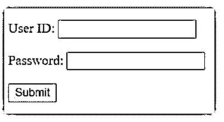
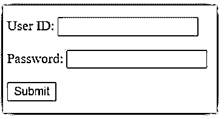
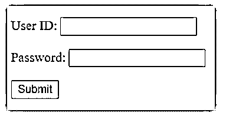
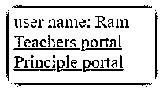

# 认证 Java

> 原文：<https://www.educba.com/authentication-java/>


## 认证 Java 简介

认证 java 是对 web 应用进行身份确认的安全性术语。这是一项使用编程语言来确认网站和网络应用程序的用户身份的功能。它确认用户的使用，并允许他们使用 java 技术访问网站、应用程序和软件相关产品。它是一种安全方法，使用 java 语言的安全术语来识别授权用户并授予使用应用程序的权限。

使用唯一内容并用安全密码和用户身份进行确认是客户端和服务器端的功能。它在客户端使用用户 id 和密码，并使用 java 编程语言访问具有真实身份的服务器端数据。这是一个文档化的过程，以保持一个安全的 web 应用程序，并且只使用可访问的团队成员。

<small>网页开发、编程语言、软件测试&其他</small>

### 句法

这种语法用于真实的特定用户分支，如学生、教师、非教学人员和校长。您可以使用用户名、电子邮件 id 和密码登录并确认身份。

在这种语法中，应用程序使用用户名和密码进行身份验证。

```
public class AppSecurityConfig extends AppSecurityConfigurerAdapter {
@Override
protected void configure(AuthenticationManagerBuilder authentic) throws Exception {
UserBuilder userid = User.withDefaultPasswordEncoder();
authentic.inMemoryAuthentication()
.withUser(usersid.username("merry").password("test@123").roles("student"))
}
@Override
protected void configure(HttpSecurity http) throws Exception {
http.authorizeRequests()
.antMatchers("/").hasRole("student")
.and()
.formLogin()
.loginPage("/useLoginPage")
.loginProcessingUrl("/authenticatationUser")
.permitAll()
.and()
.logout().permitAll();
}
}
```

### Java 中的认证是如何工作的？

使用具有安全性和登录表单的 web 应用程序。这个表单用 jsp 页面重定向。

```
<form:form action="${pageContext.request.contextPath}/authenticateUser"
Method = "POST">
<c:if test = "${param.error ! = null}">
<b class="failed"> username/password does not authenticate here… </b>
</c:if>
<p>
User ID: <input type = "text" name = "name" />
</p>
<p>
Password: <input type = "password" name = "pswrd" />
</p>
<input type = "submit" value = "Submit" />
</form:form>
```

使用 web 应用程序对登录表单进行身份验证。该表单重定向到 JSP 页面。

```
<p>
User: <security:authentication property = "principal.username" />
</p>
```

使用 java spring 框架使用 java 认证语法。Java 使用 spring 安全来认证权威。

```
public class AppSecurityConfig extends AppSecurityConfigurerAdapter {
@Override
protected void configure(AuthenticationManagerBuilder authentic) throws Exception {
UserBuilder userid = User.withDefaultPasswordEncoder();
authentic.inMemoryAuthentication()
.withUser (usersid.username ("merry")
.password ("test@123")
.roles ("student"))
}
@Override
protected void configure(HttpSecurity http) throws Exception {
http.authorizeRequests()
.antMatchers("/")
.hasRole("student")
.and()
.formLogin()
.loginPage("/useLoginPage")
.loginProcessingUrl("/authenticatationUser")
.permitAll()
.and()
.logout().permitAll();
}
}
```

### 认证 Java 的例子

下面是提到的例子:

#### 示例#1

基本示例如下所示。

**代码:**

**文件:authenticationApp.java**

```
public class authenticationApp extends AppSecurityConfigurerAdapter {
@Override
protected void configure(AuthenticationManagerBuilder authentic) throws Exception {
UserBuilder userid = User.withDefaultPasswordEncoder();
authentic.inMemoryAuthentication()
.withUser (usersid.username ("sunny")
.password ("school@123")
.roles ("student"))
}
@Override
protected void configure(HttpSecurity http) throws Exception {
http.authorizeRequests()
.antMatchers("/")
.hasRole("student")
.and()
.formLogin()
.loginPage("/useLoginPage")
.loginProcessingUrl("/authenticatationUser")
.permitAll()
.and()
.logout().permitAll();
}
}
```

**文件:main_login.jsp**

```
<form:form action="${pageContext.request.contextPath}/authenticateUser"
Method = "POST">
<c:if test = "${param.error ! = null}">
<b class="failed"> username/password does not authenticate here… </b>
</c:if>
<p>
User ID: <input type = "text" name = "name" />
</p>
<p>
Password: <input type = "password" name = "pswrd" />
</p>
<input type = "submit" value = "Submit" />
</form:form>
File: authentication.jsp
<p>
User name: <security:authentication property = "principal.username" />
</p>
```

**输出:**




**输出**


**说明:**

*   这里，您可以在单个用户名中看到单个用户身份验证。
*   “Sunny”仅通过 java 身份验证访问学生门户。
*   您将为单个真实用户获得单个表单。

#### 实施例 2

java 示例中的两个认证和输出如下所示。

**代码:**

**文件:authenticationApp.java**

```
public class authenticationApp extends AppSecurityConfigurerAdapter {
@Override
protected void configure(AuthenticationManagerBuilder authentic) throws Exception {
UserBuilder userid = User.withDefaultPasswordEncoder();
authentic.inMemoryAuthentication()
.withUser (usersid.username ("merry")
.password ("test@123")
.roles ("student"))
.withUser(users.username("sam")
.password("exam@123")
.roles("student", "teacher"))
}
@Override
protected void configure(HttpSecurity http) throws Exception {
http.authorizeRequests()
.antMatchers("/").hasRole("student")
.antMatchers("/teachers/**").hasRole("teacher")
.and()
.formLogin()
.loginPage("/useLoginPage")
.loginProcessingUrl("/authenticatationUser")
.permitAll()
.and()
.logout().permitAll();
}
}
```

**文件:main_login.jsp**

```
<form:form action="${pageContext.request.contextPath}/authenticateUser"
Method = "POST">
<c:if test = "${param.error ! = null}">
<b class="failed"> username/password does not authenticate here… </b>
</c:if>
<p>
User ID: <input type = "text" name = "name" />
</p>
<p>
Password: <input type = "password" name = "pswrd" />
</p>
<input type = "submit" value = "Submit" />
</form:form>
File: authentication.jsp
<p>
User: <security:authentication property = "principal.username" />
<br>
<a href="${pageContext.request.contextPath}/teacher"> Teachrs portal </a> </p>
```

**输出:**




**输出:**


**说明:**

*   在这里，您可以看到单个用户名中的两个身份验证。
*   “sam”通过 java 身份验证访问教师和学生门户。
*   您将获得多个真实用户的单个表单。

#### 实施例 3

java 示例中的多重身份验证和输出如下所示。

**代码:**

**文件:authenticationApp.java**

```
public class authenticationApp extends AppSecurityConfigurerAdapter {
@Override
protected void configure(AuthenticationManagerBuilder authentic) throws Exception {
UserBuilder userid = User.withDefaultPasswordEncoder();
authentic.inMemoryAuthentication()
.withUser (usersid.username ("merry")
.password ("test@123")
.roles ("student"))
.withUser(users.username("sam")
.password("exam@123")
.roles("student", "teacher"))
.withUser(users.username("Ram")
.password("admin@123")
.roles("student", "teacher", "principle"))
}
@Override
protected void configure(HttpSecurity http) throws Exception {
http.authorizeRequests()
.antMatchers("/")
.hasRole("student")
.antMatchers("/teachers/**").hasRole("teacher")
.antMatchers("/principles/**").hasRole("principle")
.and()
.formLogin()
.loginPage("/useLoginPage")
.loginProcessingUrl("/authenticatationUser")
.permitAll()
.and()
.logout().permitAll();
}
}
```

**文件:main_login.jsp**

```
<form:form action="${pageContext.request.contextPath}/authenticateUser"
Method = "POST">
<c:if test = "${param.error ! = null}">
<b class="failed"> username/password does not authenticate here… </b>
</c:if>
<p>
User ID: <input type = "text" name = "name" />
</p>
<p>
Password: <input type = "password" name = "pswrd" />
</p>
<input type = "submit" value = "Submit" />
</form:form>
File: authentication.jsp
<p>
User: <security:authentication property = "principal.username" />
<br>
<a href="${pageContext.request.contextPath}/teacher"> Teachers portal </a>
<br>
<a href="${pageContext.request.contextPath}/principle"> Principle portal </a>
</p>
```

**输出:**




**输出:**




**说明:**

*   在这里，您可以看到单个用户名中的多个身份认证。
*   “Ram”通过 java 身份验证访问教师、学生和管理员门户。
*   您将获得多个真实用户的单个表单。

### 结论

java 中的认证提供了数据和权限的安全性、保密性和保密性。认证用于对各个用户和权限访问部分数据库。它变得简单，有吸引力，用户友好，优雅的网站和网络应用程序。该函数根据用户的身份对文档进行排序，并只返回所需的数据。它有助于在不打扰他人隐私的情况下轻松获取复杂的信息。

### 推荐文章

这是一个认证 Java 的指南。这里我们讨论一下入门，Java 中的认证是如何工作的？和示例。您也可以看看以下文章，了解更多信息–

1.  [Java getMethod()](https://www.educba.com/java-getmethod/)
2.  [Java 布尔到字符串](https://www.educba.com/java-boolean-to-string/)
3.  Java 中的[范围](https://www.educba.com/range-in-java/)
4.  [Java 中的 Struts](https://www.educba.com/struts-in-java/)


