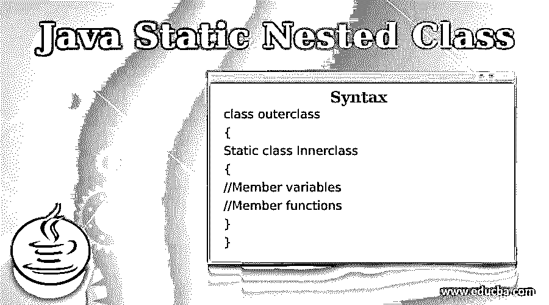

# Java 静态嵌套类

> 原文：<https://www.educba.com/java-static-nested-class/>




## Java 静态嵌套类简介

静态内部类是一个嵌套类。该类作为静态成员出现在任何充当外部类的类下。它不需要创建一个类对象来使用成员函数和变量。它可以在外部类的帮助下被实例化。此外，它还有一个限制，即不能像访问静态变量一样访问非静态成员函数和成员变量。

**语法:**

<small>网页开发、编程语言、软件测试&其他</small>

下面提供了 JAVA 静态嵌套类的语法。这里我们需要一个外部类作为内部类的保护伞类。内部类将位于外部类循环内部。内部类在 class 之前有一个“static”关键字，这样内部类就可以被识别为静态内部类或嵌套静态类。

```
class outerclass
{
static class Innerclass
{
//Member variables
//Member functions
}
}
```

### Java 静态嵌套类是如何工作的？

JAVA 静态嵌套类是通过在类定义时在类前使用“static”关键字来声明的。static 关键字还与方法和变量一起使用，以在整个程序中保持变量和方法的范围，而不会被覆盖。同样的特性也可以用在类的层次上，只是它必须是内部类。通过下一节中解释的例子，可以很好地理解嵌套静态类的功能。

尽管有一些关于 JAVA 静态嵌套类的要点需要注意:

1.  静态单词不能与外部类一起使用。这意味着只有当任何类在内部类中时，静态词才能在类之前使用。
2.  静态嵌套类可以访问外部类的静态成员函数和静态变量以及它自己的。关于外部类的可访问性，如果私有成员被声明为静态的，它甚至可以访问私有成员。
3.  静态类只能访问静态变量和方法。
4.  不需要为静态类创建对象。有一个对用 static 关键字赋值的成员函数和变量的直接调用。

### 实现 Java 静态嵌套类的示例

下面提供了一些示例及其解释，供您查看。

#### 示例#1

这些例子演示了在程序处理期间数据流中静态关键字的使用和理解。

**代码:**

```
public class Test1
{
static int vnumber=25;
static class Innerclass
{
void printmsg ()
{
System.out.println ("We are running this proram to undertsand the implementation of static keyword under JAVA nested class. The value of number passed here is "+vnumber);}
}
public static void main(String args[] )
{
Test1.Innerclass object=new Test1.Innerclass();
object.printmsg();
}
}
```

**输出:**

**

** 

**解释:**静态类不是直接实例化的，所以在这个例子中，静态类是在外部类的帮助下实例化的。外部类“Test1”是用名为“vnumber”的静态变量和名为“Innerclass”的静态类定义的。该方法是在名为“printmsg()”的内部类下定义的。这个函数包含一个字符串和一个在外部类中定义的变量。

当一个程序被执行时，主函数首先被调用。外部类和带有点操作符的内部类一起用于实例化。调用名为“object”的实例。然后使用该对象调用函数 printmsg()。printms()函数带来存储在其中的字符串和一个来自外部类静态变量声明的值为 25 的变量。因此，我们使用了类实例化方法来演示静态嵌套类的用法。这里需要注意的一点是，使用了静态内部类和静态变量，但是 printmsg()函数是非静态的。这就是我们在上面的例子中实例化的原因。如果这个函数是静态的，那么我们可以用另一种方式来使用它。

#### 实施例 2

**代码:**

```
public class Test2
{
static int vnumber=30;
static class Innerclass
{
static void printmsg()
{
System.out.println("We are running this proram to undertsand the implementation of static keyword under JAVA nested class. The value of number passed here is : "+vnumber);}
}
public static void main(String args[])
{
Test2.Innerclass.printmsg();
}
}
```

**输出:**


**解释:**这里，我们演示一个静态嵌套函数的例子，其中变量、类和方法都是静态定义的。这样做是为了演示直接调用方法，而不是调用对象来调用方法。因为只要使用“static”关键字，就不需要创建对象。可以直接使用。所以在这里，一个名为“test2”的外部类是用一个名为“vnumber”的静态变量和一个名为“inner class”的内部类创建的。Innerclass 附加了一个 static 关键字来演示静态嵌套类的用法。内部类有一个静态成员函数及其字符串和一个变量。

程序执行时调用 main 函数。外部类、内部类和方法是通过点运算符直接调用的。这里我们没有像在前面的例子中那样创建一个对象，因为方法本身被声明为静态的。

### 结论

当我们想限制在内部类中使用外部函数的成员函数时，静态嵌套类会很有用。这是可能的，因为内部静态类只能访问外部类的静态成员，而外部类的其他非静态成员仍然需要创建一个对象，如果内部类想要使用它们的话。这是在程序员希望在他/她的代码中继承一些安全性的情况下使用的。static 关键字确保数据不容易被操纵。这提高了应用程序的数据安全性和可靠性。

### 推荐文章

这是一个 Java 静态嵌套类指南。在这里，我们通过定义以及编程示例和它们的输出来讨论 Java 静态嵌套类的概念。您也可以浏览我们推荐的其他文章，了解更多信息——

1.  [JavaScript 数学函数(示例)](https://www.educba.com/javascript-math-functions/)
2.  [Java 布局介绍](https://www.educba.com/layout-in-java/)
3.  [9 大类 Java 编译器](https://www.educba.com/java-compilers/)
4.  [Java 中的合并排序指南](https://www.educba.com/merge-sort-in-java/)


