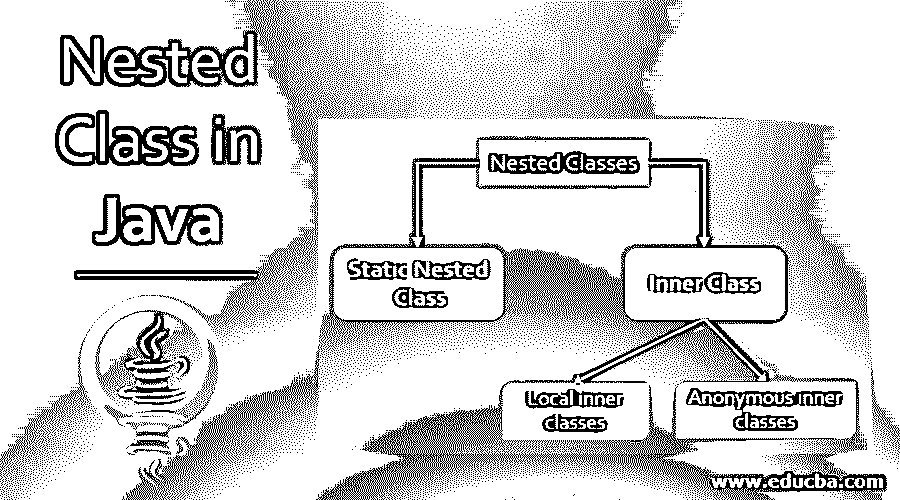
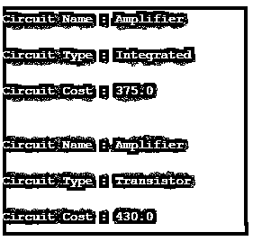

# Java 中的嵌套类

> 原文：<https://www.educba.com/nested-class-in-java/>




## Java 嵌套类介绍

嵌套类是指位于另一个类内部的类。java 允许我们用 Java 创建嵌套类。嵌套类是其外部类的成员之一。它也可以被声明为 [public、private、protected 或 default](https://www.educba.com/access-modifiers-in-java/) 。嵌套类可以访问外部类的其他成员，反之则不可能。这意味着外部类不能访问嵌套类成员，因为嵌套类是其封闭外部类的成员，所以。)用来访问嵌套类&的成员。嵌套类没有任何静态关键字。

### Java 中嵌套类的类别

嵌套类分为两类:

<small>网页开发、编程语言、软件测试&其他</small>

1.  **静态嵌套类:**用关键字 Static 声明的嵌套类称为静态嵌套类。静态嵌套类可以通过引用外部类来访问。拥有静态类的嵌套类不能访问外部类的非静态变量&方法。
2.  **内部类:**内部类，没有被静态声明为非静态嵌套类。没有静态嵌套类可以访问所有静态&非静态变量&方法，即使它声明为私有。内部类也有两种类型。

*   局部内部类
*   匿名内部类

**语法:**

在下面给出的语法中，OuterClass 有一个内部类 InnerClass，称为嵌套类。

```
//Outer class
class OuterClass {
//Inner class as a nested class
class InnerClass {
....
}
}
```

### Java 中嵌套类的使用

在编程世界中，嵌套类扮演着重要的角色，如下所示:

*   类的嵌套类似于另一个类范围中的一组类。嵌套类不能用在其他地方。
*   **导致可读性&可维护性:**类的嵌套提供了更好的代码可读性，也更容易维护，因为它不影响其他类。
*   **减少代码:**嵌套类的使用减少了代码行，从而导致优化。
*   **增加封装:**在嵌套类中，[内部类可以访问](https://www.educba.com/inner-class/)其封闭外部类的成员。而内部类成员不能被外部类直接访问。此外，内部类对其他程序是隐藏的。

### Java 中嵌套类的例子

下面是 Java 中嵌套类的例子:

#### 示例#1

在这个例子中，我们可以看到内部类是如何通过引用外部类来实例化的。

**代码:**

```
// Outer class which contains nested class
class Engine{
static double fuel = 20.0;
//static nested class
static class Ignition{
void showFuelSpend() {
System.out.println("Fuel Spend = " + fuel + " Ltrs");
}
}
}
//class uses nested class inside it
public class NestedClassExample{
public static void main(String[] args) {
//creating object of the nested class by referencing parent class
Engine.Ignition engIgnitObj = new Engine.Ignition();
//calling method of the nested class
engIgnitObj.showFuelSpend();
}
<u>}</u>
```

**输出:**


#### 实施例 2

在这个例子中，我们可以看到如何实例化内部类。要创建内部类的实例，首先需要外部类实例。一旦创建了外部类实例，就可以在其中创建嵌套类实例。

**代码:**

```
//Outer class
class Volume{
double x, y, z;
Volume(double x, double y, double z) {
this.x = x;
this.y = y;
this.z = z;
}
// Nested inner class
class Measurement{
//method to calculate the total area
void totalArea(double i, double j) {
System.out.println("\nArea for the provided container is " + (i * j));
}
//method to calculate the total volume
void totalVolume(double i, double j, double k) {
System.out.println("\nVolume for the provided container is " + (i * j * k));
}
}
}
public class NestedClassCalcExample {
public static void main(String[] args) {
//passing here all the parameter to constructor
Volume volObj = new Volume(30.0, 25, 18.0);
Volume.Measurement volMeasureObj = volObj.new Measurement();
// calculating total area
volMeasureObj.totalArea(volObj.x, volObj.y);
// calculating total volume
volMeasureObj.totalVolume(volObj.x, volObj.y, volObj.z);
}
}
```

**输出** **:**


#### 实施例 3

在这个例子中，我们可以看到嵌套类对象是如何在外部类实例中实例化的。

**代码:**

```
//outer class
class Electronic{
String circuitName,
String circuitType;
double circuitCost;
//constructor of outer class
Electronic(String name, String type, double cost) {
this.circuitName = name;
this.circuitType = type;
this.circuitCost = cost;
}
String getCircuitName() {
return this.circuitName;
}
//nested class
class Circuit{
String circuitType;
double circuitCost;
void setCircuitType() {
this.circuitType = "Transistor";
this.circuitCost = 430.0;
}
//get circuit type using this method
String getCircuitType(){
return this.circuitType;
}
//get circuit cost using this method
double getCircuitCost(){
return this.circuitCost;
}
}
}
public class Product{
public static void main(String[] args) {
Electronic elObj = new Electronic("Amplifier", "Integrated", 375.0);
Electronic.Circuit circuit = elObj.new Circuit();
//printing here the values before reset it
System.out.println("\nCircuit Name : " + elObj.circuitName);
System.out.println("\nCircuit Type : " + elObj.circuitType);
System.out.println("\nCircuit Cost : " + elObj.circuitCost);
//resetting some value
circuit.setCircuitType();
//printing here the values before reset it
System.out.println("\n\nCircuit Name : " + elObj.getCircuitName());
System.out.println("\nCircuit Type : " + circuit.getCircuitType());
System.out.println("\nCircuit Cost : " + circuit.getCircuitCost());
}
}
```

**输出** **:**




### 结论

在上面的文章中，我们回顾了嵌套类在 java 中的重要性。利用类的嵌套是一个很好的实践。嵌套类的可用性在上面的文章中也有描述。

### 推荐文章

这是 Java 中嵌套类的指南。这里我们讨论 Java 中嵌套类的基本概念和使用，以及详细的例子。您也可以看看以下文章，了解更多信息–

1.  [Java 中的 StringBuffer 类](https://www.educba.com/stringbuffer-class-in-java/)
2.  [Java 中的 Else-If 语句](https://www.educba.com/else-if-statement-in-java/)
3.  [Java 中的实例变量](https://www.educba.com/instance-variable-in-java/)
4.  [Java 时期](https://www.educba.com/java-period/)


