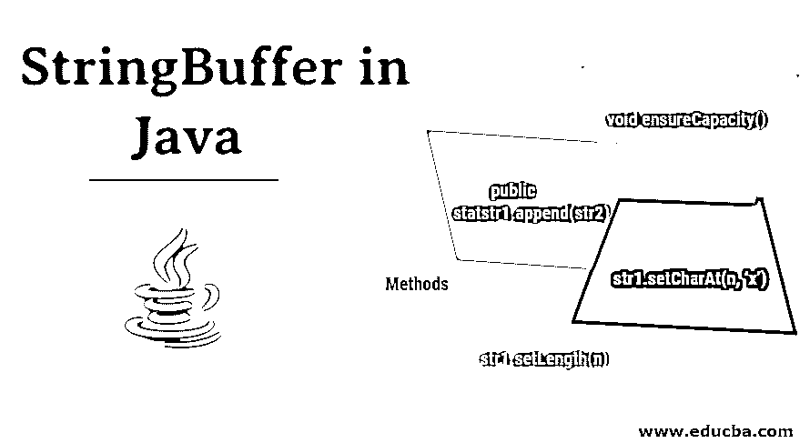

# Java 中的 StringBuffer

> 原文：<https://www.educba.com/stringbuffer-in-java/>




## Java 中 StringBuffer 概述

今天我们将看到 java 中的字符串缓冲区。首先，我们来说说 java。Java 是一种面向对象的编程语言。此前，我们一直在使用 [c，c++语言](https://www.educba.com/c-vs-c-plus-plus/)。对于这些语言，我们有平台问题。Java 是一种平台无关的语言。这意味着 java 可以在任何操作系统上运行，比如 T2 的 Linux，MAC，windows，T3 等等。在这个主题中，我们将学习 Java 中的 StringBuffer。

今天，全世界有近 30 亿台设备运行在 java 上。似乎是永无止境的技术。下面列出了一些功能。

<small>网页开发、编程语言、软件测试&其他</small>

*   Java 有很多可重用的代码。
*   一大批图书馆
*   独立于平台
*   自动垃圾收集。
*   安全性
*   大型社区支持

在开始学习 string Buffer 类之前，我们必须知道 java 是如何在幕后工作的。

Java 有我们所知道的编译语言。到底是什么意思？我们都知道计算机知道二进制形式的语言。也就是 0 和 1。为了理解用 java 写的程序，我们需要一个编译器。Java 编译器将这个程序转换成字节码。在以下命令的帮助下。

贾瓦茨·Someprogram.java

此命令创建。类文件。该文件正在计算机上运行。

现在我们知道 java 程序到底发生了什么。

现在让我们从 StringBuffer 开始。

### Java 中的 StringBuffer 是什么？

在 Java 中，字符串一旦被创建，就不能被修改。如果我们想改变或赋予字符串新的值是不可能的。它创建一个字符串对象，然后赋值。这里，字符串缓冲区类开始出现。在字符串缓冲区的帮助下，我们可以修改字符串。

### 弦是什么？

然后一个显而易见的问题出现在你的脑海里，那么什么是字符串呢？该字符串是字符**的组合。**

看下面这个例子。

```
String city = new String("Mumbai");
```

我们可以如下创建一个空字符串:

```
String city = new String();
```

我们还有[字符串数组](https://www.educba.com/string-array-in-javascript/)。请看下面的例子:

```
String myArray1 = new String[3];
```

上面的例子创建了一个包含三个常量的字符串数组。

### Java 中的字符串缓冲区是如何工作的？

在 StringBuffer java 的帮助下，字符串变得可变了。

这种可变性到底意味着什么？看下面这个例子。如果我们在 java 中将值重新赋给字符串变量，它会抛出一个错误，因为 Java 中的字符串是不可变的。

```
public class Str {
public static void main(String args[]){
//We are creating object here of StringBuffer class
StringBuffer city = new Stringbuffer("mumbai");
//let’s try to change the value of city here
City =" Delhi"
}
}
```

上面的代码将获取一个错误，因为字符串是不可变的。

### 解释 StringBuffer 类

java.lang.StringBuffer 类是一个线程安全类。这意味着多个线程不能同时访问它们。它有一个可变的字符序列。

[StringBuffer 类](https://www.educba.com/stringbuffer-class-in-java/)与 string 相同，但它是可变的，string id 是不可变的。每个 StringBuffer 的容量为 16 个字符，无需重新分配。它允许在字符串或子字符串的开头、中间或结尾添加项。StringBuffer 是一个可增长的类。

StringBuffer 方法按顺序工作。我们将看到这些方法以及它们是如何工作的。

StringBuffer 构造函数:

```
StringBuffer r = new StringBuffer();
```

这会创建一个 StringBuffer 类类型的空对象 r。

### Java 中 StringBuffer 类的方法(包括例子)

字符串缓冲类为我们提供了不同的方法来克服这个问题。

下面列出了一些方法。

| **StringBuffer 方法** | **Stv** **StringBuffer 方法使用** |
| void ensureCapacity() | 它为角色设置了限制。 |
| str1.append | 它将 str2 追加到字符串 str1 中 |
| str1.setCharAt(n，' x ') | 将第 n 个字符修改为 x |
| str1.setLength(n) | str1 的长度为 n 个字符 |
| str1.insert(n，str2) | 这会将 str2 插入 str1 的第 n 个位置 |
| Int 容量() | 这将返回总分配容量 |
| 整数长度() | 它返回对象的当前长度 |

上述方法帮助程序员使字符串可变。

#### StringBuffer 方法的详细信息

让我们看看下面的程序:

Example.java 优惠计划

```
class Example{
public static void main(String args[]){
StringBuffer abc = new StringBuffer("Hello World");
System.out.println("Welcome!!!"+ abc);
System.out.println("Total length of string is" + abc.length());
for(int i=0;i<=abc.length();i++){
int n = i+1;
System.out.println("We are using charAt function here :" + " " + n + " " + abc.charAt(i));
}
}
}
```

要运行上述程序，请打开命令提示符。转到保存文件的位置。

然后键入以下两个程序:

贾瓦茨·Example.java

Java 示例

#### 确保容量()

ensureCapacity()是容量至少等于指定的 minimumCapacity 的度量。这意味着 StringBuffer 的当前容量小于 minimumCapacity 的参数，因此新的内部数组将被分配更大的容量。

```
class Ex2{
public static void main(String[] args)
{
StringBuffer abc = new StringBuffer();
// print string capacity
System.out.println("Before ensureCapacity the value is: "
+ "method capacity = "
+ abc.capacity());
abc.ensureCapacity(20);
System.out.println("After ensureCapacity the value is: + " method capacity = "
+ abc.capacity());
}
}
```

#### append()方法

append()方法用于在指定位置追加值。

下面的例子描述了如何在现有字符串的末尾追加字符串。这是修改字符串的一种方法。

**例子**

```
class Ex2{
public static void main(String[] args)
{
StringBuffer abc = new StringBuffer("Welcome to the world ");
System.out.println("The string is:"  + abc );
abc.append("of java");
System.out.println("The string after appending is:"  + abc );
}
}
```

通过在同一个变量中追加一个新的字符串，最终，我们成功地修改了字符串的值。

在 java 中，有许多预定义的函数。我们不能在一篇文章中写所有的函数。但是，我们可以一次一个地使用这些功能并练习它们。使用 StringBuffer 类，对字符串也有许多方法。

### 结论

StringBuffer 类用于使字符串可变。这对我们来说是一个额外的优势。如果你处于 java 的学习阶段，你应该学习如何玩字符串。基本上，这是开始练习用 java 编写程序的初级水平。

### 推荐文章

这是一个 Java 中 StringBuffer 的指南。这里我们讨论什么是字符串，字符串缓冲区如何在 Java 中工作，并给出例子。你也可以看看下面的数据分析课程来了解更多。

1.  [Java 中的快速排序](https://www.educba.com/quick-sort-in-java/)
2.  [Java 包](https://www.educba.com/java-packages/)
3.  [在 JavaScript 中覆盖](https://www.educba.com/overriding-in-javascript/)
4.  [Java 包示例](https://www.educba.com/java-package-example/)


