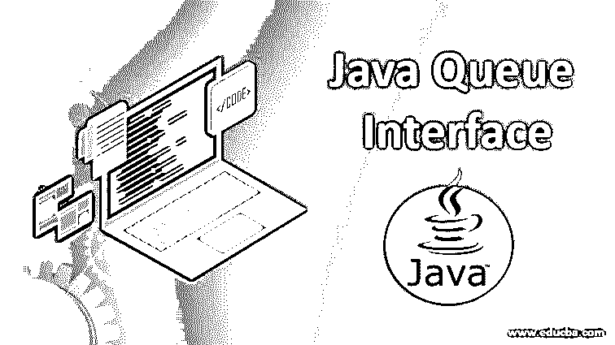
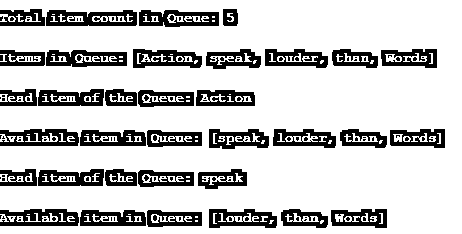
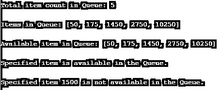

# Java 队列接口

> 原文：<https://www.educba.com/java-queue-interface/>




## Java 队列接口简介

队列接口是包 util.java 的成员。它是集合框架的一部分&用于扩展集合接口。由于[集合接口是主接口](https://www.educba.com/collection-interface-in-java/)，所以队列接口包含了它的所有方法。队列是先进先出的数据结构。Queue 表示一种数据结构，它的实现方式使得元素可以被插入到顺序中的最后一个位置。在队列中，最先插入队列的项将最先出来。java 中的队列是一个接口；因此，它不能被实例化。队列接口主要通过两个类实现，即 LinkedList & PriorityQueue。它是一个有序的对象序列，就像 java 列表一样。

### 句法

在以下语法中，使用 LinkedList / PriorityQueue 类实例化对象 obj。在下面的两个队列语法中，LinkedList 实现是标准的。

<small>网页开发、编程语言、软件测试&其他</small>

```
Queue qObj = new LinkedList();
```

**或**

```
Queue qObj = new PriorityQueue();
```

可以使用以下给定的语法创建具有受限数据类型的队列实例。

```
Queue<String> q = new LinkedList<String>();
```

### 队列接口方法

下面给出了队列接口的一些常用方法

*   **add():** add()方法用于在队列中插入元素。如果响应成功，则返回 true 否则，它会生成异常。
*   **element():** element()是返回队列头元素的重要方法之一。如果队列为空，那么它会生成异常。在示例部分，我们可以看到 element()方法是如何工作的。
*   **offer():** 这个方法也用于在队列中插入元素。add()和 offer 之间的唯一区别是，如果 add 方法无法将元素添加到队列中，它会创建一个异常，而 offer 方法不会。
*   **peek():** peek()方法和 element()方法差不多。它检查队列的头部。如果队列是空的，那么它返回 NULL
*   **poll():** 这个方法从队列的前面移除一个元素&从队列中返回前面的元素。如果队列为空，则返回 null。
*   **remove():** 这个方法用来删除&返回队列的前端元素。如果发现元素为空，它会创建异常。
*   **size():** 该方法返回队列中可用元素的计数。

### 实现 Java 队列接口的示例

下面是实现 java 队列接口的例子:

#### 示例#1

这个例子展示了程序中如何使用不同的方法&这些方法返回什么。

1.  创建了一个类型为 LinkedList 的队列实例[。](https://www.educba.com/linkedlist-in-java/)
2.  此外，通过使用 add 方法将不同的字符串元素添加到队列中。
3.  在下一条语句中，使用 size()方法显示了队列的大小。
4.  队列中的项目，队列的头元素显示在下一行。
5.  Remove 方法进一步用于从队列中移除元素。
6.  接下来的两行分别显示队列中的可用项、队列的头项。

**代码:**

```
importing packages
import java.util.*;
public class QueueInterfaceExample {
public static void main(String[] args){
Queue qObj = new LinkedList();
//adding element to the queue
qObj.add("Action");
qObj.add("speak");
qObj.add("louder");
qObj.add("than");
qObj.add("Words");
//items available in the queue
System.out.println("\nTotal item count in Queue: " + qObj.size());
//printing queue here
System.out.println("\nItems in Queue: " + qObj);
//printing the head element of the queue
System.out.println("\nHead item of the Queue: " + qObj.element());
//removing head element from the queue
qObj.remove();
//items available in the queue
System.out.println("\nAvailable item in Queue: " + qObj);
//items available in the queue after applying peek method
System.out.println("\nHead item of the Queue: " + qObj.peek());
//applying the poll method to the
qObj.poll();
//items available in the queue after applying poll method
System.out.println("\nAvailable item in Queue: " + qObj);
}
}
```

**输出:**




#### 实施例 2

在这个例子中，我们可以看到如何将受限类型的元素添加到队列中。

**代码:**

```
//importing package here
import java.util.*;
public class QueueInterfaceExample2 {
public static void main(String[] args){
//initialize a Queue using a LinkedList
Queue<Integer> qObj = new LinkedList<>();
//adding element to the queue
qObj.add(50);
qObj.add(175);
qObj.add(1450);
qObj.add(2750);
qObj.add(10250);
//items available in the queue
System.out.println("\nTotal item count in Queue: " + qObj.size());
//printing queue here
System.out.println("\nItems in Queue: " + qObj);
//items available in the queue after applying poll method
System.out.println("\nAvailable item in Queue: " + qObj);
//declaring a integer variable here
Integer intVar = 1450;
//condition to check if element is available in the queue
if(qObj.contains(intVar)){
//items available in the queue after applying poll method
System.out.println("\nSpecified item is available in the Queue.");
}
//declaring a integer variable here
Integer intVar2 = 1500;
//condition to check if element is available in the queue
if(qObj.contains(intVar2)){
//items available in the queue after applying poll method
System.out.println("\nSpecified item is available in the Queue.");
}else{
//items available in the queue after applying poll method
System.out.println("\nSpecified item " + intVar2 + " is not available in the Queue.");
}
}
}
```

**输出:**




#### 实施例 3

在这个例子中，试图将字符串类型的元素添加到整型受限队列中。

**代码:**

```
importing package here
import java.util.*;
public class QueueInterfaceExample3 {
public static void main(String[] args){
//initialize a Queue using a LinkedList
Queue<Integer> qObj = new LinkedList<>();
//adding element to the queue
qObj.add(50);
qObj.add(175);
qObj.add(1450);
qObj.add(2750);
qObj.add("Happy");
//items available in the queue
System.out.println("\nTotal item count in Queue: " + qObj.size());
//printing queue here
System.out.println("\nItems in Queue: " + qObj);
//items available in the queue after applying poll method
System.out.println("\nAvailable item in Queue: " + qObj);
}
}
```

**输出:**

上面给出的程序的输出将产生一个错误，因为不支持在整数类型队列中插入字符串类型的元素。


### 结论

在上面给出的文章中，队列接口描述得很清楚。它用于扩展集合接口。同时给出了 FIFO 在队列接口中的使用方法。前面几节给出了队列接口的用法。本文中给出了一些例子来看看 queue & queue 方法是如何工作的。

### 推荐文章

这是一个 Java 队列接口指南。在这里，我们讨论语法、常用方法以及用适当的代码和输出实现 java 队列接口的例子。您也可以浏览我们的其他相关文章，了解更多信息——

1.  [Java 中的队列](https://www.educba.com/queue-in-java/)
2.  [JavaScript 中的队列](https://www.educba.com/queue-in-javascript/)
3.  [C++队列](https://www.educba.com/c-plus-plus-queue/)
4.  [c++中的队列](https://www.educba.com/queue-in-c-plus-plus/)


