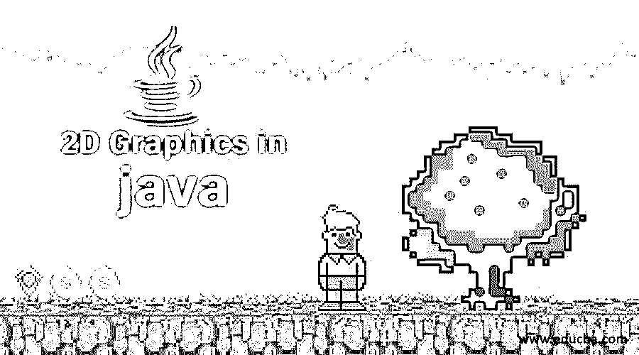
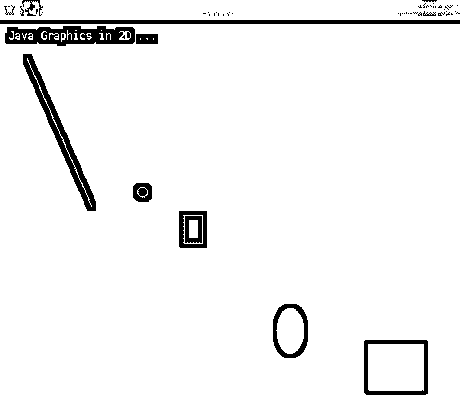
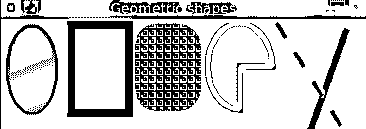
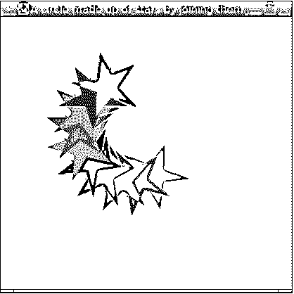
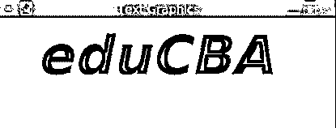

# Java 中的 2D 图形

> 原文：<https://www.educba.com/2d-graphics-in-java/>




## Java 2D 图形介绍

借助 Java 2 平台的一些高级功能，可以使用 Java 编程实现 2D 图形，这些高级功能包括 Java 的内置函数，用于图像处理、高级图形设计选项、几何变换、alpha 合成等操作。java 2D 包下提供了许多包，如 awt、awt.image、awt.color、awt.font、awt.geom、awt.print 和 awt . image . renderable。Java 是游戏开发人员社区中著名的 goto 选项，因为它具有高质量的图形结果，各种各样的几何设计选项方便了文档的打印，并允许保持所开发产品的性能。

### Java 2D 渲染

Java 2D API 支持跨所有不同设备的统一呈现模型:显示器或打印机。在程序开发过程中，无论最终组件是打印机还是显示器，渲染都以相同的方式工作。该包根据结束组件自动检测和更改图形上下文。Java 2D API 由 java.awt.Graphics2D 组成，它扩展了 Graphics 类，为增强的图形和渲染功能提供支持。

<small>网页开发、编程语言、软件测试&其他</small>

以下是该软件包提供的功能:

*   它支持原始几何形状和图形的渲染。
*   它提供了使用笔划使用“绘制属性”中指定的任何颜色或图案填充任何形状内部的选项。
*   它允许你渲染指定的图像。
*   它允许您将文本字符串转换为字形，并用绘画属性中指定的颜色填充。

#### 示例#1

让我们看看同一个 Java 程序，看看它是如何工作的。

**代码:**

```
import javax.swing.JFrame;
import java.awt.*;       // AWT package is responsible for creating GUI
import javax.swing.*;    // Java swing package is responsible to provide UI components
// AWT class extents Jframe which is part of Swing package
public class AWTGraphicsSampleProgram extends JFrame {
/**
*
*/
// Defining all the static variables
private static final long serialVersionUID = 1L;
public static final int SAMPLE_CANVAS_WIDTH  = 500;
public static final int SAMPLE_CANVAS_HEIGHT = 500;
// The program enters from the main method
public static void main(String[] args) {
SwingUtilities.invokeLater(new Runnable() {
@Override
public void run() {
new AWTGraphicsSampleProgram(); // this run method will create a new object and thus invoke the constructor method.
}
});
}
//Here we are creating an instance of the drawing canvas inner class called DrawCanwas
private DrawCanvas sampleCanvas;
public AWTGraphicsSampleProgram() {
sampleCanvas = new DrawCanvas();
sampleCanvas.setPreferredSize(new Dimension(SAMPLE_CANVAS_WIDTH,            SAMPLE_CANVAS_HEIGHT));
Container containerPane = getContentPane();
containerPane.add(sampleCanvas);
setDefaultCloseOperation(EXIT_ON_CLOSE);   // setting up the default close mechanism
pack();
setTitle("......");  // set the desired title of the JFrame
setVisible(true);    // setVisible method will be set the visibility of the Jframe to true
}
/**
* here drawCanvas is the inner class of the Jpanel which is used for custom drawing
*/
private class DrawCanvas extends JPanel {
/**
*
*/
private static final long serialVersionUID = 1L;
// Overriding paintComponent will let you to design your own painting
@Override
public void paintComponent(Graphics graphics) {
super.paintComponent(graphics);
setBackground(Color.BLACK);  // setting the background color to black
graphics.setColor(Color.GREEN);  // setting up the color to green
graphics.drawLine(30, 40, 100, 200);
graphics.drawOval(150, 180, 10, 10);
graphics.drawRect(200, 210, 20, 30);
graphics.setColor(Color.magenta);
graphics.fillOval(300, 310, 30, 50);
graphics.fillRect(400, 350, 60, 50);
graphics.setColor(Color.WHITE);
graphics.setFont(new Font("Monospaced", Font.PLAIN, 12)); // setting up the font style and font size
graphics.drawString("Java Graphics in 2D ...", 10, 20);
}
}
}
```

**输出:**




Graphics 类提供了绘制不同图形对象的不同方法。最常见的方法有 drawString()、drawImage()和 fillXxx()。这些方法可以大致分为两类。第一种图形方法是，它提供绘制和填充功能，使用户能够呈现基本的形状、文本和图像。另一种方法用于属性设置，允许您更改绘图在控制台中的显示效果。setColor 和 setFont 等方法允许您决定绘制和填充的呈现方式。图形上下文负责维护状态或属性，例如当前字体的当前绘画颜色。

#### 实施例 2

让我们看另一个例子，看看 Java 2D 类还能实现什么。

**代码:**

```
import javax.swing.*;
import java.awt.event.*;
import java.awt.*;
import java.awt.geom.*;
import java.awt.image.*;
public class GeometricShapes extends JFrame
{
/**
*
*/
private static final long serialVersionUID = 1L;
@SuppressWarnings("deprecation")
public GeometricShapes()
{
super( "Geometric shapes" );
setSize( 425, 160 );
show();
}
public static void main( String args[] )
{
GeometricShapes figure = new GeometricShapes();
figure.addWindowListener( new WindowAdapter()
{
public void windowclosing( WindowEvent e )
{
System.exit( 0 );
}
});
}
public void paint( Graphics graphics )
{
// Instantiating Graphics 2D class
Graphics2D graphics2D = ( Graphics2D ) graphics;
graphics2D.setPaint( new GradientPaint( 16, 30,
Color.red,
45, 105,
Color.green,
true ) );
graphics2D.fill( new Ellipse2D.Double( 6, 31, 61, 105 ) );
graphics2D.setPaint( Color.black );
graphics2D.setStroke(new BasicStroke( 9.0f ) );
graphics2D.draw( new Rectangle2D.Double( 82, 32, 67, 102 ) );
// This will create a black colored rounded rectangle
BufferedImage bufferedImage = new BufferedImage( 10, 10,                                  BufferedImage.TYPE_INT_RGB );
Graphics2D design = bufferedImage.createGraphics();
design.setColor( Color.blue );
design.fillRect( 0, 0, 9, 9 );
design.setColor( Color.orange );
design.drawRect( 2, 2, 7, 7 );
design.setColor( Color.black );
design.fillRect( 2, 2, 4, 4 );
design.setColor( Color.pink );
design.fillRect( 5, 5, 2, 2 );
graphics2D.setPaint( new TexturePaint( bufferedImage, new Rectangle( 9, 9 ) ) );
graphics2D.fill( new RoundRectangle2D.Double( 156, 31, 76, 101, 51, 51 ) );
graphics2D.setPaint( Color.CYAN );
graphics2D.setStroke(new BasicStroke( 7.0f ) );
graphics2D.draw( new Arc2D.Double( 240, 30, 75, 100, 0, 270, Arc2D.PIE ) );
// this will create line in red and black color
graphics2D.setPaint( Color.red );
graphics2D.draw( new Line2D.Double( 400, 40, 350, 180 ) );
float dashesArray[] = { 20 };
graphics2D.setPaint( Color.black );
graphics2D.setStroke( new BasicStroke( 4, BasicStroke.CAP_BUTT, BasicStroke.JOIN_ROUND, 10, dashesArray, 0 ) );
graphics2D.draw( new Line2D.Double( 320, 30, 395, 150 ) );
}
}
```

**输出:**




#### 实施例 3

让我们在下面的程序中应用 2D java。

**代码:**

```
import javax.swing.*;
import java.awt.event.*;
import java.awt.*;
import java.awt.geom.*;
public class GeometricShapes2 extends JFrame
{
/**
*
*/
private static final long *serialVersionUID* = 1L;
public static void main( String args[] )
{
GeometricShapes2 design = new GeometricShapes2();
design.addWindowListener(new WindowAdapter()
{
});
}
@SuppressWarnings("deprecation")
public GeometricShapes2()
{
super( "A circle made up of stars by joining them at certain position filled with random colors" );
setBackground( Color.*green* );
setSize( 450, 450 );
show();
}
public void paint( Graphics graphics )
{
int xCoordinates[] = { 57, 69, 111, 75, 85, 57, 29, 39, 3, 45 };
int yCoordinates[] = { 2, 38, 38, 56, 98, 74, 98, 56, 38, 38 };
Graphics2D graphics2D = ( Graphics2D ) graphics;
GeneralPath starFigure = new GeneralPath();
starFigure.moveTo( xCoordinates[ 0 ], yCoordinates[ 0 ] );
for ( int j = 1; j < xCoordinates.length; j++ )
starFigure.lineTo( xCoordinates[ j ], yCoordinates[ j ] );
starFigure.closePath();
graphics2D.translate( 200, 200 );
for ( int i = 1; i <= 10; i++ )
{
graphics2D.rotate( Math.*PI* / 9.0 );
graphics2D.setColor(new Color( ( int ) ( Math.*random*() * 128 ),( int ) ( Math.*random*() * 128 ),
( int ) ( Math.*random*() * 128 ) ) );
graphics2D.fill( starFigure );
}
}
}
```

**输出:**




#### 实施例 4

在下面的程序中应用颜色编码。

**代码:**

```
import java.awt.*;
import java.awt.event.*;
import java.awt.geom.*;
public class GeometricShapes3 extends Canvas {
/**
*
*/
private static final long serialVersionUID = 1L;
Frame windowFrame;
TextField sampleText;
Font sampleFont;
Color colorOfText;
Color colorOfCircle;
public static void main(String args[]) {
GeometricShapes3 start;
start = new GeometricShapes3();
}
public GeometricShapes3() {
this("Arial", Font.BOLD, 18, Color.gray, Color.red);
}
public GeometricShapes3(String ff, int fs, int fz, Color bg, Color fg) {
setBackground(bg);
colorOfCircle = Color.green.brighter();
colorOfText = fg;
sampleFont = new Font(ff, fs, fz);
sampleText = new TextField("eduCBA (Corporate Bridge Consultancy Pvt Ltd) ");
windowFrame = new Frame("Demo");
windowFrame.add(sampleText, BorderLayout.NORTH);
windowFrame.add(this, BorderLayout.CENTER);
windowFrame.setSize(new Dimension(300,340));
windowFrame.setLocation(150,140);
windowFrame.addWindowListener(new WindowAdapter() {
public void windowClosing(WindowEvent we) {
System.exit(0);
}
});
sampleText.addActionListener(new ActionListener() {
public void actionPerformed(ActionEvent ae) {
repaint();
}
});
windowFrame.setVisible(true);
}
public void paint(Graphics graphics) {
String sampleTxt = sampleText.getText();
if (sampleTxt.length() == 0) return;
if (graphics instanceof Graphics2D) {
Dimension dimension = getSize();
Point point = new Point(dimension.width / 2, dimension.height / 2);
int radius = (int)(point.x * 0.84);
graphics.setColor(colorOfCircle);
graphics.drawArc(point.x - radius, point.y - radius,
radius*2-1, radius*2-1,
0, 360);
graphics.setColor(colorOfText);
graphics.setFont(sampleFont);
CircularText((Graphics2D)graphics, sampleTxt, point, radius, -Math.PI/2, 1.0);
}
else {
System.out.println("Some Error Occurred");
}
}
static void CircularText(Graphics2D graphics, String sampleTxt, Point center,
double radius, double length, double height)
{
double circleAngle = length;
Point2D circle = new Point2D.Double(center.x, center.y);
char chArray[] = sampleTxt.toCharArray();
FontMetrics fm = graphics.getFontMetrics();
AffineTransform formx, formy;
formx = AffineTransform.getTranslateInstance(circle.getX(),circle.getY());
for(int i = 0; i < chArray.length; i++) {
double cwid = (double)(getWidth(chArray[i],fm));
if (!(chArray[i] == ' ' || Character.isSpaceChar(chArray[i]))) {
cwid = (double)(fm.charWidth(chArray[i]));
formy = new AffineTransform(formx);
formy.rotate(circleAngle, 0.0, 0.0);
String chstr = new String(chArray, i, 1);
graphics.setTransform(formy);
graphics.drawString(chstr, (float)(-cwid/2), (float)(-radius));
}
if (i < (chArray.length - 1)) {
double adv = cwid/2.0 + fm.getLeading() + getWidth(chArray[i + 1],fm)/2.0;
circleAngle += Math.sin(adv / radius);
}
}
}
static int getWidth(char charText, FontMetrics fontMetrics) {
if (charText == ' ' || Character.isSpaceChar(charText)) {
return fontMetrics.charWidth('n');
}
else {
return fontMetrics.charWidth(charText);
}
}
} Output:
```


#### 实施例 5

文本图形的 2D java。

**代码:**

```
import java.awt.*;
import java.awt.event.WindowAdapter;
import java.awt.event.WindowEvent;
import java.awt.font.FontRenderContext;
import java.awt.font.TextLayout;
import java.awt.geom.AffineTransform;
import java.awt.geom.Rectangle2D;
import java.awt.image.BufferedImage;
public class FontsDemo extends Frame {
/**
*
*/
private static final long *serialVersionUID* = 1L;
public static void main( String[] argv ) {
FontsDemo myExample = new FontsDemo( "Text Graphics" );
}
public FontsDemo( String title ) {
super( title );
setSize( 450, 180 );
addWindowListener( new WindowAdapter() {
public void windowClosing( WindowEvent we ) {
dispose();
System.*exit*( 0 );
}
} );
setVisible( true );
}
public void paint( Graphics g ) {
Graphics2D graphics = (Graphics2D) g;
FontRenderContext frc = graphics.getFontRenderContext();
Font font = new Font( "Arial", Font.*HANGING_BASELINE* | Font.*BOLD*, 72 );
TextLayout tl = new TextLayout( "eduCBA", font, frc );
Shape myShape = tl.getOutline( AffineTransform.*getTranslateInstance*( 50, 100 ) );
Paint myPaint = loadTextureResource( "1.gif" );
graphics.setPaint( myPaint );
graphics.fill( myShape );
}
public TexturePaint loadTextureResource( String absfilename ) {
MediaTracker tracker = new MediaTracker( this );
Image imtexture = Toolkit.getDefaultToolkit().getImage( absfilename );
tracker.addImage( imtexture, 0 );
try {
tracker.waitForID( 0 );
int width = imtexture.getWidth( this );
int height = imtexture.getHeight( this );
System.*out*.println( "width" + width + " height =" + height );
BufferedImage buffImg = new
BufferedImage( width, height, BufferedImage.*TYPE_INT_ARGB* );
Graphics g = buffImg.getGraphics();
g.drawImage( imtexture, 0, 0, this );
return new TexturePaint( buffImg, new Rectangle2D.Double( 0, 0, width, height ) );
}
catch( Exception e ) {
System.*out*.println( "Exception on Image-Texture Loading" );
}
return null;
}
}
```

**输出:**




### 结论

既然我们已经到了文章的结尾，我希望你们对 Java 2D 图形能实现什么有一个公平的想法。老实说，Java 2D 类的能力并不局限于简单的形状和图形；它可以扩展到设计复杂的图形和几何形状，主要取决于如何利用现有的类和方法。

### 推荐文章

这是一个 Java 2D 图形指南。这里我们讨论 Java 中的 2D 图形介绍以及代码实现和输出。您也可以浏览我们推荐的其他文章，了解更多信息——

1.  [2D 动画软件](https://www.educba.com/2d-animation-software/)
2.  [Java 中的回文](https://www.educba.com/palindrome-in-java/)
3.  [Java 中的内部类](https://www.educba.com/inner-class-in-java/)
4.  [Java 线程池](https://www.educba.com/java-thread-pool/)


