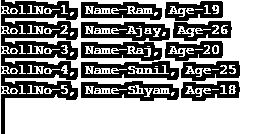
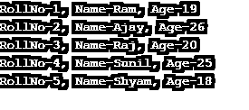

# Java 示例中的可比性

> 原文：<https://www.educba.com/comparable-in-java-example/>


## Java 示例中的 Comparable 概述

Java 中的 Comparable 是一种干扰，用于将当前对象与同类型的其他对象进行比较。这种比较可用于对集合中的元素进行排序。你必须在一个类中实现一个接口，使它可排序或“可比较”您只需要实现一个方法“compareTo”这种任意类型的排序称为自然排序，实现的“compareTo”方法称为自然比较方法。在这篇 java 中的 comparable 示例文章中，我们将看看 Java 中 Comparable 的不同示例。

### 举例说明 Java 中的 Comparable 的使用

java 中 comparable 的工作方式如下:

<small>网页开发、编程语言、软件测试&其他</small>

**声明:**

```
Interface Comparable<T>
```

若要实现此接口，必须实现此方法:

```
public int compareTo(To);
```

**参数:**

t–是与该对象进行比较的对象的类型。

**返回值:**

如果指定的对象和此对象相等，则 compareTo 方法返回 0。如果此对象小于指定的对象，则返回负整数。如果此对象大于指定的对象，则返回正整数。

**投掷:**

*   **ClasscastException**–如果传递给该方法的对象为空
*   **NullPointerException**–如果传递给此方法的对象与此对象不兼容。

实现 Comparable interface 的类具有指定的自然排序，因此可以使用 Collections.sort()和 Arrays.sort()在集合或数组中直接对它们进行排序。它们还可以用作排序映射中的键和排序集合中的元素，而无需单独指定比较。

让我们借助一个例子来理解可比较的接口:

**举例:**

```
package comparableDemo;
import java.util.TreeSet;
public class Student implements Comparable<Student> {
private int rollNo;
private String name;
private int age;
public Student(int rollNo, String name, int age) {
this.rollNo = rollNo;
this.name = name;
this.age = age;
}
@Override
public int compareTo(Student o) {
if (this.rollNo > o.rollNo) {
return 1;
} else if (this.rollNo == o.rollNo) {
return 0;
} else {
return -1;
}
}
@Override
public String toString() {
return "RollNo-" + this.rollNo + ", Name-" + this.name + ", Age-" + this.age;
}
public static void main(String[] args) {
TreeSet<Student> students = new TreeSet<>();
Student student1 = new Student(3, "Raj", 20);
Student student2 = new Student(5, "Shyam", 18);
Student student3 = new Student(1, "Ram", 19);
Student student4 = new Student(4, "Sunil", 25);
Student student5 = new Student(2, "Ajay", 26);
students.add(student1);
students.add(student2);
students.add(student3);
students.add(student4);
students.add(student5);
for (Student student : students) {
System.out.println(student);
}
}
}
```

**输出:**




### 说明

这是一个存储学生详细信息的应用程序。

*   首先，我们创建了一个类“Student”作为实体 Student 的表示。然后，我们将存储基本信息，如学生的编号、姓名和年龄。
*   并且要求是根据点名对学生名单进行排序。
*   为了满足这一要求，实现了一个可比较的接口，并基于卷号与学生进行比较，正如您可以看到的“compareTo”方法的实现。
*   然后我们用主方法来展示功能。在这里，我们创建了一个“树集”,并添加了五个随机编号的学生。我们使用了“TreeSet ”,因为它按照排序的顺序存储元素。
*   现在，如果您遍历学生列表，您会发现学生是根据点名进行排序的。这就是我们的要求！
*   我们也可以根据名字或年龄等其他属性对学生进行分类。为此，我们必须在“compareTo”方法中使用名称或年龄变量，而不是“rollNo”

**举例:**

```
@Override
public int compareTo(Student o) {
if (this.age> o.age) {
return 1;
} else if (this.age == o.age) {
return 0;
} else {
return -1;
}
}
OR
@Override
public int compareTo(Student o) {
return this.name.compareTo(o.name);
}
```

### 可比与比较

Comparator 也是一个类似 Comparable 的接口，用于比较一个类型的两个对象。不同之处在于，比较器不是在实体类本身中实现的。我们必须在另一个类中实现它，并将它的实例显式地提供给排序机制。为此，我们还可以使用匿名类实例。

例如，假设我们有一个没有实现类似接口的学生类:

```
package comparableDemo;
import java.util.TreeSet;
public class Student{
private int rollNo;
private String name;
private int age;
public Student(int rollNo, String name, int age) {
this.rollNo = rollNo;
this.name = name;
this.age = age;
}
@Override
public String toString() {
return "RollNo-" + this.rollNo + ", Name-" + this.name + ", Age-" + this.age;
}
public static void main(String[] args) {
TreeSet<Student> students = new TreeSet<>();
Student student1 = new Student(3, "Raj", 20);
Student student2 = new Student(5, "Shyam", 18);
Student student3 = new Student(1, "Ram", 19);
Student student4 = new Student(4, "Sunil", 25);
Student student5 = new Student(2, "Ajay", 26);
students.add(student1);
students.add(student2);
students.add(student3);
students.add(student4);
students.add(student5);
for (Student student : students) {
System.out.println(student);
}
}
}
```

如果您尝试执行此程序，将会得到以下异常:


因为 TreeSet 需要一种对元素进行排序的方法。

为了解决这个错误，我们可以使用在这个程序中实现的比较器:

```
package comparableDemo;
import java.util.Comparator;
import java.util.TreeSet;
public class Student {
private int rollNo;
private String name;
private int age;
public Student(int rollNo, String name, int age) {
this.rollNo = rollNo;
this.name = name;
this.age = age;
}
@Override
public String toString() {
return "RollNo-" + this.rollNo + ", Name-" + this.name + ", Age-" + this.age;
}
public static void main(String[] args) {
Comparator<Student> studentComparator = new Comparator<Student>() {
@Override
public int compare(Student o1, Student o2) {
if (o1.rollNo < o2.rollNo) {
return -1;
} else if (o1.rollNo == o2.rollNo) {
return 0;
} else {
return 1;
}
}
};
TreeSet<Student> students = new TreeSet<>(studentComparator);
Student student1 = new Student(3, "Raj", 20);
Student student2 = new Student(5, "Shyam", 18);
Student student3 = new Student(1, "Ram", 19);
Student student4 = new Student(4, "Sunil", 25);
Student student5 = new Student(2, "Ajay", 26);
students.add(student1);
students.add(student2);
students.add(student3);
students.add(student4);
students.add(student5);
for (Student student : students) {
System.out.println(student);
}
}
}
```




可以看到 Comparator 接口是在一个匿名的[内部类](https://www.educba.com/inner-class-in-java/)中实现的，实例被提供给 TreeSet 进行元素排序。现在，您将像前面一样获得正确的输出。

### Java 中的集合接口

集合是集合框架中的根接口。它包含所有通用方法的声明，这些方法在列表和集合等集合中实现。Map 接口没有扩展集合接口，因为 Map 是键值对的集合，而不仅仅是元素的集合。一些集合接口方法是在抽象类“abstract Collection”中实现的[。](https://www.educba.com/abstract-class-in-c-sharp/)

此接口不是直接实现的，而是由特定接口扩展的，因为它的实现是特定于集合的。例如，一些集合允许重复元素(Ex- List)，而一些不允许(Ex- Set)，一些保持索引(Ex- List)，而一些不允许(Ex- Set)。

这里描述了一些重要的方法:

1.  **Boolean add(E e):** 该方法向集合中添加一个元素，并返回添加操作的状态。
2.  **布尔 addAll(收藏<？扩展 E > c):** 该方法将指定集合中的所有元素添加到该集合中，并返回添加操作状态。
3.  **void clear():** 这个方法从集合中移除所有的元素。
4.  **boolean contains(Object o):**该方法检查集合中是否存在指定的元素。相应地返回 true 或 false。
5.  **布尔包含(收藏<？> c):** 这个方法检查所有指定的集合元素是否都存在于这个集合中，并相应地返回 true 或 false。
6.  **boolean isEmpty():** 该方法检查集合是否为空，并相应地返回 true 或 false。
7.  **迭代器< E >迭代器():**这个方法返回这个集合的迭代器。[迭代器用于](https://www.educba.com/iterators-in-python/)遍历集合中的所有元素。
8.  **boolean remove(Object o):** 这个方法从集合中移除指定的元素，并返回移除操作状态。
9.  **布尔 removeAll(收藏<？> c):** 这个方法从这个集合中移除所有存在于指定集合和这个集合中的元素。
10.  **布尔零售(收藏<？> c):** 这个方法从这个集合中移除指定集合中不存在而这个集合中存在的所有元素。
11.  **int size():** 这个方法返回集合的大小。
12.  **Object[] toArray():** 这是一个重要的方法，它形成并返回包含该集合所有元素的数组。
13.  **<T>T[]to array(T[]a):**该方法将集合中的所有元素添加到指定的数组中，并返回该数组。如果数组的大小小于此集合的大小，则它创建一个与指定数组的类型相同的新数组，并返回它。如果指定的数组大小大于此集合的大小，则为数组的剩余元素设置 null 值，并返回数组。

### 结论

总之，Java 接口中的 Comparable 对于手动比较对象、对集合和数组进行排序或者拥有一个排序的集合本身非常有用。我们还可以根据实体的不同属性对元素进行排序。不要求 equals 和“compareTo”方法具有相同的结果，但强烈建议这样做，以避免在使用这两种方法的集合中出现混乱。

### 推荐文章

这是一个在 Java 中可比较的例子。这里我们讨论一下 Java 中的引入可比性例子，Java 中的集合接口等。您也可以浏览我们推荐的其他文章，了解更多信息——

1.  [Java 中的排序](https://www.educba.com/sorting-in-java/)
2.  [最佳 Java IDE](https://www.educba.com/best-java-ide/)
3.  [Java 中的集合接口](https://www.educba.com/collection-interface-in-java/)
4.  [Java InputStreamReader](https://www.educba.com/java-inputstreamreader/)


