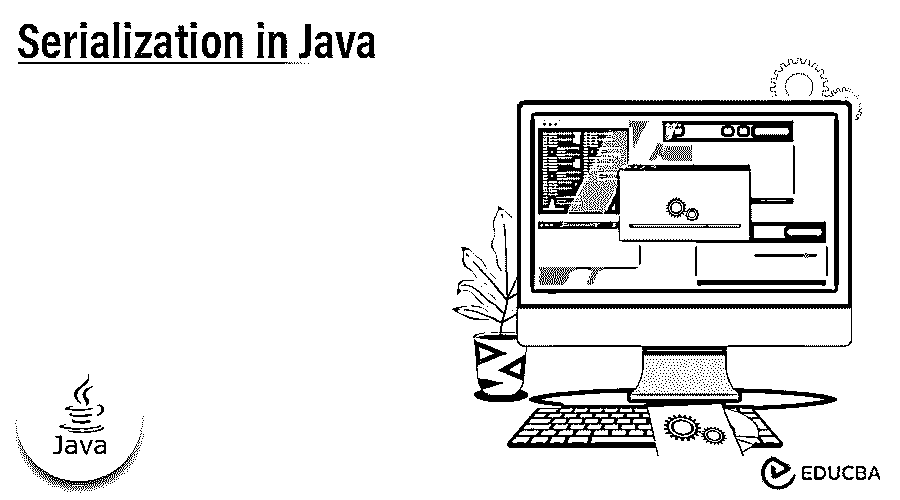

# Java 中的序列化

> 原文：<https://www.educba.com/serialization-in-java/>




## Java 序列化简介

Java 中的序列化是一种将对象状态转换成字节流的机制。反序列化是它的反向过程。通过反序列化，在内存中从一个字节流创建一个实际的 Java 对象。这种机制持久化对象。通过序列化创建的字节流不依赖于任何平台。在一个平台上序列化的对象可以在任何其他平台上反序列化，没有任何问题。

因此，序列化和反序列化的整个过程是独立于 JVM 的。如果要序列化一个类对象，那么需要实现 java.io.Serializable 接口。java 中的 Serializable 是一个标记接口。它没有要实现的字段或方法。通过这个看起来像是选择加入过程的过程，一个类变得可序列化。Java 中的序列化由两个类 ObjectInputStream 和 ObjectOutputStream 实现。所需要的只是一个包装器，这样就可以将它们保存到文件中或者通过网络发送。

<small>网页开发、编程语言、软件测试&其他</small>

### Java 中的序列化概念

ObjectOutputStream 类是上一节中提到的序列化类，它包含几种用于编写各种数据类型的方法，但有一种方法是最受欢迎的。

```
public final void writeObject( Object x ) throws IOException
```

上述方法可用于序列化对象。此方法还将其发送到输出流。同样，ObjectInputStream 类包含对象反序列化的方法。

```
public final Object readObject() throws IOException, ClassNotFoundException
```

反序列化方法从流中检索对象并反序列化该对象。返回值也是一个对象，所以只需要将它转换成相关的数据类型。

对于要成功序列化的类，必须满足两个条件:

*   io。该类必须实现可序列化的接口。
*   该类的所有字段必须是可序列化的。如果甚至有一个字段是不可序列化的，那么它应该被标记为瞬态的。

如果有人需要检查一个类是否可序列化，简单的解决方法就是检查这个类是否实现了 java.io.Serializable 方法；如果是，那么它是可序列化的。如果不是，那就不是。应该注意，当将对象序列化为文件时，标准的做法是给文件一个. ser 扩展名。

### 方法

如果这些方法出现在类中，它们将用于 Java 中的序列化。

#### Java 中的序列化方法

| **方法** | **描述** |
| public final void writeObject(Object obj)引发 IOException {} | 这将把指定的对象写入 ObjectOutputStream。 |
| 公共 void flush()抛出 IOException {} | 这将刷新当前输出流。 |
| public void close()抛出 IOException {} | 这将关闭当前输出流。 |

#### Java 中的反序列化方法

| **方法** | **描述** |
| 公共最终对象 readObject()引发 IOException，ClassNotFoundException{} | 这将从输入流中读取一个对象。 |
| public void close()抛出 IOException {} | 这将关闭 ObjectInputStream。 |

### Java 中序列化的示例

下面是提到的例子:

这里提供了一个 Java 示例来演示 Java 中的序列化是如何工作的。我们创建一个 Employee 类来研究一些特性，下面提供了相同的代码。这个 employee 类实现了 Serializable 接口。

```
public class Employee implements java.io.Serializable {
public String name;
public String address;
public transient int SSN;
public int number;
public void mailCheck() {
System.out.println("Mailing a letter to " + name + " " + address);
}
}
```

执行完这个程序后，会创建一个名为 employee.ser 的文件。该程序不提供有保证的输出，而是仅用于解释目的，目标是理解其使用和工作。

```
import java.io.*;
public class SerializeDemo {
public static void main(String [] args) {
Employee e = new Employee();
e.name = "Rahul Jain";
e.address = "epip, Bangalore";
e.SSN = 114433;
e.number = 131;
try {
FileOutputStream fileOut =
new FileOutputStream("https://cdn.educba.com/tmp/employee.ser");
ObjectOutputStream out = new ObjectOutputStream(fileOut);
out.writeObject(e);
out.close();
fileOut.close();
System.out.printf("Serialized data saved in /tmp/employee.ser");
} catch (IOException i) {
i.printStackTrace();
}
}
}
```

下面描述的反序列化演示程序反序列化在序列化演示程序中创建的上述雇员对象。

```
import java.io.*;
public class DeserializeDemo {
public static void main(String [] args) {
Employee e = null;
try {
FileInputStream fileIn = new FileInputStream("https://cdn.educba.com/tmp/employee.ser");
ObjectInputStream in = new ObjectInputStream(fileIn);
e = (Employee) in.readObject();
in.close();
fileIn.close();
} catch (IOException i) {
i.printStackTrace();
return;
} catch (ClassNotFoundException c) {
System.out.println("Employee class is not found");
c.printStackTrace();
return;
}
System.out.println("Deserialized Employee...");
System.out.println("Name: " + e.name);
System.out.println("Address: " + e.address);
System.out.println("SSN: " + e.SSN);
System.out.println("Number: " + e.number);
}
}
```

**输出:**

反序列化员工…

姓名:拉胡尔·贾恩

地址:班加罗尔 epip

SSN: 0

数量:131

**与上述计划相关的一些要点如下:**

*   上面的 try/catch 块试图捕获一个 ClassNotFoundException。这由 readObject()方法声明。
*   JVM 只有在找到类的字节码时才能反序列化对象。
*   如果 JVM 在反序列化期间没有找到类，它将抛出 ClassNotFoundException。
*   readObject()的返回值总是被转换为雇员引用。
*   当对象被序列化时，SSN 字段值最初是 114433，但是这个值没有被发送到输出流。由于同样的原因，反序列化的雇员 SSN 字段对象为 0。

### 结论

上面，我们介绍了序列化概念并提供了示例。让我们在结束语中理解序列化的必要性。

*   **通信:**如果运行相同代码的两台机器需要通信，简单的方法是一台机器构建一个包含要传输的信息的对象，然后在将该对象发送到另一台机器之前序列化它。这不是一个很好的方法，但它完成了工作。
*   **持久化:**如果操作的状态要存储在数据库中，那么首先将它序列化为一个字节数组，然后存储在数据库中，以便在以后的时间点进行检索。
*   **Deep Copy:** 如果需要创建一个对象的 exactreplica，而编写一个专门的 clone 类又太辛苦，那么只有序列化该对象，然后反序列化为另一个对象，才能达到目的。
*   **跨 JVM 同步:**可以同步运行在不同机器和架构上的不同 JVM。

### 推荐文章

这是 Java 中序列化的指南。这里我们讨论了 java 中序列化的基本概念和不同方法，并举例说明。您也可以阅读以下文章，了解更多信息——

1.  [Java 开发者面试问题](https://www.educba.com/java-developer-interview-questions/)
2.  [Java 列表 vs 数组列表](https://www.educba.com/java-list-vs-array-list/)
3.  [JavaScript 的使用](https://www.educba.com/uses-of-javascript/)
4.  [Java 中的数据类型](https://www.educba.com/data-types-in-java/)


