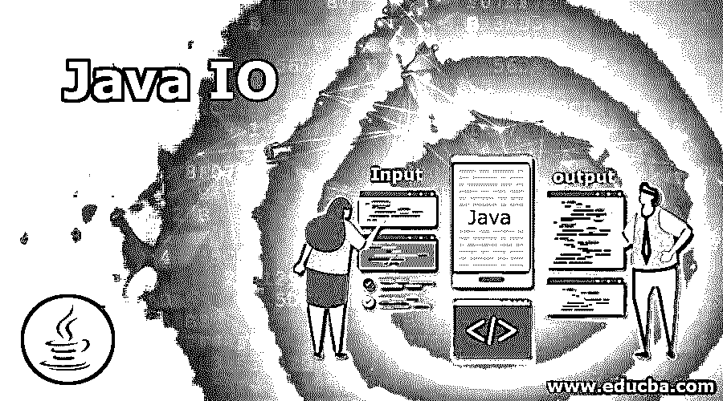

# Java IO

> 原文：<https://www.educba.com/java-io/>

## Java IO 简介

Java I/O 代表 Java 输入和输出。换句话说，我们可以说 Java 接受用户的输入，然后执行适当的操作来生成输出。即 Java I/O 简单地处理输入并生成输出。为了使 I/O 操作更快，Java 使用了流的概念；java.io 包中的这个流支持执行输入和输出操作所需的所有类。I/O 中使用的流是一个数据序列，分为两部分——输入流和输出流，其中输入流用于从源读取数据，输出流用于将数据写入目标。

### Java I/O 类

下面是用于执行 I/O 操作的类的列表:

<small>网页开发、编程语言、软件测试&其他</small>

**1。FileInputStream:** 在 Java 中，FileInputStream 类用于读取音频、视频、图像等数据。，字节格式。也就是说，这个类只是从源文件中读取字节。

**2。FileOutputStream:** 在 Java 中，FileOutputStream 类的工作原理与 FileInputStream 类相反；它写入音频、视频、图像等数据。，采用字节和字符格式。即这个类将数据写入文件。

**3。DataInputStream:** 这个类允许应用程序以独立于机器的方式从输入流中读取原始数据。

**4。DataOutputStream:** 这个类允许应用程序以独立于机器的方式将原始数据写入输出流。

**5。BufferedReader:** 这个类允许通过继承 Reader 类从基于字符的输入流中逐行读取文本。

**6。在 java 中，这个方法通过继承 Writer 的类来提供写实例的缓冲。**

**7。BufferedInputStream:** 这个类用于从输入流中读取数据。一旦创建了 BufferedInputStream，内部缓冲区数组就会自动初始化。当从流中读取字节时，内部缓冲区会自动从源输入流中重新填充。

**8。BufferedOutputStream:** 这个类用来缓冲输出流。为了存储数据，这个类使用一个内部缓冲区。即这个类在 OutputStream 中添加缓冲区。

**9。FilePermission:** 这个类用来给文件或者目录适当的权限；这些权限与文件路径相关。文件路径可以有两种类型

10。D:\\IO\\: 该路径表示权限分别与所有子文件和目录相关联。

**11。D:\\IO\\*:** 该路径表示该权限与该指定目录中除子目录以外的所有文件和目录相关联。

**12。Console:** 这个类在内部附属于系统控制台，通过提供各种方法来获取控制台的输入。控制台类可以读取文本和密码，其中文本将显示给用户，而密码不会显示(可以以星形格式显示)。

13。Scanner: 这个类是内置的，可以在 java.util 包中找到。这个类用于从键盘读取数据，并以原始数据类型(int、float、long、double、string 等)获取用户输入。)要让 scanner 类读取用户的输入，我们需要传递输入流，即 System.in。

**14。FilterInputStream:** 这个类实现了 InputStream，并使用各种子类(如 BufferedInputStream 和 DataInputStream)来提供附加功能。它只是覆盖所有 InputStream 方法。

15。FilterOutputStream: 这个类的工作方式与 FilterInputStream 相反。它实现了 OutputStream，并使用各种子类(如 BufferedOutputStream 和 DataOutputStream)来提供附加功能。它只是覆盖所有的 OutputStream 方法。

16。SequenceInputStream: 顾名思义，这个类以顺序格式读取数据，即一个接一个地读取。这个类从第一个开始读取数据，直到到达文件的结尾；然后它开始读取第二个，然后第三个，以此类推。

**17。RandomAccessFile:** 这个类用来访问随机文件；这个随机访问文件是一个很大的字节数组。它通常用于读写随机文件，读写操作是使用游标执行的

18。InputStreamReader: 这个类充当连接字节流和字符流的桥梁。它首先读取字节，然后使用指定的字符集将其解码为字符。

**19。OutputStreamWriter:** 这个类的工作方式与 InputStreamReader 相反。它将字符流转换成字节流。它首先读取字符，然后使用指定的字符集将其解码为字节。

20。StringReader: 这个类是一个字符流，它接受一个输入字符串，并使用 Reader 类将其转换为字符流。

**21。StringWriter:** 这个类是一个字符流，它接受一个可用于构造字符串的输出字符串。它继承了 writer 类。

**22。FileReader:** FileReader 是一个面向字符的类，用于读取指定的文件数据，并以字节格式返回数据。

**23。FileWriter:** FileWriter 是一个面向字符的类，用于将数据写入指定的文件。

**24。ObjectStreamClass:** 这个类充当类的序列化描述。它存储类的名称和系列版本 id。

**25。ObjectStreamField:** 在 Java 中，这个类用于初始化类的可序列化字段。

**26。这个类使用一个内部缓冲区从输入流中读取字节数组。**

**27。ByteArrayOutputStream:** 这个类用于将数据写入一个字节数组。

**结论:**在本文中，我们已经看到了 Java 中执行输入输出操作的 Java I/O 类有哪些。

### 推荐文章

这是一本 Java IO 指南。在这里，我们讨论 Java IO 的介绍及其用于执行 I/O 操作的类列表。您也可以浏览我们推荐的其他文章，了解更多信息——

1.  [Java Min()](https://www.educba.com/java-min/)
2.  [Java max()](https://www.educba.com/java-max/)
3.  [Java 中的 Copy()](https://www.educba.com/copy-in-java/)
4.  [Java 8 中的可选类](https://www.educba.com/optional-class-in-java-8/)

