# 如何用 Java 连接数据库？

> 原文：<https://www.educba.com/how-to-connect-database-in-java/>


## 如何用 Java 连接数据库？

在使用任何编程语言编写 IT 应用程序时，进出应用程序的数据流服务于核心功能。如果数据流受到某种影响，它会对应用程序功能产生负面影响，并可能给业务带来巨大损失。现在有不同的方法可以将程序连接到数据库，以向用户提供他们请求的信息，从用户那里收集信息，根据用户的要求删除信息，以及每天更新数据库的数据。我们将使用 Java 作为我们的编程语言，JDBC 作为数据库连接方法，并遵循面向对象的方法来研究这样一种方法。

### 什么是 JDBC？

JDBC 代表 Java 数据库连接，它[帮助 Java 程序](https://www.educba.com/java-commands/)在数据库上执行不同种类的操作，比如创建、读取、更新和删除。另外，JDBC 是一个 Java API。

<small>Hadoop、数据科学、统计学&其他</small>

通过使用 JDBC，程序员应该能够:

*   与数据库建立连接
*   通过将 SQL 命令发送到数据库来运行它们
*   解释来自数据库的结果

### 在 Java 中创建数据库以连接数据库

在使用 JDBC 之前，需要有一个数据库才能连接到它。为了便于说明，我们将使用 Oracle 数据库。请从以下链接下载 oracle 11g 快速版。

[点击这里](https://www.oracle.com/database/technologies/appdev/xe.html)

我已经准备好了 Oracle 10g 安装程序，如下所示:


来源:来自我的桌面

*   请双击安装程序；将弹出下面的屏幕。单击下一步。

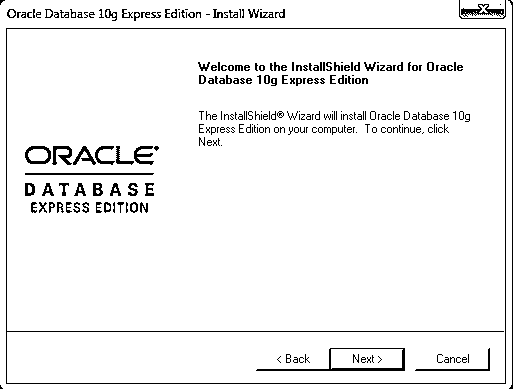


来源:来自我的桌面

*   请接受许可协议，然后单击“下一步”。

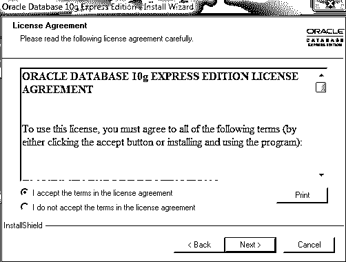


来源:来自我的桌面

*   请保留默认设置，然后单击下一步。

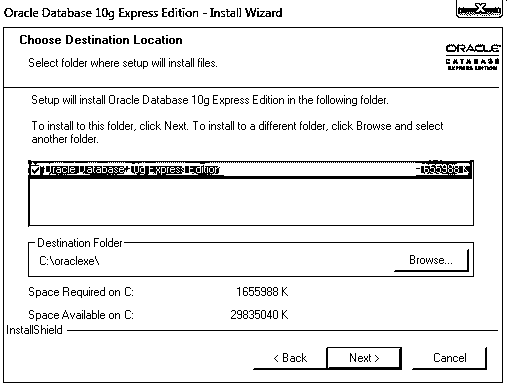


来源:来自我的桌面

*   当您登录 Oracle 11g 实例时，它会要求您输入密码。请提供密码，然后单击下一步。

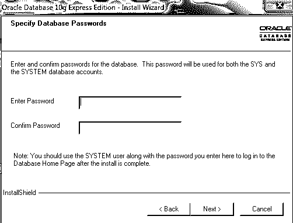


来源:来自我的桌面

*   提供密码后，安装过程将开始。安装完成后，你的桌面上会出现一个快捷图标。如果找不到，请转到 windows 开始并[搜索 Oracle](https://www.educba.com/install-oracle/)；你应该得到它。点击它，它会通过浏览器为你打开一个瘦客户端。登录到实例。请注意，Oracle 数据库的用户名将是相同的，即 system。密码将是您在配置数据库时提供的密码。

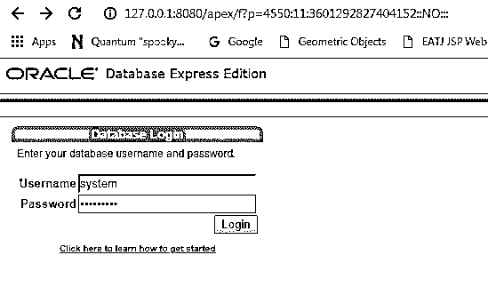


来源:来自我的桌面

*   现在，一旦您登录，您将看到的第一个屏幕如下所示:

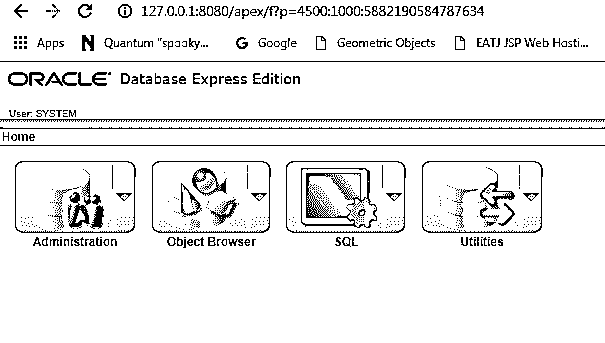


来源:来自我的桌面

*   现在让我们创建一个表。请在上面的屏幕中单击 SQL 模块，然后运行下面的查询。

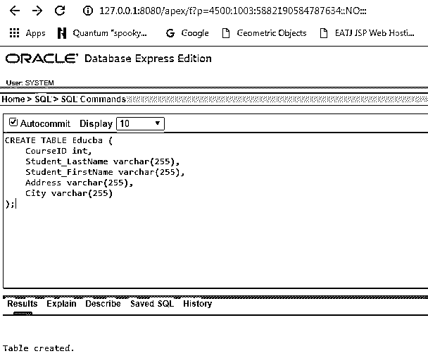


来源:来自我的桌面

*   正如您所看到的，我们已经成功地创建了一个名为 Educba 的表。

### 用 Java 连接数据库

有一些接口和类用于连接到数据库并使用 JDBC API 执行操作。

我们将一个一个地解释，但是让我首先给你呈现下面的程序:

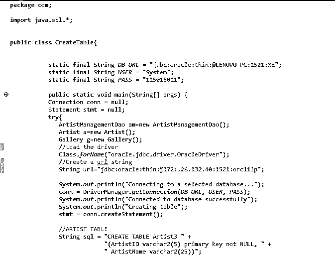


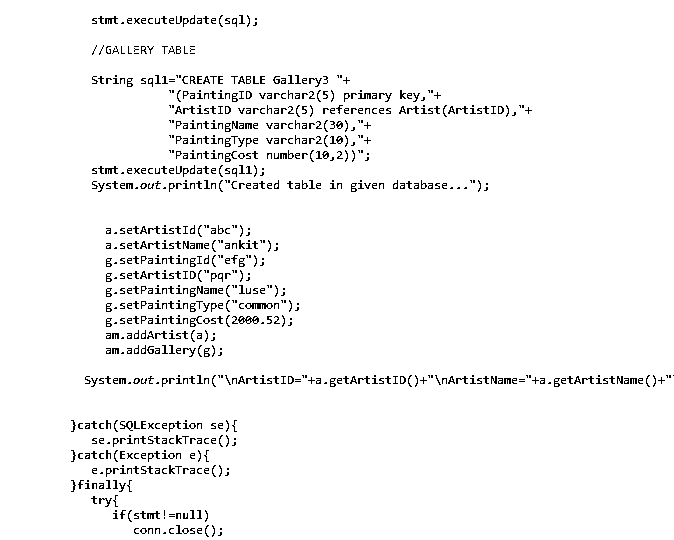


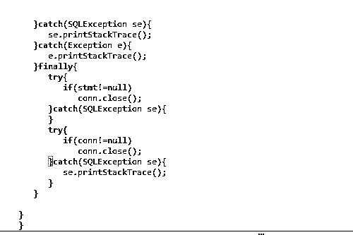


来源:来自我的桌面

下面是我们将用来连接到数据库并对其执行操作的接口:

1.  驱动程序经理
2.  关系
3.  声明
4.  结果集
5.  准备好的声明

让我们看看作为 JDBC 行动的一部分，我们可以执行哪些行动。

1.  将实体中的数据存储到数据库中，即它们创建了一个操作
2.  从数据库中检索实体或 bean 的数据
3.  更新数据库中实体或 bean 的数据
4.  从数据库中删除实体或 bean 上的数据。

无论我们执行什么操作，都有一些基本步骤保持不变:

1.  加载驱动程序。

```
class.forName("oracle.jdbc.driver.OracleDriver");
```

2.  创建 URL 字符串

```
String url="jdbc:oracle:thin:@172:.26.132.40:1521:orclilp";
```

3.  使用驱动程序管理器创建连接

```
con=DriverManager.getConnection(URL, USERNAME, PASSWORD);
```

4.  使用连接引用创建语句

```
stmt = conn.createStatement();
```

5.  使用语句执行查询


6.处理结果集(可选，依赖)

7.释放 finally 块中的资源。

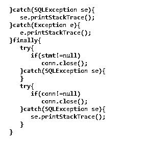


### 说明

因为我们在我们的示例中使用了 [Oracle 数据库](https://www.educba.com/what-is-oracle-database/)，所以我们需要 Oracle 应该提供的驱动程序。驱动程序类通常是名为 ojdbc14.jar 的 jar 文件的形式。如果没有这个驱动程序，应该将其作为“引用库”的一部分导入到 java 程序中。

如果您已经在 C 文件夹中安装了 Oracle 11g，理想情况下可以在下面的路径中找到它: (如果没有，可以从[这里](http://www.java2s.com/Code/Jar/o/Downloadojdbc14jar.htm)轻松下载)

c:\ Oracle xe \ app \ Oracle \ product \ 10 . 2 . 0 \ server \ JDBC \ lib


来源:来自我的桌面

应该有很多 jar 文件可用；但是，ojdbc14.jar 是最新的。同样可以用于我们的目的。这个 jar 应该被添加到项目的类路径中。请查看下图。

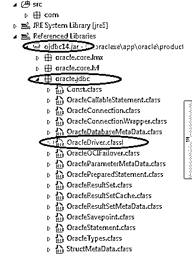


来源:来自我的桌面

让我们创建一个具有以下属性的艺术家表: (您可以直接运行 SQL 命令行，它是 Oracle Express Edition 的一个独立模块。但是首先，您需要连接，您可以执行“connect”命令来连接数据库。

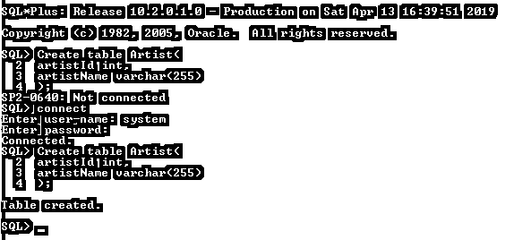


来源:来自我的桌面

作为这个示例的一部分，我们将创建三个 java 类，即 Artist.java、CreateTable.java 和 ArtistManagementDao.java，来实现这一点。

另外，在 java 层，我们需要创建一个名为 Artist bean 的类。这个类应该具有艺术家的属性与上述背景。它将如下所示:

#### Artist.java

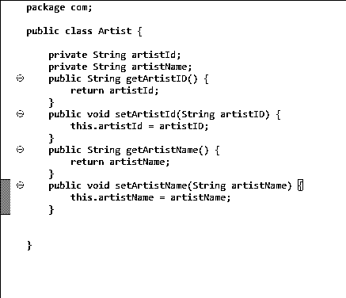


让我们创建另外两个 java 类，分别名为 ArtistManagementDao 和 CreateTable.java。

#### ArtistManagementDao.java

```
package com;
import java.sql.Connection;
import java.sql.DriverManager;
import java.sql.PreparedStatement;
import java.sql.SQLException;
public class ArtistManagementDao {
private final static String DRIVERNAME="oracle.jdbc.driver.OracleDriver";
private final static String URL="jdbc:oracle:thin:@LENOVO-PC:1521:XE";
private final static String USERNAME="System";
private final static String PASSWORD="Your DB password";
private Connection con =null;
public void addArtist(Artist a)
{
try {
Class.forName(DRIVERNAME);
String sql="insert into Artist1 values (?,?)";
con=DriverManager.getConnection(URL, USERNAME, PASSWORD);
PreparedStatement pst=con.prepareStatement(sql);
pst.setString(1, a.getArtistID());
pst.setString(2, a.getArtistName());
pst.executeUpdate();
} catch (ClassNotFoundException e) {
// TODO Auto-generated catch block
System.out.println(e);
} catch (SQLException e) {
System.out.println(e);
}
}
}
```

**说明:**

1.  Dao 类帮助我们将应用程序/业务层与持久层隔离开来。这通常是关系数据库。
2.  我们首先创建了一个数据库 URL，它应该包含您的计算机名和数据库端口号(理想情况下是 1521)，前面加上 JDBC:oracle:thin:@。然后，我们创建了用户名和密码，以便在数据库连接期间传递这些属性。强烈建议在生产环境中加密这些值。
3.  在 addArtist 方法中，我们尝试按照前面学习的步骤使用 conn 语句建立连接。
4.  现在，我们已经使用 insert 方法将值从属性推送到数据库。
5.  在下一个语句中，为了进行测试，我们使用 get 语句从数据库中检索值。
6.  我们还使用了 try 和 catch 块来捕获任何异常并抛出。

#### CreateTable.java

```
package com;
import java.sql.*;
public class CreateTable{
static final String DB_URL = "jdbc:oracle:thin:@LENOVO-PC:1521:XE";
static final String USER = "System";
static final String PASS = "Your DB Password";
public static void main(String[] args) {
Connection conn = null;
Statement stmt = null;
try{
ArtistManagementDao am=new ArtistManagementDao();
Artist a=new Artist();
Class.forName("oracle.jdbc.driver.OracleDriver");
System.out.println("Connecting to a selected database...");
conn = DriverManager.getConnection(DB_URL, USER, PASS);
System.out.println("Connected to database successfully");
System.out.println("Creating table");
stmt = conn.createStatement();
//ARTIST TABLE
String sql = "CREATE TABLE Artist3 " +
"(ArtistID varchar2(5) primary key not NULL, " +
" ArtistName varchar2(25))";
stmt.executeUpdate(sql);
System.out.println("Created table in given database...");
a.setArtistId("abc");
a.setArtistName("ankit");
am.addArtist(a);
System.out.println("\nArtistID="+a.getArtistID()+"\nArtistName="+a.getArtistName());
}catch(SQLException se){
se.printStackTrace();
}catch(Exception e){
e.printStackTrace();
}finally{
try{
if(stmt!=null)
conn.close();
}catch(SQLException se){
}
try{
if(conn!=null)
conn.close();
}catch(SQLException se){
se.printStackTrace();
}
}
}
}
```

**说明:**

1.  我们首先创建了一个数据库 URL，它应该包含您的计算机名和数据库端口号(理想情况下是 1521)，前面加上 JDBC:oracle:thin:@。然后，我们创建了用户名和密码，以便在数据库连接期间传递这些属性。强烈建议在生产环境中加密这些值。
2.  在 CreateTable.java 类中，我们分别创建了 ArtistManagementDao.java 和 Artist.java 类的对象“am”和“a”。
3.  然后，我们尝试按照之前学习的步骤使用 conn 语句建立连接。
4.  然后，我们创建了一个名为 Artist3 的表，并使用 execute 语句更新了数据库或将其推送到数据库。
5.  如果我们想给属性赋值，我们将使用我们为 artist 类创建的对象，注意不是这个类将值插入数据库；它将是 ArtistmanagementDao 类。到目前为止，我们已经在属性中存储了值，我们将在 day class 中看到如何将这些值推送到数据库中。
6.  最后，我们使用了 artemanagementdao 中的“am”对象将这个对象“a”传递给 ArtistManagementDao java 类的 addArtist()方法。
7.  我们还使用了 try 和 catch 块来捕获任何异常并抛出。

### 推荐文章

这是一个如何用 java 连接数据库的指南。这里我们已经讨论了如何用 java 连接数据库以及用来连接数据库的接口和类。您也可以阅读以下文章，了解更多信息——

1.  [什么是 SQL Server？](https://www.educba.com/what-is-sql-server/)
2.  [大数据是数据库吗？](https://www.educba.com/is-big-data-a-database/)
3.  【JavaScript 如何工作
4.  [Java 多线程面试问题](https://www.educba.com/multithreading-interview-questions-in-java/)


