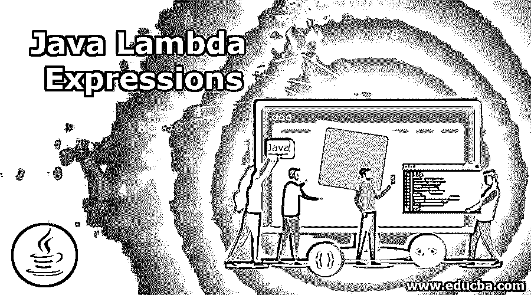

# Java Lambda 表达式

> 原文：<https://www.educba.com/java-lambda-expressions/>




## Java Lambda 表达式简介

Lambda 表达式是 Java8 中引入的新特性。它基本上描述了功能接口的所有实例。它的实现方式是只包含一个抽象函数并实现函数接口。Java 8 Lambda Expression 可以创建一个方法参数，也可以将整个代码视为数据。它可以实现一个没有任何特定类的函数，这意味着一个抽象类。这个表达式可以传递给下一个对象，并且可以在任何需要的时候执行。Lambda 表达式可以被视为函数，并且可以像其他函数一样接受参数。

**语法:**

<small>网页开发、编程语言、软件测试&其他</small>

```
lambda_operator -> body
```

### Java Lambda 表达式的参数

传递给 lambda_operator 的参数如下:

*   # **零参数:**该参数表示不能传递函数的任何参数，表示如下:
*   **():**system . out . println(" zero lambda 自变量")；
*   # **一个参数:**该参数表示可以传递函数中的任意一个参数，表示如下:
*   **(p):** System.out.println("一个自变量:"+p)；
*   # **多参数:**顾名思义，该参数可以用来传递多个参数给操作员，表示如下:
*   **(q1，q2):** System.out.println("多参数:"+ q1 +"，"+Q2)；

### 为什么我们需要 Java Lambda 表达式？

Lambda 表达式随着 Java 8 的出现而出现，它已经转化并简化了代码块的所有复杂执行，这些代码块可以被传递执行。这是许多其他编程语言都使用的一个非常常见的特性，Java 8 也是如此；引入之后，java 的早期特性首先需要创建一个对象，然后传递对象，比如创建一个策略化的设计模式。但是 lambda 表达式成了上述问题的救星，因为它是增强功能接口实现的附加值。它简化了 lambda_operator 函数的实现，该函数指向拥有零个、一个和多个参数的程序体，这些参数将传递给该函数。它还利用了创建的不属于任何已定义类的函数。它有一个非常好的特性，可以把函数的功能性作为函数的方法参数，整体来看就是数据。

Java 8 中的 Lambda 表达式非常强大，非常引人注目。强烈建议将与函数接口相关的对象转换为最终输出。

### Java Lambda 表达式是如何工作的？

任何表达式中都有一个隐藏的工作模式，所以作为 Lambda 表达式，它也有一些工作模式，表示如下:

```
(int arg_a, String arg_b)
{System.out.println("two arguments"+ arg_a+" and "+arg_b);}
```

这两个参数 int arg_a 和 String arg_b 构成了具有零个参数、一个参数或多于两个参数(即多个参数)的参数列表。在 arrow 标记的帮助下，这些参数作为一个参数列表被传递给 lambda 表达式的主体。这个带有参数列表的箭头标记一直跟在 lambda 主体后面。此外，这种格式的 lambda 表达式还利用函数接口来实现。但是如果它是多个参数列表，那么必须关闭括号或代码块，然后匿名函数的返回类型将与需要返回代码块或 void 的值的类型相同，如果它没有返回或拥有任何值。

### Java Lambda 表达式的实现示例

以下是 Java Lambda 表达式的示例:

#### 示例#1

这个程序演示了接口的执行，没有使用 lambda 表达式，甚至没有创建一个抽象类来打印矩形的大小。

**代码:**

```
interface Shapes
{
public void rectangle();
}
public class WithoutLambdaExpression {
public static void main(String[] args) {
int size=15;
Shapes wd=new Shapes(){
public void rectangle()
{
System.out.println("Get the shape" +  size );
}
};
wd.rectangle();
}
}
```

**输出:**


#### 实施例 2

这个程序演示了使用 lambda 表达式创建功能接口，从而提供形状所需的输出。

**代码:**

```
interface Shapes{
public void Rectangle();
}
public class UsinglmbdaExpression {
public static void main(String[] args) {
int size=20;
Shapes r8=()->
{
System.out.println("Shapes of all sizes "+ size);
};
r8.Rectangle();
}
}
```

**输出:**


#### 实施例 3

这个程序用于说明 Java 8 的 Lambda 表达式，不传递任何参数，只传递函数参数和实现的函数接口的相关抽象类，如图所示。

**代码:**

```
interface SomethingFishy{
public String strange();
}
public class LambdaWithNoArg{
public static void main(String[] args) {
SomethingFishy k=()->{
return "Very Strange View.";
};
System.out.println(k.strange());
}
}
```

**输出:**


#### 实施例 4

这个程序用函数参数的实现来说明 lambda 表达式，从而传递来自接口函数的单个参数和与之相关联的 lambda 表达式。

**代码:**

```
interface JuicyFruit{
public String juicy(String name);
}
public class SinglParamLambda
{
public static void main(String[] args)
{
JuicyFruit jf1=(name)->{
return "Kiwi, "+name;
};
System.out.println(jf1.juicy("orange"));
JuicyFruit jf2= name ->{
return "Mango, "+name;
};
System.out.println(jf2.juicy("Pineapple"));
}
}
```

**输出:**


#### 实施例 5

这个程序是用来说明多参数 lambda 表达式的除法功能接口，以及使用类的 div 函数对其值进行除法运算。

**代码:**

```
interface Division{
int div(int p,int q);
}
public class MultiParamLambdaExpression{
public static void main(String[] args) {
Division div1=(p,q)->(p/q);
System.out.println(div1.div(20,40));
Division div2=(int p,int q)->(p/q);
System.out.println(div2.div(400,600));
}
}
```

**输出**


**Note:** Lambda expressions are exclusively used to implement the functional interfaces, and they can contain any type of argument such as zero, two or multiple.

### 结论

Java 8 引入的 Lambda Expression 使用指向 Lambda 主体的数组操作符和操作符箭头简化了代码块的执行，然后它将用于实现与每个类关联的抽象类的接口。因此，Java 8 的 Lambda Expression 真正改变了接口交互，并且通过抽象类使函数和方法的实现变得更加容易。

### 推荐文章

这是 Java Lambda 表达式的指南。这里我们讨论 Java Lambda 表达式的介绍以及它如何与参数一起工作。您也可以浏览我们推荐的其他文章，了解更多信息——

1.  [PHP 正则表达式](https://www.educba.com/php-regular-expressions/)
2.  [Java 中的布局](https://www.educba.com/layout-in-java/)
3.  [Java 编译器](https://www.educba.com/java-compilers/)
4.  [Java 中的合并排序](https://www.educba.com/merge-sort-in-java/)


