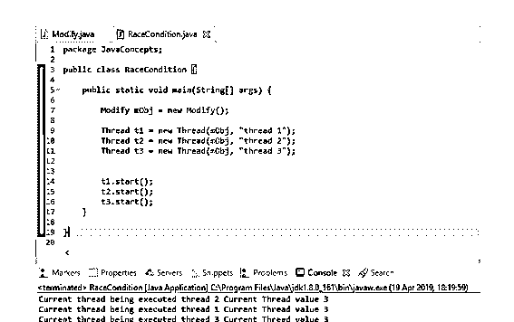
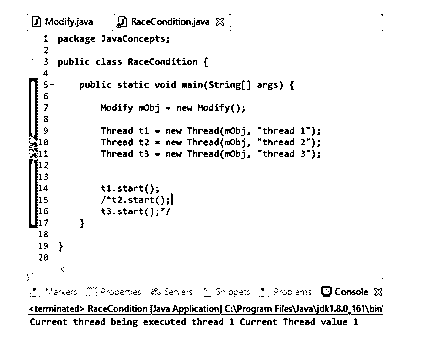
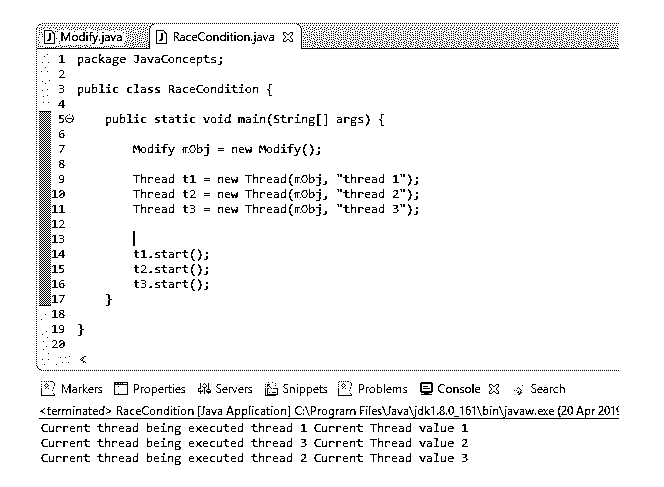
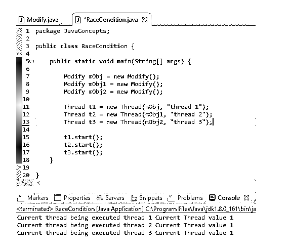

# Java 中的同步是什么？

> 原文：<https://www.educba.com/what-is-synchronization-in-java/>


## Java 同步简介

Java 中的同步是 Java 的一个特性，它限制多个线程同时访问共享资源。这里的共享资源指的是外部文件内容、类变量或数据库记录。

同步广泛应用于多线程编程中。“Synchronized”这个关键字为您的代码提供了这样一种能力，即只允许一个线程在其上操作，而不会受到任何其他线程的干扰。

<small>网页开发、编程语言、软件测试&其他</small>

### 为什么我们在 Java 中需要同步？

*   Java 是一种多线程编程语言。这意味着两个或多个线程可以同时运行来完成一个任务。当线程同时运行时，很有可能会出现代码可能会产生意外结果的情况。
*   您可能想知道，如果[多线程](https://www.educba.com/what-is-multithreading/)会导致错误的输出，那么为什么它被认为是 Java 中的一个重要特性？
*   多线程通过并行运行多个线程来提高代码速度，从而减少代码执行时间并提供高性能。但是，利用多线程环境会导致不准确的输出，这是由于一种通常称为竞争条件的情况。

### 什么是竞争条件？

当两个或多个线程并行运行时，它们倾向于在那个时间点访问和修改共享资源。线程调度算法决定线程执行的顺序。

因此，我们无法预测线程的执行顺序，因为线程调度程序只能控制线程的执行顺序。这会影响代码的输出，并导致不一致的输出。由于多个线程正在相互竞争以完成操作，因此该条件被称为“竞争条件”。

例如，让我们考虑下面的代码:

```
class Modify:
package JavaConcepts;
public class Modify implements Runnable{
private int myVar=0;
public int getMyVar() {
return myVar;
}
public void setMyVar(int myVar) {
this.myVar = myVar;
}
public void increment() {
myVar++;
}
@Override
public void run() {
// TODO Auto-generated method stub
this.increment();
System.out.println("Current thread being executed "+ Thread.currentThread().getName() + "Current Thread value " + this.getMyVar());
}
}
class RaceCondition:
package JavaConcepts;
public class RaceCondition {
public static void main(String[] args) {
Modify mObj = new Modify();
Thread t1 = new Thread(mObj, "thread 1");
Thread t2 = new Thread(mObj, "thread 2");
Thread t3 = new Thread(mObj, "thread 3");
t1.start();
t2.start();
t3.start();
}
}
```

连续运行上述代码时，输出如下:

**我们的输出 1:**

正在执行的当前线程线程 1 当前线程值 3

正在执行的当前线程线程 3 当前线程值 2

正在执行的当前线程线程 2 当前线程值 3

**输出 2:**

正在执行的当前线程线程 3 当前线程值 3

正在执行的当前线程线程 2 当前线程值 3

正在执行的当前线程线程 1 当前线程值 3

**输出 3:**

正在执行的当前线程线程 2 当前线程值 3

正在执行的当前线程线程 1 当前线程值 3

正在执行的当前线程线程 3 当前线程值 3

**输出 4:**

正在执行的当前线程线程 1 当前线程值 2

正在执行的当前线程线程 3 当前线程值 3

正在执行的当前线程线程 2 当前线程值 2




*   从上面的例子中，您可以得出结论，线程是随机执行的，并且值是不正确的。按照我们的逻辑，该值应该增加 1。然而，这里的输出值在大多数情况下是 3，在少数情况下是 2。
*   这里的“myVar”变量是多线程在其上执行的共享资源。线程同时访问和修改“myVar”的值。让我们看看如果我们注释掉另外两个线程会发生什么。




**这种情况下的输出是:**

正在执行的当前线程线程 1 当前线程值 1

这意味着当单个线程运行时，输出是预期的。但是，当多个线程运行时，每个线程都会修改该值。因此，需要将在共享资源上工作的线程数量限制为一次一个线程。这是通过同步实现的。

### 理解什么是 Java 中的同步

*   Java 中的同步是借助关键字“synchronized”实现的。该关键字可用于方法、块或对象，但不能用于类和变量。一段同步的代码只允许一个线程在给定时间访问和修改它。
*   但是，一段同步的代码会影响代码性能，因为它会增加试图访问它的其他线程的等待时间。所以一段代码应该只在可能发生竞争的情况下同步。如果不是，应该避免。

### Java 中的同步在内部是如何工作的？

*   Java 中的内部同步是借助锁(也称为监视器)概念实现的。每个 Java 对象都有自己的锁。在同步代码块中，线程需要在能够执行特定代码块之前获取锁。一旦线程获得锁，它就可以执行这段代码。
*   执行完成后，它会自动释放锁。如果另一个线程需要对同步代码进行操作，它会等待对其进行操作的当前线程释放锁。这个获取和释放锁的过程由 Java 虚拟机在内部处理。程序不负责线程锁的获取和释放。但是，其余的线程可以同时执行任何其他非同步的代码。

让我们通过使用类“Modify”中的 synchronized 块同步 run 方法中的代码来同步前面的示例，如下所示:

```
class Modify:
package JavaConcepts;
public class Modify implements Runnable{
private int myVar=0;
public int getMyVar() {
return myVar;
}
public void setMyVar(int myVar) {
this.myVar = myVar;
}
public void increment() {
myVar++;
}
@Override
public void run() {
// TODO Auto-generated method stub
synchronized(this) {
this.increment();
System.out.println("Current thread being executed "
+ Thread.currentThread().getName() + " Current Thread value " + this.getMyVar());
}
}
}
```

类“RaceCondition”的代码保持不变。现在运行代码，输出如下:

**输出 1:**

正在执行的当前线程线程 1 当前线程值 1

正在执行的当前线程线程 2 当前线程值 2

正在执行的当前线程线程 3 当前线程值 3

**输出 2:**

正在执行的当前线程线程 1 当前线程值 1

正在执行的当前线程线程 3 当前线程值 2

正在执行的当前线程线程 2 当前线程值 3




请注意，我们的代码提供了预期的输出。这里，每个线程都将变量“myVar”(在类“Modify”中)的值递增 1。

**Note:** Synchronization is required when multiple threads are operating on the same object. If multiple threads are operating on multiple objects, then synchronization is not required.

例如，让我们修改类“RaceCondition”中的代码，如下所示，并使用之前未同步的类“modify”。

```
package JavaConcepts;
public class RaceCondition {
public static void main(String[] args) {
Modify mObj = new Modify();
Modify mObj1 = new Modify();
Modify mObj2 = new Modify();
Thread t1 = new Thread(mObj, "thread 1");
Thread t2 = new Thread(mObj1, "thread 2");
Thread t3 = new Thread(mObj2, "thread 3");
t1.start();
t2.start();
t3.start();
}
}
```

**输出:**

正在执行的当前线程线程 1 当前线程值 1

正在执行的当前线程线程 2 当前线程值 1

正在执行的当前线程线程 3 当前线程值 1




### Java 中的同步类型

有两种类型的线程同步，一种是互斥的，另一种是线程间通信。

#### 1.互斥的

*   在这种情况下，线程在对对象进行操作之前获得锁，从而避免处理其值被其他线程操作的对象。
*   这可以通过三种方式实现:

##### 一、同步方法

我们可以对一个方法使用“synchronized”关键字，从而使它成为一个同步的方法。每个调用 synchronized 方法的线程都将获得该对象的锁，并在操作完成后释放它。在上面的例子中，我们可以通过在访问修饰符后使用“synchronized”关键字来使我们的“run()”方法同步。

```
@Override
public synchronized void run() {
// TODO Auto-generated method stub
this.increment();
System.out.println("Current thread being executed "
+ Thread.currentThread().getName() + " Current Thread value " + this.getMyVar());
} 
```

这种情况下的输出将是:

正在执行的当前线程线程 1 当前线程值 1

正在执行的当前线程线程 3 当前线程值 2

正在执行的当前线程线程 2 当前线程值 3

##### 二。静态同步方法

为了同步静态方法，需要获得它的类级锁。在线程获得类级锁之后，只有这样它才能执行静态方法。当一个线程持有类级锁时，其他线程不能执行该类的任何其他静态同步方法。然而，其他线程可以执行任何其他常规方法或常规静态方法，甚至是该类的非静态同步方法。

例如，让我们考虑我们的“修改”类，并通过将我们的“增量”方法转换为静态同步方法来对其进行更改。代码更改如下:

```
package JavaConcepts;
public class Modify implements Runnable{
private static int myVar=0;
public int getMyVar() {
return myVar;
}
public void setMyVar(int myVar) {
this.myVar = myVar;
}
public static synchronized void increment() {
myVar++;
System.out.println("Current thread being executed " + Thread.currentThread().getName() + " Current Thread value " + myVar);
}
@Override
public void run() {
// TODO Auto-generated method stub
increment();
}
}
```

##### 三。同步块

同步方法的一个主要缺点是它增加了线程等待时间，影响了代码的性能。因此，为了只同步所需的代码行而不是整个方法，需要使用同步块。使用同步块减少了线程的等待时间，也提高了性能。在前面的例子中，我们已经在第一次同步代码时使用了 synchronized 块。

示例:

```
public void run() {
// TODO Auto-generated method stub
synchronized(this) {
this.increment();
System.out.println("Current thread being executed "
+ Thread.currentThread().getName() + " Current Thread value " + this.getMyVar());
}
}
```

#### 2.螺纹配合

对于同步线程，线程间通信是一项重要的任务。帮助同步代码实现线程间通信的内置方法有:

*   等待()
*   通知()
*   notifyAll()

**Note:** These methods belong to the object class and not the thread class. For a thread to be able to invoke these methods on an object, it should be holding the lock on that object. Also, these methods cause a thread to release its lock on the object on which it is being invoked.

##### 一.等待()

调用 wait()方法的线程释放对象上的锁，并进入等待状态。它有两个方法重载:

*   public final void wait()引发 InterruptedException
*   公共最终 void 等待(长超时)引发 InterruptedException
*   公共最终 void 等待(长超时，int Nanos)引发 InterruptedException

##### 二。通知()

一个线程通过使用 notify()方法向处于等待状态的另一个线程发送信号。它只向一个线程发送通知，以便该线程可以继续执行。在所有处于等待状态的线程中，哪个线程将接收通知取决于 Java 虚拟机。

```
public final void notify()
```

##### 三。notifyAll()

当线程调用 notifyAll()方法时，每个处于等待状态的线程都会得到通知。这些线程将根据 Java 虚拟机决定的顺序一个接一个地执行。

```
public final void notifyAll()
```

### 结论

在本文中，我们看到了在多线程环境中工作如何会由于竞争条件而导致数据不一致，同步如何通过限制一个线程一次只能操作一个共享资源来帮助我们克服这一问题。此外，同步线程如何相互通信。

### 推荐文章

这是什么是 Java 中的同步的指南？.在这里，我们讨论了同步的介绍、理解、需要、工作和类型，并给出了一些示例代码。您也可以浏览我们推荐的其他文章，了解更多信息——

1.  [Java 中的序列化](https://www.educba.com/serialization-in-java/)
2.  [Java 中什么是泛型？](https://www.educba.com/what-is-generics-in-java/)
3.  [Java 中的 API 是什么？](https://www.educba.com/what-is-api-in-java/)
4.  [Java 中的二叉树是什么？](https://www.educba.com/what-is-a-binary-tree-in-java/)


