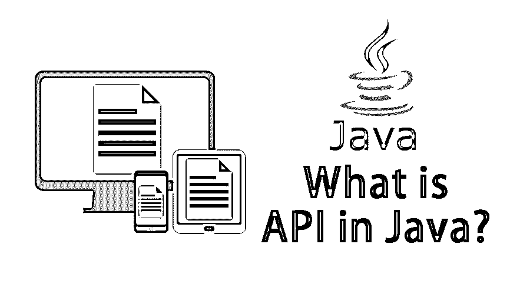
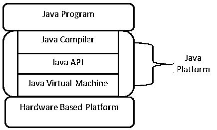
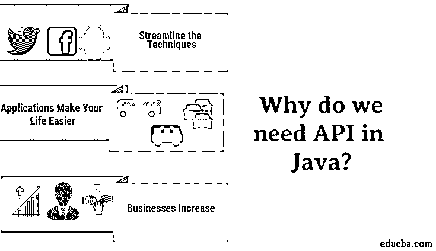

# Java 中的 API 是什么？

> 原文：<https://www.educba.com/what-is-api-in-java/>

## Java 中的 API 介绍

API 可以被描述为一种使计算机拥有一个公共接口的方式，允许它们相互通信。Java 应用编程接口(API)是 Java 开发工具包(JDK)的领域。API 包括类、接口、包以及它们的方法、字段和构造函数。所有这些内置类都给程序员带来了好处。只有程序员知道如何应用那个类。用户界面提供用户和计算机之间的基本用户交互；同样，API 作为应用程序接口，在软件和消费者之间提供连接。API 包括类和包，它们通常帮助程序员减少程序的行数。

### 理解 Java 中的 API

<small>网页开发、编程语言、软件测试&其他</small>

Java 开发工具包(JDK)通常由三个基本组件组成，如下所示:

1.Java 编译器

2.Java 虚拟机(JVM)

3.Java 应用编程接口(API)

*   添加到 JDK 的 Java API 解释了每个元素的功能。在 Java 编程中，一些组件是预先创建的，并且被广泛使用。
*   因此，程序员可以通过 Java API 使用预先编写的程序。在提到可获得的 API 类和包之后，程序员快速创建需要的程序类和包来执行。
*   Java API 是 JDK 的一个重要元素，它确定了每个元素的特性。虽然是用 Java 编程，但是组件已经制作完成了。通过 Java，API 编码者可以简单地利用预先编写的程序。
*   程序员首先声明类和包；然后，这个编码器可以简单地使用类和包的应用程序来执行。

### 在 Java 中使用 API

JAX-RS(用于 Restful Web 服务的 Java API)客户端提供了以下功能:

*   调用 REST 端点
*   使用类似的路径/模板作为服务器 API
*   改进的异步调用程序支持
*   服务器发送的事件支持

表述性状态转移或 REST 是一个基于 web 标准的架构，使用 HTTP 协议进行数据通信。

HTTP 方法最常用于基于 REST 的架构，如 get、PUT、DELETE 和 POST。

使用 Java API 时，JAX-RS 客户端 API 中的异步请求处理是如何改进的。我们将通过查看一个使用 JAX 遥感客户端 API 的真实示例来实现这一点。假设我们将使用一个 JAX-RS 客户端打一个电话到 api.ipify.org。

这是一个现有的服务，将报告回你自己的 IP 地址。一旦我们获得了 IP 地址，我们将使用这个 IP 地址调用另一个名为 ip.api.com 的服务，正如您所看到的，我们必须提供 IP 地址作为路径的一部分。

当执行这个到 ip.api.com 的 GET 调用并提供我们的 IP 地址时，我们将根据他们数据库中的内容获得一些关于这个 IP 地址位置的信息。这里我们有两个 API 调用，其中第二个依赖于第一个。

### Java 中 API 的优势

**自动化**:有了 Java APIs，计算机系统可以代替人来控制工作。通过 API，组织可以升级工作流，从而更快、更有效地创建工作流。

**应用**:由于 Java APIs 可以轻松访问软件组件，服务和数据的交付更加灵活。

**效率**:一旦 Java API 提供了访问权限，产生的内容就可以立即发布，并且每个频道都可以随时访问。这使得它能够被快速分发和发送出去。

**集成**:Java API 使得内容可以更容易地被任何网站或者软件嵌入。这确保了额外的流畅数据传输，以及内置的用户体验。

### 所需技能

*   了解一个 [MVC 框架](https://www.educba.com/what-is-mvc/)，包括 Spring/Play。
*   了解 HTTP 协议(方法/响应规则)，REST/Restful web 服务，SOAP(可选)。
*   JSON 或者 XML 或者照片爱好者知识。
*   验证框架的基础。
*   任何好的持久性系统 Spring/Hibernate。

### API 基础

这些是 API 的一些基础；一旦你弄清楚了所有这些，你就可以开始尝试:

*   构建一个 API 来响应 OK，然后提供一个字符串或 web 内容
*   响应和消费 [JSON/XML](https://www.educba.com/json-vs-xml/)
*   处理表单提交
*   消费数据(如 form/JSON/XML)，验证数据并在数据库中持久化
*   要连接到另一个 API
*   将数据保存到各种数据存储 SQL/NoSQL
*   更新数据库中的数据
*   删除数据库中的数据
*   保护您的 API

或许，如果你有能力执行上述任务，你可以被认为是一个伟大的 API 程序员。

### Java 中为什么需要 API？

在 Java API 中，Java 编程中有超过 4500 个 API 可用。

#### 1.简化技术

开发社交智能收件箱就是一个很好的例子。你将分别登录脸书和 Twitter，检查信息，操作搜索词，并在你被标记时做出回应。现在，由于网络的 API，您可以在一个视图中观察所有这些，减少了额外的时间。

#### 2.应用程序让您的生活更加轻松

如果你使用公共交通工具，你可能会带着一个应用程序，提示下一辆旅游巴士什么时候来。该应用程序有利于公交系统的 API 显示哪辆公交车何时来。它可以节省你的时间，如果你生活在寒冷的环境中，也可能会节省时间。

#### 3.商业增长

如果他们提供一个 API，一个企业的潜力可以被扩展。你会发现一家公司可以提供很多资产。开发一个可以从那些想要开发所有 API 的开发者那里获得的 API 可能会增加他们提供给额外客户的产品。

### 这项技术将如何帮助你的职业发展？

Java API 开发人员对大多数跨国公司的职业发展有好处，如 Flipkart、Wallmart、Amazon 和 Goldman Sachs，他们在大型项目中使用 Java API。

它是基于分类的，并发的，并且依赖于[面向对象的编程](https://www.educba.com/advantages-of-oop/)(哎呀)。

它是一种稳定的语言，Java API 承担了大量需要设计复杂系统的工作。

Java API 已经在 Android 应用程序、web 应用程序、交易应用程序、[大数据技术](https://www.educba.com/big-data-technologies/)、支付、电子商务等等中成功实现。

### 结论

*   Java API 的特点就是轻量级。因此，如果在此之后有带宽限制，选择 REST web 服务非常简单快速地构建。
*   使用 Java API，像 Twitter、Yahoo 这样的顶级网站都使用这种模式。
*   像 facebook.com 这样的大多数社交媒体网站受益于 REST 网络服务。
*   通过使用 REST 模式，移动应用程序开发和他们的服务器连接发展很快，因为它在处理请求和响应数据方面更快。

### 推荐文章

这是一本关于什么是 Java 中的 API 的指南？.在这里，我们讨论了需求、基础、职业发展、所需技能、工作及其优势。您也可以浏览我们推荐的其他文章，了解更多信息——

1.  [Java 中的数据类型](https://www.educba.com/data-types-in-java/)
2.  [Java 中的同步块](https://www.educba.com/synchronized-block-in-java/)
3.  [Java 字典](https://www.educba.com/java-dictionary/)
4.  [Java 中的 swap()](https://www.educba.com/swap-in-java/)

