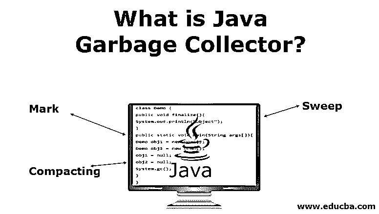

# 什么是 Java 垃圾收集器？

> 原文：<https://www.educba.com/what-is-java-garbage-collector/>




## 什么是 Java 垃圾收集器？

垃圾收集器是一个守护线程，在运行时释放内存。垃圾收集也可以表示为内存回收。大多数情况下，在 JVM 中，oracle hotspot 垃圾收集器由于其效率而被使用。JVM 中创建对象的内存区域称为堆。堆分为两部分:

1.  年轻一代空间
2.  旧/终身世代空间

年轻一代又被分成 3 部分

<small>网页开发、编程语言、软件测试&其他</small>

1.  伊甸园空间
2.  幸存者
3.  幸存者到

在接下来的要点中已经给出了更深入的解释。例如，如果你在你的程序中创建了一个缓存，并且这个缓存对象经受住了很多次 GC 循环，那么它就会进入老一代。GC 寻找程序不再需要的对象并销毁它们。

### 为什么是垃圾收集器？

在 Java 之前，最流行的两种语言[是 C 和 C++](https://www.educba.com/c-vs-c-plus-plus/) 。在 C 中，我们遇到过 calloc()，malloc()，realloc()会分配缓冲区内存，在 C++中，我们有析构函数。所有这些功能都是为了内存管理。Java 提供垃圾收集器作为自动内存管理，主要有两个原因:

*   首先，一些创建的对象变得不可访问。
*   第二，从旧对象到年轻对象的引用只存在于少数。

因此，使用垃圾收集器的最佳实践是在 JVM 上设置标志。

让我给你举一个不可及的物体的例子。

```
//class code
int i = 1;
if(i == 1){
String s = abc;
System.out.println(s);
}
//class code
```

在上面的例子中，Java 会创建一个 string 对象，而那个对象的作用域正好在那个如果块不能在外面使用。因此，当垃圾收集在该类上运行时，它会将“s”标记为不可到达和未使用的对象，并将它们删除。

### 垃圾收集器中的函数

*   **标记:**从应用程序的根节点(main)开始，遍历对象图，将可到达的对象标记为生命。
*   **删除/清除:**删除无法到达的对象。当 GC 删除对象时，它会在堆中创建一个洞，使堆变得不一致。因此，使用了压缩。
*   **压缩:**通过移动对象来压缩内存，并将分配标记为连续而不是分段。这是一项耗时的任务。

### Java 垃圾收集器是如何工作的？

*   有两种类型的对象:

**活动对象:**可到达(来自另一个对象的引用)

**死对象:**不可达(不从任何地方引用)

*   所有新创建的对象都是在伊甸园空间(年轻一代空间)中创建的。
*   一旦 Eden 空间满了，minorGC()程序就在年轻一代空间上运行，它标记所有未使用或死亡的对象，并将它们从内存中清除。
*   在这次 GC 循环中幸存下来的物体将被转移到太空幸存者中。重复相同的过程，这一次当对象从 Eden 空间移动到 Survivor From space 时，GC 检查空间是否已满，死对象被释放，幸存对象也将被移动到 Survivor。
*   重复这个过程，如果一些对象经受住了阈值数量的 GC 周期，这些对象被移动到旧的代空间。
*   在这个场景中，JVM 运行 majorGC()函数，该函数遍历整个堆空间，识别/标记未使用的(空的或死的)对象，并清除所有这些对象。
*   请记住，从堆空间中清除对象会在内存中产生空洞，从而导致内存泄漏。为了避免这种情况，垃圾收集器实现了内存空间的压缩。

### Java 中垃圾收集器的例子

system.gc()的示例:

```
class Demo {
public void finalize(){
System.out.println("Object");
}
public static void main(String args[]){
Demo obj1 = new Demo();
Demo obj2 = new Demo();
obj1 = null;
obj2 = null;
System.gc();
}
}
```

**输出:**


**上述代码的解释**

*   上面的代码，两个对象 obj1 和 obj2，都是指向 null 的，所以用 null 和未引用的值存储在 Eden 空间。
*   系统 gc()将调用垃圾收集的守护线程，这两个对象都将从空间中删除。

### 利弊

下面是 Java 垃圾收集器的一些优点和缺点:

**垃圾收集器的优点:**

*   垃圾收集提高了内存效率，因为它会删除所有未使用的和空的对象。
*   垃圾收集器是一个自动的过程，所以开发人员可能不关心它，因为在其他语言中，如果没有垃圾收集器，程序员就必须关心难以捉摸的内存问题。

**垃圾收集器的缺点:**

*   垃圾收集器将运行一个主要的 gc 函数，这个函数将在整个堆空间中运行，使你的程序速度慢了几秒钟。
*   这个过程将花费更多的 CPU 时间，使代码系统变慢。
*   如果您正在处理一个需要大量内存的应用程序，请使用可用的 JVM 标志。
*   如果堆空间已满，并且不能再抓取或添加对象，那么 Java 会抛出内存不足错误，这会降低整个应用程序的速度，还会导致内存泄漏。

### 推荐文章

这是一个什么是 Java 垃圾收集器的指南？.在这里，我们讨论它的工作以及 Java 垃圾收集器的功能、示例、优点和缺点。您也可以阅读以下文章，了解更多信息——

1.  [Java 中的构造函数和析构函数](https://www.educba.com/constructor-and-destructor-in-java/)
2.  [Java 中的析构函数](https://www.educba.com/destructor-in-java/)
3.  [C#与 Java 性能对比](https://www.educba.com/c-sharp-vs-java-performance/)
4.  [什么是 JVM？](https://www.educba.com/what-is-jvm/)


