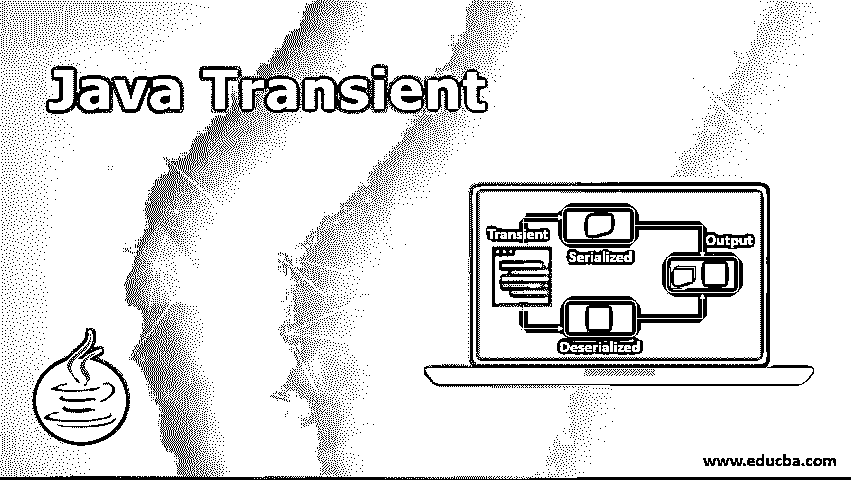

# Java 瞬态

> 原文：<https://www.educba.com/java-transient/>




## Java 瞬态介绍

Java transient 是一个修饰符关键字，用于标记其值在序列化期间不被序列化的变量。如果我们不想在序列化过程中保存特定变量的值，那么我们可以使用 transient 关键字将变量标记为 transient。顾名思义，短暂性表示它持续的时间很短或者不是永久性的。当 JVM 遇到瞬态变量时，它会忽略变量的原始值，并使用默认的数据类型值保存它。

**语法:**

<small>网页开发、编程语言、软件测试&其他</small>

下面是声明瞬态关键字。

```
transient private <member variable>;
```

或者

```
private transient <member variable>;
```

如上所述，我们可以看到定义为 transient 的数据成员不会被序列化，因为它被 transient 关键字标记为不序列化。我们可以用两种方法定义一个瞬态数据成员，和上面的语法一样。

请注意，序列化是一个将对象的状态转换为字节流的过程。在序列化过程中，如果我们不想在文件中保存变量值，我们可以将它声明为瞬态的。

### Java 中瞬态关键字的例子

接下来，我们编写 java 代码来更清楚地理解 transient 关键字，在下面的示例中，我们将使用 transient 关键字来定义一个类的成员变量，并使这个类成为 Serializable 的子类，以执行序列化和反序列化，如下所示。

#### 示例#1

**代码:**

```
//package demo;
import java.io.FileInputStream;
import java.io.FileOutputStream;
import java.io.ObjectInputStream;
import java.io.ObjectOutputStream;
import java.io.Serializable;
class Employee implements Serializable{
private String name;
private String eid;
private int age;
//transient variable not serialized
private transient int projid = 104;
public Employee( String name, String eid, int age, int projid) {
this.age = age;
this.name = name;
this.eid = eid;
this.projid = projid;
}
@Override
public String toString() {
return "Employee ( name=" + name + ", eid=" + eid + ", age=" + age + ", projid=" + projid + ')';
}
}
public class Demo
{
public static void main(String[] args)
{
// create Employee class object which is Serializable
Employee e1 = new Employee( "John", "e106", 26, 104);
System.out.println("Employee object Before Serialization is : " + e1);
try {
FileOutputStream fw = new FileOutputStream("D:\\data.txt");
ObjectOutputStream ow = new ObjectOutputStream(fw);
ow.writeObject(e1);
System.out.println("Employee is successfully Serialized ");
// code for deserialization
FileInputStream fr = new FileInputStream("D:\\data.txt");
ObjectInputStream or = new ObjectInputStream(fr);
Employee de1 = (Employee) or.readObject();
System.out.println("Employee object successfully created from Serialized data.");
System.out.println("Employee object after deseriazliation is : " + de1);
} catch (Exception e) {
e.printStackTrace();
}
}
}
```

**输出:**


**代码解释:**在上面的代码中，已经创建了 employee 类，并且作为 employee 类的 projid 数据成员的项目 id 被定义为 transient，因此 projid 值不会被序列化，并且在将 employee 对象写入文件时，不会将 projid 的值保存在文件中。在后面的代码中，从该文件中读回一个 employee 对象并反序列化一个对象；我们可以在输出中看到，employee 对象的 printing projid 是 0，这是临时变量 projid 的默认值，因为它是序列化的。

#### 实施例 2

接下来，我们编写 java 代码来理解 transient 关键字，并展示 transient 关键字不会像 transient 那样影响静态变量和最终变量。

**代码:**

```
//package demo;
import java.io.FileInputStream;
import java.io.FileOutputStream;
import java.io.ObjectInputStream;
import java.io.ObjectOutputStream;
import java.io.Serializable;
class Employee implements Serializable{
private String name;
// Use of transient has no impact on static
private static String eid;
// Use of transient has no impact on final
private final int age;
//transient variable not serialized
private transient int projid = 104;
public Employee( String name, String eid, int age, int projid) {
this.age = age;
this.name = name;
this.eid = eid;
this.projid = projid;
}
@Override
public String toString() {
return "Employee ( name=" + name + ", eid=" + eid + ", age=" + age + ", projid=" + projid + ')';
}
}
public class Demo
{
public static void main(String[] args)
{
// create Employee class object which is Serializable
Employee e1 = new Employee( "John", "e106", 26, 104);
System.out.println("Employee object Before Serialization is : " + e1);
try {
FileOutputStream fw = new FileOutputStream("D:\\data.txt");
ObjectOutputStream ow = new ObjectOutputStream(fw);
ow.writeObject(e1);
// code for deserialization
FileInputStream fr = new FileInputStream("D:\\data.txt");
ObjectInputStream or = new ObjectInputStream(fr);
Employee de1 = (Employee) or.readObject();
System.out.println("Employee object after deseriazliation is : " + de1);
} catch (Exception e) {
e.printStackTrace();
}
}
}
```

**输出:**


**代码解释:**和上面的代码一样，employee 类已经创建，eid 数据成员声明为 static 和 transient，age 声明为 final 和 transient，employee 类的 porjid 声明为 only transient，所以只有 projid 的值不会被序列化，而在向文件中写入 employee 对象时，其他数据成员值会被序列化。我们可以在输出中看到，在反序列化一个对象之后，employee 对象的 projid 为 0，所有其他数据成员的值都被保存，因为它们没有被序列化。

### 结论

简单来说，名字 transient 的意思是持续很短的时间或者不是永久的，就像 transient 关键字在 java 中的用法一样。transient 是一个修饰符关键字，用于标记其值在序列化期间不被序列化的变量。

### 推荐文章

这是一个 Java 瞬态的指南。在这里，我们还将讨论 java 中瞬态关键字的引入和工作方式，以及示例和代码实现。您也可以看看以下文章，了解更多信息–

1.  JavaScript 中的[对象](https://www.educba.com/object-in-javascript/)
2.  [Java 8 流](https://www.educba.com/java-8-stream/)
3.  Java.net·URI
4.  [java.net 套餐](https://www.educba.com/java-dot-net-package/)


