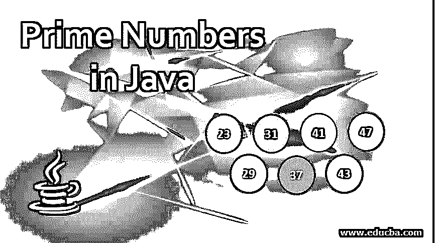

# Java 中的质数

> 原文：<https://www.educba.com/prime-numbers-in-java/>




## Java 中的质数介绍

这篇文章是关于 Java 中的质数的。素数是一种只能被单位和数本身整除的数。它不能被任何其他数整除。质数是一种特殊的数。数字的例外是 1 和 2。1 是唯一既不是质数也不是合数的数。2 是自然界中唯一的偶数素数。质数的反义词是能被除了整数本身之外的其他数整除的数。合数和质数是相反的。一般来说，质数是奇数，除了数字 2。这并不一定意味着一个奇数总是质数，因为它可能被 3 和任何其他奇数整除。

### Java 中素数的例子

下面是用 java 实现质数的例子:

<small>网页开发、编程语言、软件测试&其他</small>

#### 示例# 1–使用 For 循环

在第一个编码示例中，我们将检查一个数字是否是质数。我们首先使用缓冲的阅读器流输入来输入数字。然后我们有一个 for 循环，在这个循环中，我们要检查这个数是否能被除了 1 和其他数之外的任何数整除。for 循环从 2 开始，然后一直循环到相应数字的一半。然后我们有一个变量，报告这个数是否能被任何数整除，这是循环的一部分。代码和循环部分如下所示，它输入一个数，并给出相应的输出，不管这个数是否是质数。在程序中，java.io.*被导入，因此在下面的代码行中出现了输入/输出操作。此外，如果存在 IOException，那么它会被区别对待。我们在 main 声明之后给出了 throws IO Exception 命令，该命令抛出一个在输入/输出操作期间发生的异常。除此之外，程序中还使用了一些有意义的名字，以便任何阅读程序的人都能理解。

**代码:**

```
import java.io.*;
public class Prime
{
public static void main(String[] args) throws IOException
{
BufferedReader br= new BufferedReader(new InputStreamReader(System.in));
System.out.println("ENTER A NUMBER TO CHECK IF IT IS PRIME OR NOT");
int num= Integer.parseInt(br.readLine());
boolean count = false;
for(int i = 2; i <= num/2; ++i)
{
// condition for nonprime number
if(num % i == 0)
{
count = true;
break;
}
}
if (!count)
System.out.println(num + " is a prime number.");
else
System.out.println(num + " is not a prime number.");
}
}
```

**输出:**


**代码解释:**在输出中，我们看到一个输入的数是否是质数。首先，我们输入 29 作为一个数来检查它是否是质数。我们发现 29 是一个质数，因为它只能被单位数和这个数本身整除。除此之外，它不能被其他任何数整除。

其次，我们输入另一个数来检查这个数是否是质数。我们输入 58 作为数字，然后检查这个数字是否是质数。最后，我们发现 58 不是一个质数，但它是一个合数。它是一个能被 2，29 整除的偶数，而不是整数本身。

#### 示例 2–使用 While 循环

在[代码示例](https://www.educba.com/what-is-coding/)中，我们将看到 While 循环在检查一个数是否是质数时的用法。我们使用与 for 循环相同的逻辑，但是我们对程序有不同的看法。

**代码:**

```
import java.io.*;
public class PrimeNumber
{
public static void main(String[] args)throws IOException
{
BufferedReader br= new BufferedReader(new InputStreamReader(System.in));
System.out.println("ENTER A NUMBER TO CHECK IF IT IS PRIME OR NOT");
int num= Integer.parseInt(br.readLine());
int i = 2;
boolean count = false;
while(i <= num/2)
{
// condition for nonprime number
if(num % i == 0)
{
count = true;
break;
}
++i;
}
if (!count)
System.out.println(num + " is a prime number.");
else
System.out.println(num + " is not a prime number.");
}
}
```

**输出:**


**代码解释:**在样本输出中，我们输入两个奇数，检查数字是否为质数。我们输入 71 和 37 作为两个数字，然后最终发现这两个数字都是质数，因为它们只能被 1 和数字本身整除。

#### 示例 3–使用计数

在这个编码示例中，我们将检查一个数字范围内的质数。我们输入一个最小值 20 和最大值 50，然后在这个范围内找到质数。这是一个非常简单的程序，只要改变最小和最大变量，我们就可以找到最小和最大变量之间的质数。编码示例如下所示。

**代码:**

```
import java.io.*;
public class PrimeRange
{
public static void main(String[] args)
{
int min = 20, max = 50;
while (min < max) {
boolean count = false;
for(int i = 2; i <= min/2; ++i) {
// condition for nonprime number
if(min % i == 0) {
count = true;
break;
}
}
if (!count)
System.out.print(min + " ");
++min;
}
}
}
```

**输出:**


**代码解释:**在上面的代码中，我们发现素数的个数在 20 到 50 之间。我们找到只能被 1 和数本身整除的数。质数是 23、29、31、37、41、43 和 47。该代码使用一个 for 循环，该循环用于通过相应的 for 循环控制变量来检查数字的整除性。如果数是可除数，则是合数，如果数是不可除数，则是质数。

### 结论

在本文中，我们看到素数使用 for 循环和 while 循环工作。此外，我们看到了在一定范围内存在的质数。使用 for 循环和 while 循环检查素数的逻辑几乎是相同的。因此，检查质数是相当容易的。循环控制变量是检验一个数是否是质数的一个非常重要的因素。

### 推荐文章

这是 Java 中的质数指南。这里我们讨论 java 中素数的介绍和不同的例子，以及代码实现。你也可以看看下面的文章来了解更多-

1.  [Java 中的矩阵乘法](https://www.educba.com/matrix-multiplication-in-java/)
2.  [Java 中的 Continue 语句](https://www.educba.com/continue-statement-in-java/)
3.  [Java 中的运行时多态性](https://www.educba.com/runtime-polymorphism-in-java/)
4.  [Java 中的 NumberFormatException](https://www.educba.com/numberformatexception-in-java/)


