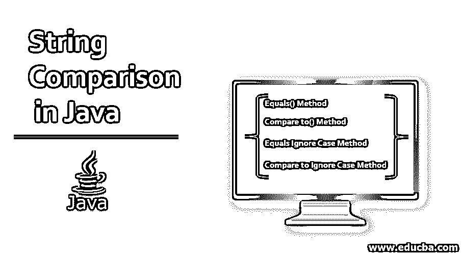
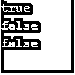
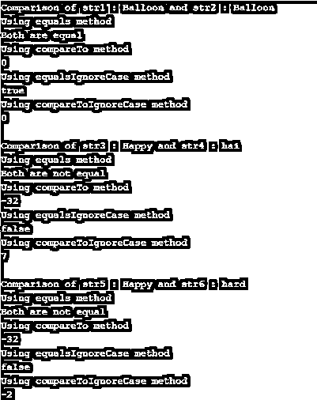

# Java 中的字符串比较

> 原文：<https://www.educba.com/string-comparison-in-java/>




## Java 中的字符串比较介绍

在 Java 中，字符序列被称为字符串。它是不可变的(一旦创建就不能更改),有助于执行多种操作。另外，字符串的[比较是 Java 中常见的编程任务。这可以通过几种方式来实现，我们将在下面的章节中详细讨论。](https://www.educba.com/python-comparison-operators/)

### Java 中如何比较字符串？

如前所述，可以使用不同的方法进行字符串比较。它们是:

<small>网页开发、编程语言、软件测试&其他</small>

*   使用 equals()方法
*   使用 compareTo()方法
*   使用 equalsIgnoreCase()方法
*   使用 compareToIgnoreCase()方法

#### 1.Equals()方法

equals()方法基于字符串内容比较两个字符串。如果字符串大小写不同(即大写或小写)，将被视为不相等。下面是 equals()方法的一个例子。

**程序**

```
public class StringComparisonExamples {
public static void main(String[] args) {
String str1 = "Balloon";
String str2 = "Balloon";
//string comparison using equals method
if (str1.equals(str2)) {
System.out.println("Both str1 : " + str1 + " and str2 : "+ str2 +" are equal");
}
else
{
System.out.println("Both str1 : " + str1 + " and str2 : "+ str2 +" are not equal");
}
String str3 = "Happy";
String str4 = "hai";
if (str3.equals(str4)) {
System.out.println("Both str3 : " + str3 + " and str4 : "+ str4 +" are equal");
}
else
{
System.out.println("Both str3 : " + str3 + " and str4 : "+ str4 +" are not equal");
}
String str5 = "Happy";
String str6 = "hard";
if (str5.equals(str6)) {
System.out.println("Both str5 : " + str5 + "and str6 : "+ str6 +" are equal");
}
else
{
System.out.println("Both str5 : " + str5 + " and str6 : "+ str6 +" are not equal");
}
}
}
```

**输出:**


**上述代码的解释**

*   这里，两个字符串 str1 和 str2 是相等的，因为它们的大小写相同。(骆驼案)。
*   另外，Str3 和 Str4、str5 和 str6 不相等。

#### 2.Compare to()方法

在此方法中，值按字典顺序进行比较，并返回整型值。该值基于第一个字符串是等于、小于还是大于第二个<sup>和</sup>字符串。

存在两个字符串 str1 和 str2

*   如果 str1 == str2，则 0
*   如果 str1 > str2，则+ve 值
*   如果 str1 < str2，则-ve 值

**程序**

```
//Java program to demonstrate compareTo method
public class StringComparisonExamples {
public static void main(String[] args) {
String str1 = "Balloon";
String str2 = "Balloon";
String str3 = "Happy";
String str4 = "hai";
//string comparison using compareTo method
System.out.println(str1.compareTo(str2));
System.out.println(str3.compareTo(str4));
String str5 = "Happy";
String str6 = "Hardest one";
System.out.println(str5.compareTo(str6));
}
}
```

**输出:**


**上述代码的解释**

*   因为两个字符串 str1 和 str2 在字典上是相等的，所以返回 0。
*   同时，str3 小于 str4，str5 小于 str6。因此，返回一个负值。

#### 3.等于忽略大小写方法

使用这种方法，将比较两个字符串，而不考虑字符串是大写还是小写。

**程序**

```
//Java program to demonstrate equalsIgnoreCase method
public class StringComparisonExamples {
public static void main(String[] args) {
String str1 = "Balloon";
String str2 = "balloon";
//string comparison using equalsIgnoreCase method
System.out.println(str1.equalsIgnoreCase(str2));
String str3 = "Happy";
String str4 = "hai";
System.out.println(str3.equalsIgnoreCase(str4));
String str5 = "Happy";
String str6 = "hard";
System.out.println(str5.equalsIgnoreCase(str6));
}
}
```

**输出:**




**上述代码的解释**

*   因为使用了 equalsIgnoreCase 方法，所以 str1 和 str2 是相等的，即使它们的大小写不同(小写和大写)。因此，返回 True。
*   在 str3 和 str4、str5 和 str6 的情况下，这两个字符串是不同的。因此，返回 false。

#### 4.与忽略大小写方法相比

此方法类似于 compareTo 方法，在 compare to 方法中，字符串是按字典顺序进行比较的。不同之处在于，无论字符串是大写还是小写，比较都不会受到影响。

**程序**

```
//Java program to demonstrate compareToIgnoreCase method
public class StringComparisonExamples {
public static void main(String[] args) {
String str1 = "Balloon";
String str2 = "balloon";
//string comparison using compareToIgnoreCase method
System.out.println(str1.compareToIgnoreCase(str2));
String str3 = "Happy";
String str4 = "hai";
System.out.println(str3.compareToIgnoreCase(str4));
String str5 = "Happy";
String str6 = "Hard";
System.out.println(str5.compareToIgnoreCase(str6));
}
}
```

**输出:**


**上述代码的解释**

*   这里，完成了 compareTo 和 Ignorecase 的组合。由于 str1 和 str2 在不考虑大小写的情况下是相等的，因此返回 0。
*   类似地，当 str3 大于 str4 时返回正值，当 str5 小于 str6 时返回负值。

现在，让我们在单个程序中看到上述所有方法，以便更好地理解字符串比较。

**程序**

```
//Java program to demonstrate different methods for string comparison
public class StringComparisonExamples {
public static void main(String[] args) {
String str1 = "Balloon";
String str2 = "Balloon";
System.out.println("Comparison of str1 : " + str1 + " and str2 : " + str2);
System.out.println("Using equals method ");
//string comparison using equals method
if (str1.equals(str2)) {
System.out.println("Both are equal");
}
else
{
System.out.println("Both are not equal");
}
System.out.println("Using compareTo method ");
//string comparison using compareTo method
System.out.println(str1.compareTo(str2));
System.out.println("Using equalsIgnoreCase method ");
//string comparison using equalsIgnoreCase method
System.out.println(str1.equalsIgnoreCase(str2));
System.out.println("Using compareToIgnoreCase method ");
//string comparison using compareToIgnoreCase method
System.out.println(str1.compareToIgnoreCase(str2));
String str3 = "Happy";
String str4 = "hai";
System.out.println("\nComparison of str3 : " + str3 + " and str4 : " + str4);
System.out.println("Using equals method ");
if (str3.equals(str4)) {
System.out.println("Both are equal");
}
else
{
System.out.println("Both are not equal");
}
System.out.println("Using compareTo method ");
System.out.println(str3.compareTo(str4));
System.out.println("Using equalsIgnoreCase method ");
System.out.println(str3.equalsIgnoreCase(str4));
System.out.println("Using compareToIgnoreCase method ");
System.out.println(str3.compareToIgnoreCase(str4));
String str5 = "Happy";
String str6 = "hard";
System.out.println("\nComparison of str5 : " + str5 + " and str6 : " + str6);
System.out.println("Using equals method ");
if (str5.equals(str6)) {
System.out.println("Both are equal");
}
else
{
System.out.println("Both are not equal");
}
System.out.println("Using compareTo method ");
System.out.println(str5.compareTo(str6));
System.out.println("Using equalsIgnoreCase method ");
System.out.println(str5.equalsIgnoreCase(str6));
System.out.println("Using compareToIgnoreCase method ");
System.out.println(str5.compareToIgnoreCase(str6));
}
}
```

**输出:**




### 结论

字符串是字符序列，其对象是不可变的。有不同的方法，如 equals、compareTo 等。，可用于比较字符串。所有这些方法都是根据需要使用的。它们在上面的部分中有详细的解释。

### 推荐文章

这是一个关于 Java 中字符串比较的指南。这里我们讨论 Java 中字符串比较的介绍，如何在 Java 中比较字符串，以及代码和输出。您也可以浏览我们推荐的其他文章，了解更多信息——

1.  [Java 中受保护的关键字](https://www.educba.com/protected-keyword-in-java/)
2.  Java 中的 JTextArea
3.  [Java 中的 GridBagLayout](https://www.educba.com/gridbaglayout-in-java/)
4.  [Java 中的数组方法](https://www.educba.com/array-methods-in-java/)


