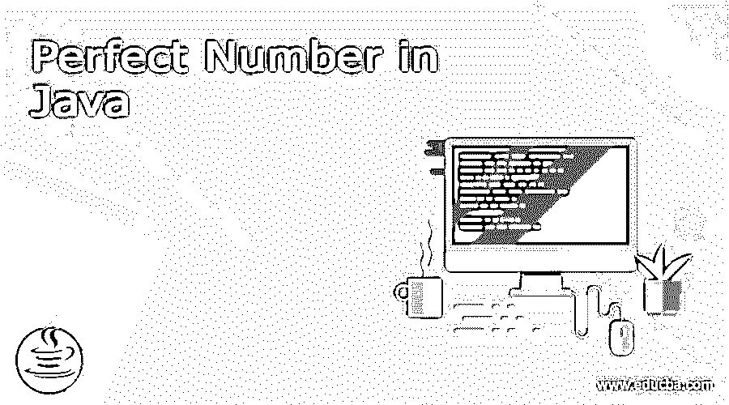

# Java 中的完全数

> 原文：<https://www.educba.com/perfect-number-in-java/>




## Java 完全数的定义

Java 为用户提供了一种不同的数字系统；完全数也是 java 提供的一种数制。在 Java 中，我们可以把任何一个数看作完全数。如果排除这个数的所有因素它都等于给定的数，那么我们可以认为给定的数是一个完全数。在 Java 中，我们可以用不同的方法来寻找完美的数字。基本上完全数就是数系中任何以 10 为基数的数，是数学中数系的一个子领域。根据用户要求，我们可以使用完美的数字系统。

### 完全数背后的逻辑

现在我们来看看 java 中完全数背后的逻辑如下。

<small>网页开发、编程语言、软件测试&其他</small>

完全数的基本逻辑很简单。首先，我们需要找出一个给定数字的正因数，然后将所有因数相加，不包括数字本身。如果因子的和等于给定的数，那么我们可以说给定的数是完全数，如果因子的和不等于给定的数，那么我们可以说给定的数不是完全数。让我们看一个完全数的例子；然后我们会得到一个详细的思路如下。

假设我们需要检查 8 是否是一个完美的数字。

*   首先找出正因数，即 1，2，4，8。现在把 8 以外的所有因素加起来，我们得到的结果是 7。现在将结果与给定的数字进行比较；看这里两个数字是不同的。这意味着我们可以说这个数字不是一个完美的数字。
*   现在让我们考虑另一个数字:6。
*   求 6 的正因数是 1，2，3，6。
*   所有因子之和为 6，不含 6。
*   现在比较结果和给定的数字，看这里给定的数字和结果是一样的，这意味着我们可以说给定的数字是一个完全数。

### Java 中如何检查完全数？

现在我们来看看如何检查完全数 java 如下。在 java 编程中，有三种不同的方法来检查完全数，如下所示。

#### 1.通过使用 while 循环

在 while 循环中，我们需要遵循如下一些步骤。

1.首先，我们需要读取用户输入的数字。

2.循环将继续，直到条件(j < =否/2)为假。如果 no/j 的余数为 0，则将 j 的值加到和中，并增加 j 的值，在完成所有迭代后，比较结果。如果展位号相等，则打印给定的号为完全数；否则，将给出的数字打印为非完全数。

3.例如 no=8，j=1 no/2=4，那么 j <=4 意味着条件为真，现在求因子。

8%j=0 真，则 sum =1

J=2 2<4 为真 8%2 =0 为真，sum= 1+3=3。

所以这样，我们完成所有的迭代，找到完美的数字。

#### 2.通过使用静态方法

在这个方法中，我们可以调用一个静态方法来检查完全数；在这个方法中，我们只需要调用 PerfacOrNot 方法。它会自动计算所有正因子的总和，并检查给定的数字是否完美。

#### 3.通过使用递归方法

在这个方法中，我们还使用对象调用 PerfectOrNot()方法。在这个方法中，执行自己启动并调用 PerfectOrNot()。它重复迭代，直到 j<= number/2 为假。

### 例子

现在让我们看看 Java 中完全数的不同例子如下。

#### 示例#1

**代码:**

```
import java.util.Scanner;
class Perfect_number1
{
public static void main(String arg[])
{
long num,s=0;
Scanner s_c=new Scanner(System.in);
System.out.println("Enter number");
num=s_c.nextLong();
int j=1;
while(j<=num/2)
{
if(num%j==0)
{
s+=j;
}
j++;
}
if(s==num)
{
System.out.println(num+" the given number is perfect number");
}
else
System.out.println(num+" the given number is not perfect number");
}
}
```

**解释**

通过使用上面的程序，我们尝试用 while 循环在 java 中实现完全数。上述程序的编码非常简单，这里我们创建了 main 方法；在 main 方法中，我们使用 scanner 类和 while 循环来查找给定数字的因子，并将该因子添加到 s 变量中，该变量是因子的总和，如上面的程序所示。最后，我们比较这两个数字，并根据比较结果打印消息。我们用下面的截图来说明上面程序的最终输出。


#### 实施例 2

现在让我们看看另一个使用静态方法的完全数的例子，如下所示。

**代码:**

```
import java.util.Scanner;
class Perfect_Method
{
public static void main(String arg[])
{
long num,m;
Scanner s_c=new Scanner(System.in);
System.out.println("Enter number");
num=s_c.nextLong();
m=perfectOrNot(num);
if(m==num)
System.out.println(num+" The given number is perfect number");
else
System.out.println(num+" The given number is not perfect number");
}
static long perfectOrNot(long n)
{
long s=0;
for(int j=1;j<=n/2;j++)
{
if(n%j==0)
{
s+=j;
}
}
return s;
}
}
```

**解释**

在上面的程序中，我们用一个静态的方法来检查一个给定的数是否是一个完全数。在上面的程序中，我们使用了 perfecOrNot()方法。之后我们用一个 for 循环来寻找给定数字的因子，剩下的过程是一样的，就是将结果与给定数字进行比较，根据比较结果打印一条消息。我们用下面的截图来说明上面程序的最终输出。


#### 实施例 3

现在让我们看另一个例子，使用递归方法检查完全数，如下所示。

**代码:**

```
public class Recursive
{
static int n = 200;
static int s = 0;
static int d = 1;
static int findPerfect(int n, int d) {
{
if(d<=n/2)
{
if(n%d==0)
{
s+=d;
}
d++;
findPerfect(n,d);
}
return s;
}
}
public static void main(String args[])
{
int r = findPerfect(n,d);
if(r == n)
System.out.println(" The given number is perfect Number");
else System.out.println("The given number is not perfect Number");
}
}
```

**解释**

在上面的程序中，我们使用了递归方法来检查完全数。我们用下面的截图来说明上面程序的最终输出。


### 结论

我们希望通过这篇文章，你能学会 java 中的完全数。从上面的文章中，我们学习了完全数的基本逻辑，也看到了不同的完全数的例子。从这篇文章中，我们学习了如何以及何时在 java 中使用完全数。

### 推荐文章

这是一个 Java 中完全数的指南。这里我们讨论一下定义，Java 中如何检查完全数？代码实现示例。您也可以看看以下文章，了解更多信息–

1.  [Java 中的 Servlet](https://www.educba.com/servlet-in-java/)
2.  [跳过列表 Java](https://www.educba.com/skip-list-java/)
3.  [Java 中的桶排序](https://www.educba.com/bucket-sort-in-java/)
4.  [Java 中的 Shell 排序](https://www.educba.com/shell-sort-in-java/)


